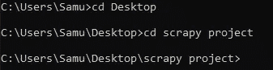
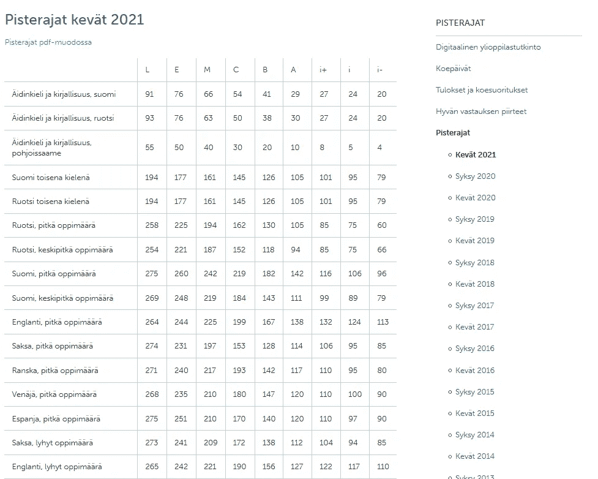
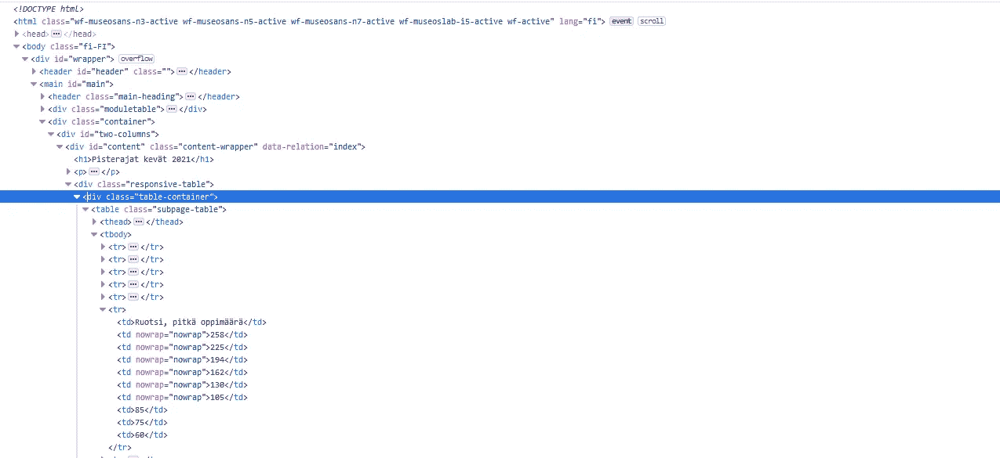
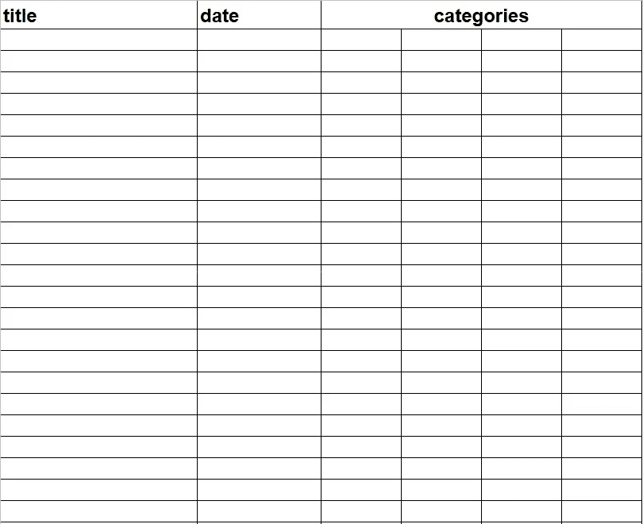
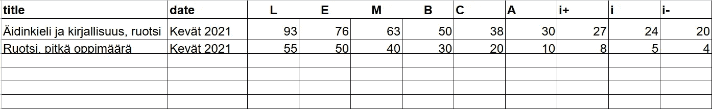
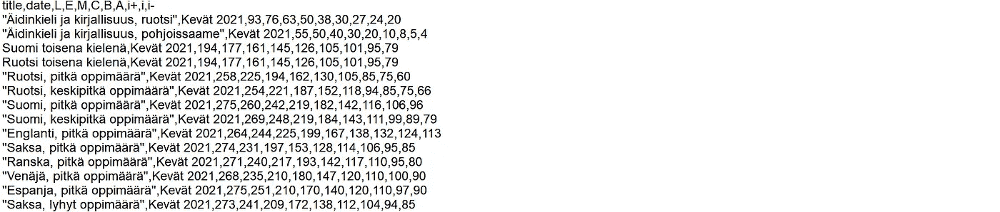
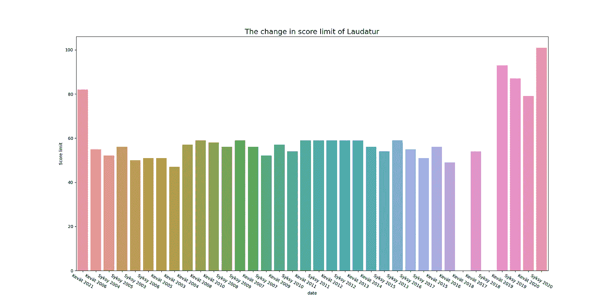

# 浏览网页，了解教育趋势

> 原文：<https://medium.com/codex/web-scraping-to-see-trends-in-education-c18485260bad?source=collection_archive---------8----------------------->

## 用 Scrapy 提取芬兰教育数据


[斯科特·格雷厄姆](https://unsplash.com/@homajob?utm_source=unsplash&utm_medium=referral&utm_content=creditCopyText)在 [Unsplash](https://unsplash.com/s/photos/education?utm_source=unsplash&utm_medium=referral&utm_content=creditCopyText) 上拍照

芬兰大学入学考试是高中学生(标准完成时间为 15-19 岁)参加的最后一次考试，包括一门学科的所有领域。这些考试的成绩被用来申请大学，你需要达到一定的标准才能通过高中。

分数是用所谓的分数限制来决定的。例如，一个等级的赞美诗的分数限制，可能是最好的，可能是 120 分。这意味着，如果你得到 120 或以上，你得到赞美。这些分数限制是根据高斯分布计算的。这意味着前 5%的参与者得到赞美，然后 15%得到 Eximia(第二好)等等。[你可以阅读更多关于这个过程和这里使用的确切公式](https://www.ylioppilastutkinto.fi/en/assessment-and-certificates/assessment-of-the-examination)。

因为分数限制与参与者的表现相关，所以它们可以用来比较每年学生的一般学术能力。这当然没有考虑到这样一个事实，即有时测试会稍微难一点或容易一点。

另一个要注意的重要事情是，随着时间的推移，考试通常会变得更难，以平衡教育越来越好和信息量越来越大的事实。

这样一来，我们就可以真正进入项目了

## 目录

1 — Scrapy
2 —在本地启动一个 Scrapy 项目
3 —在 Jupyter 上启动一个 Scrapy 项目
4 —配置您的蜘蛛
5 —使用 LinkExtractor
6 提取链接—抓取限制分数表
7 —规划我们的导出
8 —最终的蜘蛛
9 —在本地提取数据
10 —在 Jupyter 上提取数据
11 —生成洞察

## Scrapy

这篇文章将主要处理这个项目的网页抓取部分，并可以作为一个很好的介绍像 Scrapy 和它提供的非常方便的功能。

如果你对 Scrapy 完全陌生，我建议[通读文档](https://docs.scrapy.org/en/latest/index.html)。与这个项目最相关的是[蜘蛛](https://docs.scrapy.org/en/latest/topics/spiders.html)和[链接提取器](https://docs.scrapy.org/en/latest/topics/link-extractors.html)。当然，我会解释整个项目中的所有新概念，并在需要时给出例子，但是浏览文档可以帮助你更好地理解项目。

此外，你还需要确保你已经安装了 Scrapy。你可以使用 pip 安装 Scrapy。

要在 windows 上这样做，请打开 cmd 并键入

```
pip install Scrapy
```

在 linux 上，您可以使用

```
#pip install Scrapy
```

如果您正在使用 Anaconda，您可以简单地从 navigator 向您的环境添加 Scrapy。

通常当你开始一个零碎的项目时，你首先创建项目文件。这种情况的主要例外是当你想在 Jupyter 笔记本上运行项目时(这也意味着通过 Kaggle 笔记本或 Google Colab 运行它)。我将在这里介绍这两种方法。

## 在本地开始一个零碎的项目

要开始一个项目，你需要首先打开你的 cmd。然后使用它导航到您的项目文件夹。我的项目文件夹在我的桌面上，所以这里是我如何导航到那里。



如果您不确定如何到达下一个路径，您可以使用 dir 命令来查看您可以移动到哪些文件夹。

导航到文件夹后，可以使用下面的命令创建项目。

```
scrapy startproject <project name> 
```

我建议给这个项目起一个相关的名字。我把我的名字命名为“matricular_scrape”。

运行此命令将生成一个项目文件夹，其中包含此项目所需的所有文件。其中最重要的是你的设置文件和蜘蛛文件夹。我们的下一步是在 spiders 文件夹中创建一个蜘蛛。

为此，我们运行以下命令:

```
scrapy genspider <spider name> <starting link>
```

现在，在我们生成蜘蛛之前，我们需要决定从哪一页开始抓取。对于这个项目，我们将使用这个页面:[https://www . yliopilastutkinto . fi/yliopilastutkinto/pisterajat](https://www.ylioppilastutkinto.fi/ylioppilastutkinto/pisterajat)

原因是，我们可以看到在右侧栏中有一个到每年分数限制的链接。每年的日期分为春季和秋季。这是因为大学入学考试每年在全国范围内举行两次。

从这一页开始，我们可以在以后利用链接提取器获得每年分数限制的链接。

如果你想完全跟随我，你应该给这个蜘蛛起名叫“分数限制”。当我们运行蜘蛛时，这个名字将是相关的。

这意味着现在要运行的命令应该是:

```
scrapy genspider score_limits “[https://www.ylioppilastutkinto.fi
/ylioppilastutkinto/pisterajat](https://www.ylioppilastutkinto.fi/ylioppilastutkinto/pisterajat)”
```

## 在 Jupyter 上开始了一个棘手的项目

你不需要在 Jupyter 上创建一个项目文件夹，而是首先确保把 Scrapy 安装到那个笔记本上。大多数笔记本支持使用

```
!pip install Scrapy
```

然后，您需要手动创建蜘蛛。你可以在 [Scrapy 文档](https://docs.scrapy.org/en/latest/topics/spiders.html#scrapy-spider)中找到创建通用蜘蛛的模板。

## 配置您的蜘蛛

现在你已经创建了蜘蛛，你可以打开它创建的模板，看起来应该是这样的:

现在我们想对此做些改变。首先，我们可以把`allowed_domains`概括为仅仅是`‘[www.ylioppilastutkinto.fi'](http://www.ylioppilastutkinto.fi')`。这就把它变成了一个域名而不是一个 url。

## 使用 LinkExtractor 提取链接

接下来，我们将开始构建解析函数。这是当你告诉你的蜘蛛抓取一个网站时将运行的功能。它将获取`start_urls`中给定的网站，并将获取的数据存储到响应对象中。

正如我们之前建立的那样，我们希望从侧栏中检索链接。为此，我们将创建一个链接提取器。一个链接提取器将允许我们从一个给定的网站提取任何链接。
下面是设置链接提取器的代码:

这里有几点需要注意:

1.  我们需要在`LinkExtractor`类中导入，这是我们在第 2 行做的
2.  我们给了`LinkExtractor`和蜘蛛相同的允许域名
3.  我们只想要边栏中的链接。为此，我们需要检查网站并找出侧栏的 xpath。然后通过给出`restrict_xpaths`参数，我们可以告诉`LinkExtractor`只在 xpath 中寻找链接。

为了实际获得链接，我们需要使用`le.extract_links(response)`调用`LinkExtractor`

现在我们有了链接，我们需要一些方法来告诉蜘蛛去那些链接，并给它指示当它到达那些网站时该做什么。

将蜘蛛发送到每个链接的完整代码如下:

所以详细说明一下评论:
我们首先调用`yield scrapy.Request`它的作用是告诉 scrapy 去获取另一个网站。
然后我们通过调用`url = link.url`给出获取的 url。
我们设置了一个回调函数，让我们在每次发出请求时给出一个我们想要运行的函数。然后我们给出回调参数。这里我们给它`date`，这样我们可以在回调参数中给定的函数期间使用它。

现在我们已经让蜘蛛先找到所有我们想浏览的链接，然后我们将蜘蛛发送到这些链接。现在我们需要构建一个函数，蜘蛛将使用它来抓取我们发送给它的每个链接。

## 刮极限分数表

我们将要设置的函数将被称为`parse_table`。如果你想叫它别的名字，记得相应地更新回调参数。

这个函数需要一些东西。因为我们在这个类中设置了一个函数，所以我们将`self` 值传递给它，但是我们也需要传递`response`，然后我们传递之前给出的回调参数。在这种情况下，这意味着变量`date`。结果行应该是:

```
def parse_table(self, response, date):
```

现在我们需要开始思考我们将用来抓取网站的实际逻辑。如果我们看一下侧边栏中的第一个链接，我们可以看到这样一个表格:



表格被剪短以保持图像足够大

我们使用 chrome/Firefox 的检查工具来计算如何从网站上选择我们的数据。



由此我们可以看到，表存储在内容类中。我们还可以看到，每个科目的分数限制存储为表格行。

有了这些信息，我们就可以开始构建抓取逻辑了。

我们从抓取列标题开始(所以 L，E，M，C…)。我们为每个链接单独抓取这些，因为它们会随着时间的推移而略有变化。这些类别位于表格的第一行。下面是完整的代码:

我们使用列表理解建立一个列表。逻辑基本上是:

1.我们首先得到每个类别的根值，从中我们可以得到纯文本，也就是类别本身。
2。我们通过使用 css 选择器选择表格，然后选择所述表格的第一行来获得每个类别。
3。我们从第二个值向前选择第一行的值。这是因为第一行的第一个值是空的。(你可以在截图中看到)

按照这个逻辑，我们可以得到网站上表格的类别。

现在，有时每个网站的格式不尽相同。当处理跨越多年的数据时，这种情况经常发生。这里也是如此。

在一些网站上，表格数据只是简单的`td`，但是在另一些网站上，表格数据被附加了一个`strong`标签。这意味着我们需要使用`td strong`来清除它。为了涵盖这两种情况，我们可以使用 if 语句来检查当我们只使用`td`进行抓取时，类别是否有`None`值。

if 语句的逻辑在这里。类别列表的一致性遵循我上面解释的逻辑。

## 规划我们的出口

现在我们可以开始实际刮每个科目的分数限制。在这一步，最好首先考虑如何导出数据。数据通常是表格形式的，这意味着您通常会输出 csv 文件。

对于这个项目，我选择了以下类型的结构:



**标题**将是主题的名称。
**日期**将是分数限制的起始年份和赛季。
**类别**每个类别有一列，并且有该类别的分数限制。

下面是一个完整的示例:



既然我们已经决定了如何导出数据，我们实际上可以开始构建导出的字典了。

下面是这段代码的第一部分:

首先，我们开始遍历表中的每一行。我们得到包含以下内容的行:

```
rows = response.css(‘#content table tbody tr’)
```

也就是说，我们选择内容包装器，然后选择其中的表，然后只选择表的主体，最后选择该表中的所有行。

1.  `cols`表示该行的所有数据(即每列的值)
2.  通过选择第一个值，我们得到了主题名，也称为标题
3.  然后我们获取实际的分数限制。我们从第二个值开始前进。我们在这里也应用同样的`.root.text`来获得实际值。

在我们得到必要的数据后，我们为最终的词典建立一个基础。我们在这里设置标题和日期的值。

现在我们需要将每个分数限制分配给相应的类别。
为此，我们使用以下代码:

该代码利用了分数限制以与类别相同的顺序存储的知识。有了这些信息，我们浏览每个分数限制(`num`)并将其分配给相同位置的`category` 。这意味着`nums`中的第一个分数限制被分配给`categories`中的第一个`category`。

运行之后，我们已经构建了字典，并且拥有了我们想要的所有数据。

最后一步我们调用`yield data`，当我们使用蜘蛛爬行时，它将输出字典。

## 最后的蜘蛛

如果你在路上迷路了，或者只是想看看更大的图片，这里是整个蜘蛛的代码:

## 在本地提取数据

现在，我们已经建立了一个功能蜘蛛，但我们如何实际使用它来抓取数据？我们要做到这一点，我们需要再次打开 cmd。

首先，再次导航到您的项目文件夹。您所在的文件夹是存储 csv 文件的文件夹，所以请记住这一点。要激活 Scrapy spider，我们使用以下命令语法:

```
scrapy crawl <spider name> -o <file name>
```

如果你一直跟着，那么蜘蛛的名字将是`score_limits`。我将使用“data.csv”作为文件名，但只需选择任何相关的内容。请记住在名称中包含文件扩展名，并用引号将名称括起来。

如果你想了解更多关于从 scrapy 导出数据的信息，我推荐[饲料导出文档](https://docs.scrapy.org/en/latest/topics/feed-exports.html)。

运行此命令后，您应该有一个与您在项目文件中选择的名称相同的文件。该文件应该包含抓取的数据。例如，下面是我的 csv 文件的开头:



## 在 Jupyter 上导出数据

为了在 Jupyter 上抓取带有 Scrapy 的蜘蛛，你需要建立抓取[设置](https://docs.scrapy.org/en/latest/topics/settings.html)并设置一个[抓取进程](https://docs.scrapy.org/en/latest/topics/api.html#crawler-api)。如果你想深入了解这些，看看链接的文件。

首先，您应该使用以下命令导入`CrawlerProcess`

```
from scrapy.crawler import CrawlerProcess
```

接下来你需要设置`CrawlerProcess`。有很多不同的东西你可以改变，但这里最重要的是`FEEDS`。这个设置告诉蜘蛛如何在爬行时导出数据。要设置输出 csv，您可以执行以下操作:

使用这些设置，输出文件的名称是“scores.csv ”,它将被格式化为 csv 文件。

现在，您只需要告诉进程开始爬行，并实际启动进程。你可以用

```
# We tell the spider to crawl when process startsprocess.crawl(MainSpider)# We start the process, 
# and set it to end after we’ve crawled through all pages
process.start(stop_after_crawl=True)
```

## 产生洞察力

我们可以从这些数据中收集一些一般性的见解，如数学测试中赞美诗分数限制随时间的变化。

我们可以用下面的代码做到这一点:

这将输出下图:



从这张图中可以看出，在过去的几年里，数学水平相对较高。其中一些也可以归因于 2019 年发生的数学考试的数字化。

我们从中获得的另一个洞见也与我们的刮擦过程有关。例如，我们可以看到我们缺少“kevt 2017”和“kevt 2019”的数据。

这个项目的范围到此为止。如果你很好奇，你肯定可以浏览这些数据，并获得一些非常有趣的见解，但这超出了这个项目的预期范围。

我希望这个项目向您展示了用 Scrapy 和它提供的一些更酷的功能抓取数据的方法。

你可以在 medium 上关注我，查看我的新帖子
你也可以在其他社交媒体上查看我:
[Twitter](https://twitter.com/kaarlsamu)
LinkedIn