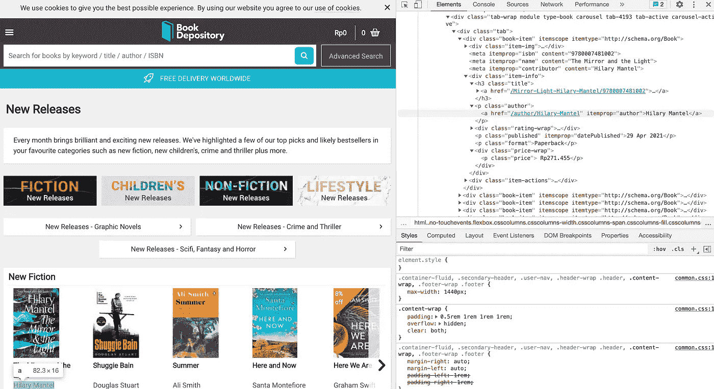
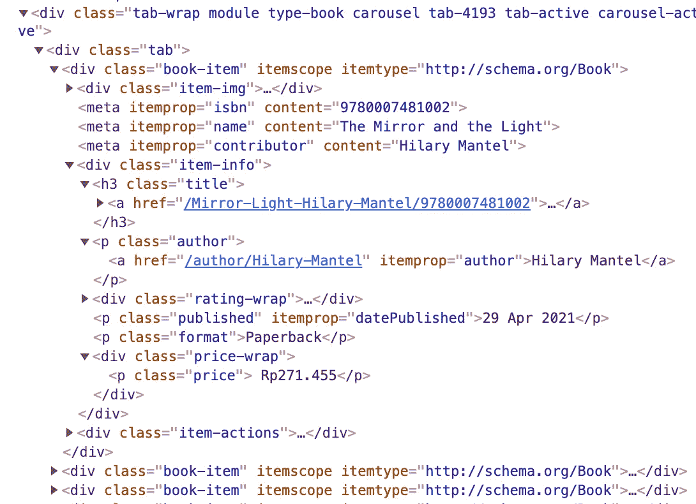
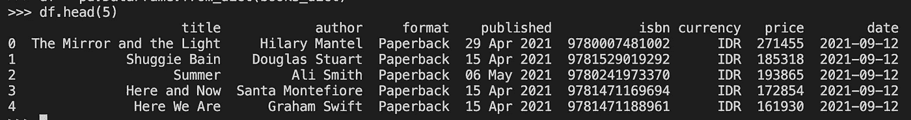

# 使用 BeautifulSoup +将数据推送到 MySQL 数据库的网络抓取

> 原文：<https://medium.com/codex/web-scraping-using-beautifulsoup-pushing-data-to-mysql-database-9de6af06e7b8?source=collection_archive---------1----------------------->

## 通过定期从网站收集和记录数据来创建自己的数据集。


由[阿尔方斯·莫拉莱斯](https://unsplash.com/@alfonsmc10?utm_source=medium&utm_medium=referral)在 [Unsplash](https://unsplash.com?utm_source=medium&utm_medium=referral) 上拍摄的照片

在本文中，我们将学习如何使用 BeautifulSoup 从 web 的 HTML 内容中抓取数据，beautiful soup 是一个流行的用于 web 抓取的 Python 包。然后，我们将学习如何将数据推入 MySQL 数据库中的一个表中。

## 用 BeautifulSoup 抓取 HTML 数据

BeautifulSoup 是一个用于解析 HTML 和 XML 文档的 Python 包。通过网络浏览器访问的每个网站都由 HTML 文档组成，通过查看页面可以看到这些文档。



Book Depository 的新发布页面和 HTML。—图片由作者提供。

比方说，你是个书呆子。你想通过书库的新书来更新自己，并且你想定期更新你的列表。你可以时不时地在 Book Depository 的网站上查看新的发行页面(通过访问[https://www.bookdepository.com/top-new-releases](https://www.bookdepository.com/top-new-releases))，但你认为如果你能收集数据并以表格形式保存，处理这些信息会容易得多。

在检查了该网站的元素后，您发现该页面中的所有 book 元素都存储在 div 标签下，并带有`"book-item"`类。从每个 book-item 元素中，您可以获得各种信息，如 ISBN、标题、作者姓名、出版日期、图书格式和价格。你想记录所有信息，加上一个额外的信息，即刮削日期。所以，现在你有一个粗略的计划，为您的网页抓取之旅:(1)首先，从 HTML 抓取信息，并将其转换为表格格式，和(2)保存表格到外部位置。为了简单起见，我们将使用 requests 包发送 HTTP 请求以获得 HTML 响应，使用 BeautifulSoup 解析 HTML，使用 pandas 将信息转换为 DataFrame，最后使用 sqlalchemy 包将所有数据推送到 MySQL 数据库。



图书仓库新发布页面中图书项目的 HTML 标签-图片由作者提供。

使用 Python 包管理器安装 BeautifulSoup。如果您使用 pip，请使用`pip install beautifulsoup4`进行安装。然后，导入几个包，并开始通过 HTTP 请求请求 HTML。

```
import requests
import pandas as pd
import datetime
from bs4 import BeautifulSoup
from sqlalchemy import create_engineURL = '[https://www.bookdepository.com/top-new-releases](https://www.bookdepository.com/top-new-releases)'
page = requests.get(URL)
soup = BeautiulSoup(page.content, "html.parser")
books = soup.find_all("div", class_ = "book-item")
```

在上面的代码片段中，get 请求被发送到 URL。存储在`page`变量中的响应，该变量后来通过使用 BeautifulSoup 对象转换成一个解析的数据对象。然后，我们用`book-item`类获取所有 HTML 元素，并将其存储在`books`列表中。`books`变量由数百个 book 元素组成，每个元素如下所示:

```
print(books[0])===============<div class="book-item" itemscope="" itemtype="[http://schema.org/Book](http://schema.org/Book)">
<div class="item-img">
<a href="/Mirror-Light-Hilary-Mantel/9780007481002" itemprop="url">

</a>
</div>
<meta content="9780007481002" itemprop="isbn"/>
<meta content="The Mirror and the Light" itemprop="name"/>
<meta content="Hilary Mantel" itemprop="contributor"/>
<div class="item-info">
<h3 class="title">
<a href="/Mirror-Light-Hilary-Mantel/9780007481002">
                    The Mirror and the Light<br/>
</a>
</h3>
<p class="author">
<a href="/author/Hilary-Mantel" itemprop="author">Hilary Mantel</a>
</p>
<div class="rating-wrap">
<a aria-label="Ratings for The Mirror and the Light" href="/Mirror-Light-Hilary-Mantel/9780007481002">
<div class="stars">
<span class="star full-star"></span>
<span class="star full-star"></span>
<span class="star full-star"></span>
<span class="star full-star"></span>
<span class="star half-star"></span>
</div>
</a>
</div>
<p class="published" itemprop="datePublished">29 Apr 2021</p>
<p class="format">Paperback</p>
<div class="price-wrap">
<p class="price">
                        Rp271.455</p>
</div>
</div>
<div class="item-actions">
<div class="btn-wrap">
<a class="btn btn-sm btn-primary add-to-basket" data-currency="IDR" data-isbn="9780007481002" data-price="271455" data-ref="carousel" data-show-related="false" href="/basket/addisbn/isbn13/9780007481002" rel="nofollow">
                        Add to basket</a>
</div>
</div>
</div>
```

根据元素的结构，我们可以决定从哪里获取我们需要的信息。例如，ISBN、价格和货币可以用`"btn btn-sm btn-primary add-to-basket"`类从标签`a`中提取。可以从 itemprop 的带有`"name"`属性的`meta`标签中抓取标题，其中作者姓名、图书格式和出版日期可以分别从带有`"author"`、`"format"`和`"published"`类的`p`标签中抓取。

对于第一个 book 元素，可以使用以下几行代码来抓取每条信息:

```
book_title = books[0].find("meta", {"itemprop":"name"}).get("content")book_author = books[0].find("p", class_ = "author").find("a").textbook_format = books[0].find("p", class_ = "format").textbook_published = books[0].find("p", class_ = "published").textbook_isbn = books[0].find("a", class_ = "btn btn-sm btn-primary add-to-basket").get("data-isbn")book_currency = books[0].find("a", class_ = "btn btn-sm btn-primary add-to-basket").get("data-currency")book_price = books[0].find("a", class_ = "btn btn-sm btn-primary add-to-basket").get("data-price")
```

要从所有 book 元素中抓取信息，创建一个字典，其中每个键对应于每一列(例如标题、作者或 isbn)，每个值包含相应列的值列表。然后，迭代到`books`变量，并通过使用与前面代码片段所示相同的方法抓取单个信息来追加每个列表。

```
books_dict = {'title':[], 'author':[], 'format':[], 'published':[], 'isbn':[], 'currency':[], 'price':[], 'date':[]}for b in books:
     books_dict['title'].append(b.find("meta", {"itemprop":"name"}).get("content"))
     books_dict['author'].append(b.find("p", class_ = "author").find("a").text)
     books_dict['format'].append(b.find("p", class_ = "format").text)
     books_dict['published'].append(b.find("p", class_ = "published").text)
     books_dict['isbn'].append(b.find("a", class_ = "btn btn-sm btn-primary add-to-basket").get("data-isbn"))
     books_dict['currency'].append(b.find("a", class_ = "btn btn-sm btn-primary add-to-basket").get("data-currency"))
     books_dict['price'].append(b.find("a", class_ = "btn btn-sm btn-primary add-to-basket").get("data-price"))
     books_dict['date'].append(datetime.date.today())
```

最后，将字典转换成熊猫数据框架。

```
df = pd.DataFrame.from_dict(books_dict)
df.head(5)
```



数据帧格式的抓取数据—按作者分类的图像

## 将数据帧推送到 MySQL 数据库

假设您有一个 MySQL 数据库，有一个名为`"book-depo-new-releases"`的表。除了这个表，还有 MySQL 数据库的用户名和密码、主机和数据库名称。要将数据帧推送到 MySQL，用 sqlalchemy 创建一个引擎，然后利用 pandas 方法直接推送数据。

```
engine = create_engine('mysql+pymysql://'+{USERNAME}+':'+{PASSWORD}+'@'+{HOST}+'/'+{DATABASE})df.to_sql(con=engine, name='book-depo-new-releases', if_exists='append', index=False)
```

通过使用`append`选项，您不会覆盖该表中以前写入的行。此外，DataFrame 的索引也不会写入 MySQL 表。