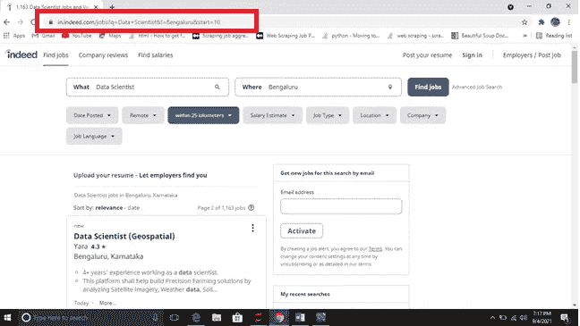
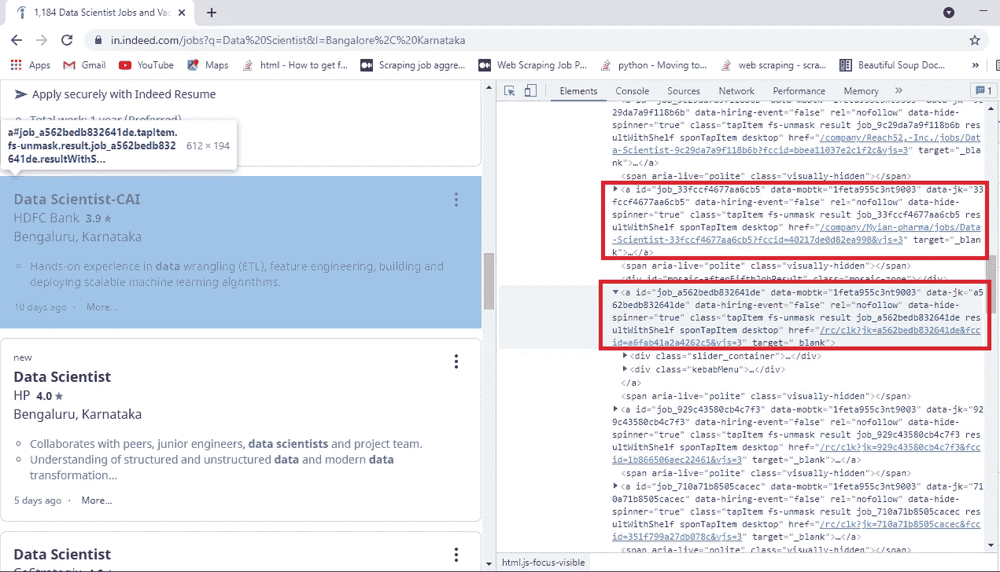
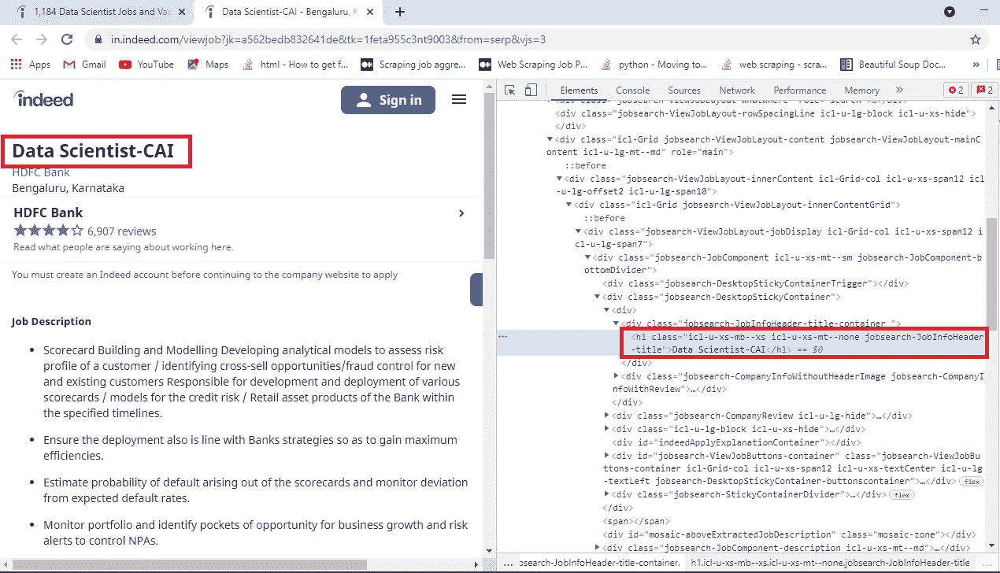
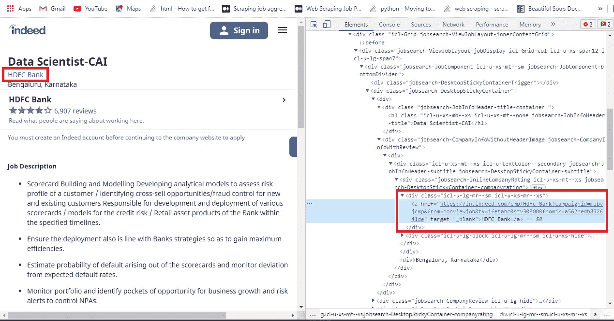
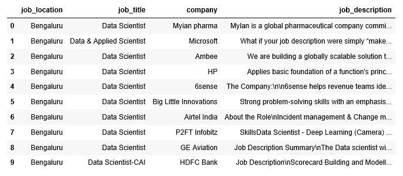

# 美声网刮

> 原文：<https://medium.com/codex/web-scraping-with-beautifulsoup-66a3a2b3b60?source=collection_archive---------4----------------------->

凯文·巴加特在 [Unsplash](https://unsplash.com?utm_source=medium&utm_medium=referral) 上的照片

网络抓取是从不同网站提取数据的过程。我们将看看如何从 Indeed.com 收集数据，这是一个流行的求职网站。在继续下一步之前，免责声明是检查条款和条件，无论你试图抓取的网站是否允许。在这种情况下，Indeed.com 允许网页抓取，所以我们将进一步进行。

我们将使用 BeautifulSoup 和请求库从 indeed.com 收集数据。

首先，我们用一个例子来了解一下 URL 的结构。

https://in.indeed.com/jobsq=Data+Scientist URL =[T5&l = Bengaluru&start = 10](https://in.indeed.com/jobs?q=Data+Scientist&l=Bengaluru&start=10)

“q”是您要搜索的职位的字符串。从上面的 URL 示例中，我们想搜索一份数据科学家的工作。因此，q 将等于用“+”号分隔的字符串数据科学家。

“l”是您要搜索的位置或城市的字符串。在上面的例子中，它是“Bengaluru”。

“开始”表示您想要开始的结果。在我们的例子中，它是 10。

我们将使用这个 URL 结构来概括我们将要编写的函数。

[https://in.indeed.com/](https://in.indeed.com/)

每页一次显示 15 个结果。我们可以在 URL 中使用 start 参数来浏览结果。这个页面上的所有信息都用 HTML 标签编码。HTML(超文本标记语言)是一种编码，它告诉你的互联网浏览器在访问一个给定的页面时如何显示它的内容。这包括它的基本结构和顺序。HTML 标签也有属性，这些属性有助于跟踪在页面结构中的什么位置可以找到什么信息。

Chrome 用户可以通过右击页面并从出现的菜单中选择“检查”来检查页面的 HTML 结构。页面右侧会出现一个菜单，其中有一长串嵌套的 HTML 标签，包含当前显示在浏览器窗口中的信息。

现在让我们了解什么是请求模块，以及我们为什么需要它。它是一个 python 模块，可以用来发送所有类型的 HTTP 请求。这是一个易于使用的库，具有许多功能，从在 URL 中传递参数到发送自定义头和 SSL 验证。我们将使用它向我们的 URL 发送 HTTP 请求。

首先安装 BeautifulSoup 和 Requests。现在，让我们来看看一步一步的过程中建立一个刮刀。

现在，我们将通过 Requests 模块发送一个 HTTP 请求，看看是否能得到适当的响应。

我碰到的很多教程都是使用 urllib.request 中的 urlopen 来取数据，不提供头。它用于伪装请求，否则您可能会遇到禁止的状态代码(HTTP 错误 403)。因此，在请求中使用报头非常重要。上面的代码给出了状态码 200，这意味着请求被成功执行。在使用 BeautifulSoup 与网页建立连接后，我们将解析 HTML 并将对象存储在一个名为 Soup 的变量中。

现在，我们将获取各个职位的链接，然后提取公司、职位、位置和职位描述。有几种方法可以做到。我遇到的大多数教程都使用 HTML 树结构来访问链接。但是这种方法不起作用，因为页面结构发生了变化。相反，我们将遵循一种通用的方法，即使将来页面结构发生变化，它也能工作。因为这让我们了解了页面结构以及每个招聘信息的 URL 是如何嵌入的。

单击链接所在的职位，然后右键单击“检查”。然后滚动找到“href”属性。它包含特定工作发布的链接。

如果您向下滚动，可以看到所有的作业链接都是在一个标记内的“href”属性中定义的。所以我们将提取嵌入在标签中的所有‘href’属性。这将需要一点点探索你的网页，你一定会明白是怎么回事。

如果您仔细查看该页面，您会看到工作链接遵循一种模式。在这种情况下，包含“/rc/clk”或“/company/”的链接都是作业链接。这可能会在未来发生变化，但肯定会有一种模式，你需要找到，然后你可以过滤招聘链接的链接。

现在，我们已经获得了工作发布的所有 URL，我们将进一步提取我们想要的所有信息。

让我们理解上面的代码发生了什么。所以，上面的函数有两个参数，我们之前得到的 URL 列表和我们正在寻找工作的城市。现在，遍历每个 URL，我们发送 HTTP 请求并获得一个 soup 对象。现在，让我们了解如何从每个 URL 中提取信息。

请看下图。我正在检查一个这样的网址，它是我从求职页面中提取的。如果您右键单击作业标题并单击 inspect，您会看到它包含在一个

# 标记中，该标记的类名为“ICL-u-xs-MB—xs ICL-u-xs-mt—none jobsearch-JobInfoHeader-title”。使用类名，您可以访问所有 URL 的标题。

接下来，我们将看看公司名称。在检查公司名称时，我可以看到它被包含在一个

标签中。您可能会在某些页面上发现不同之处。对于一些招聘信息，我注意到公司名称也包含一个超链接。在这种情况下，将有一个标记，它将有一个包含公司名称的文本和一个带有 URL 的 href 属性。而在其他情况下，公司名称不会有超链接，所以文本将直接在标签下。在这两种情况下，您都可以通过提及 div 标记的类名来直接访问文本。在这里，公司名称在一个带有类名的标签中:“ICL-u-LG-Mr-sm ICL-u-xs-Mr-xs”。

现在，工作所在的位置或城市也包含在一个

标签中，标签的类名为:“jobsearch-inline company rating ICL-u-xs-mt—xs jobsearch-DesktopStickyContainer-company rating”。请注意，在许多 URL 中，包含城市名称的 div 标签没有任何类。我已经在异常处理中处理了这个场景，在这里我直接附加了我们已经在输入参数中提供的城市名称。

现在，我们到了最后一部分，职位描述。当您检查作业描述时，您会看到它被包含在另一个

标签中，标签的类名为:“jobsearch-jobDescriptionText”。请记住，在抓取数据时，您可能会遇到对 URL 的访问被拒绝的情况，因为您一次可以抓取多少数据是有限制的。因此，我在这里使用了异常处理。即使一些网址被封锁，你的代码不会失败。此外，一次发送太多请求是不明智的，你会开始得到 Recaptcha，或者更糟的是你可能会被阻塞。为小型 ML 项目提取数据完全没问题。

现在让我们巩固所有的知识，并编写最终的函数。

在上面的函数中，您只需要插入您想要搜索数据的目的地和城市，您将提取数据并存储在熊猫数据框中。

**结论**

我已经整合了我所有的知识和我在学习网络抓取时遇到的问题。一旦你理解了一个 HTML 页面的基本结构以及我们如何使用它来提取数据，它就是你的数据科学技能组合中一个非常有用的工具。

完整代码请访问 GitHub [链接](https://github.com/vdhar1992/Web_Scraper)。

如果您喜欢阅读，请关注我的[此处](https://vaishali4175.medium.com/)了解更多数据科学内容，并在 Linkedin 上与我联系，我们很乐意与您谈论数据世界。

感谢阅读。