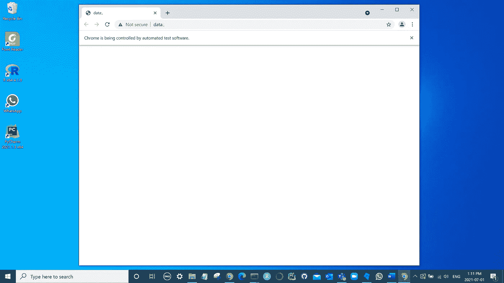
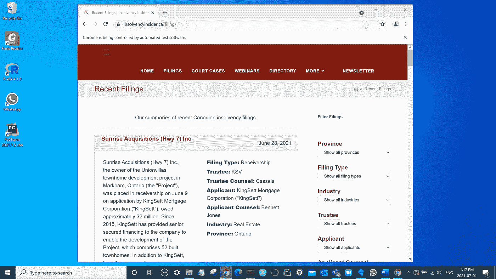
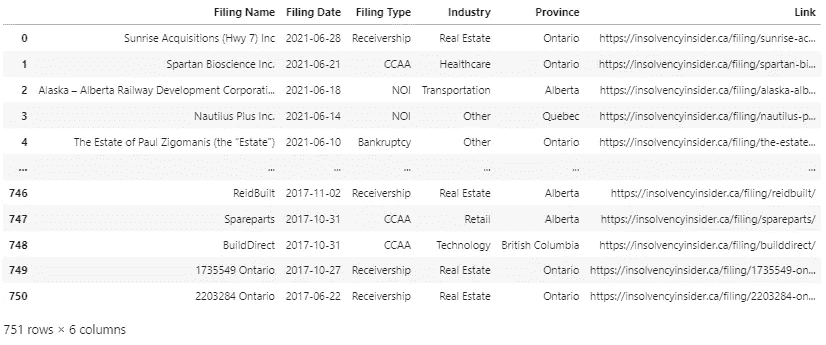

# Python 中 Selenium 的 Web 抓取

> 原文：<https://medium.com/codex/web-scraping-with-selenium-in-python-832cf4b827a4?source=collection_archive---------2----------------------->


由[阿诺·弗朗西斯卡](https://unsplash.com/@clark_fransa?utm_source=medium&utm_medium=referral)在 [Unsplash](https://unsplash.com?utm_source=medium&utm_medium=referral) 上拍摄的照片

通常，数据对我们来说是公开的，但不是以一种容易使用的形式。这就是网络抓取的用武之地。网络抓取是从网站提取数据的过程。我们可以使用 web 抓取将我们想要的数据转换成一种方便的格式，然后可以使用。在本教程中，我将展示如何使用 Python 中的 selenium 包从网站中提取感兴趣的信息。硒是极其强大的。它允许我们驱动一个浏览器窗口，并以编程方式与网站进行交互。Selenium 也有几种方法，使得提取数据非常容易。

在本教程中，我将在 Windows 10 上使用 Python3 在 Jupyter 笔记本上进行开发。

首先，我们需要下载一个驱动程序。在本教程中，我将使用谷歌浏览器的 ChromeDriver。有关支持的驱动程序和平台的完整列表，请参考[https://www.selenium.dev/downloads/](https://www.selenium.dev/downloads/)。如果你想使用谷歌浏览器，去 https://chromedriver.chromium.org/[下载与你当前版本谷歌浏览器相对应的驱动程序。](https://chromedriver.chromium.org/)

一旦你安装了驱动程序，你就可以开始写代码了。让我们从导入我们将使用的库开始:

```
from selenium import webdriver
import urllib3
import re
import time
import pandas as pd
```

现在我们已经导入了库，我们需要初始化 Chrome webdriver 对象。您需要指定驱动程序的路径:

```
# Create driver object. Opens browser window.
path = "C:/Users/Robpr/OneDrive/Documents/chromedriver.exe"
driver = webdriver.Chrome(executable_path=path)
```

您应该会看到一个空白的 Chrome 窗口出现，如下所示。



图 selenium 打开的 Chrome 浏览器。

接下来，我们需要导航到我们感兴趣的网站。最近，我一直在收集 insolvencyinsider.ca 来归档数据，所以我将使用它。用`get()`方法导航到[https://insolvencyinsider.ca/filing/](https://insolvencyinsider.ca/filing/):

```
# Navigates browser to insolvency insider.
driver.get("[https://insolvencyinsider.ca/filing/](https://insolvencyinsider.ca/filing/)")
```

你应该看到你的浏览器导航到破产内幕。



图 2:将浏览器导航到 insolvencyinsider.ca/filing/

如果你向下滚动到页面底部，你会注意到一个讨厌的“加载更多”按钮。如果没有 selenium，我们将被限制在数据的第一页。

Selenium 为在网页上定位元素提供了几种方法。我们将使用`find_element_by_xpath()`方法创建一个按钮对象，然后我们可以与之交互:

```
# Creates "load more" button object.
loadMore = driver.find_element_by_xpath(xpath="/html/body/div[2]/div/main/div/div/div/button")
```

在我们继续之前，我们需要知道有多少页，这样我们就知道我们需要点击按钮多少次。我们需要一种提取网站源代码的方法。幸运的是，使用`urllib3`和`re`库，这个过程相对来说没有什么痛苦。

```
url = "[https://insolvencyinsider.ca/filing/](https://insolvencyinsider.ca/filing/)"
http = urllib3.PoolManager()
r = http.request("GET", url)
text = str(r.data)
```

`text`现为一串。现在，我们需要一种从我们的`text`字符串中提取`total_pages`的方法。打印`text`来看看我们如何使用 RegEx 和`re`包来提取它。我们可以`total_pages`这样:

```
totalPagesObj = re.search(pattern='"total_pages":\d+', string=text)totalPagesStr = totalPagesObj.group(0)totalPages = int((re.search(pattern="\d+", string=totalPagesStr)).group(0))
```

`search`方法接受一个模式和一个字符串。在这种情况下我们的模式是`'"total_pages":\d+'`。如果您不熟悉 RegEx，这意味着我们正在寻找冒号后有两位或更多数字的字符串`"total_pages":`。`\d`表示 0 到 9 之间的一个数字，而`+`表示 Python 应该寻找一个或多个前面的正则表达式。你可以在这里阅读更多关于`re`包[的内容](https://docs.python.org/3/library/re.html)。`search()`方法返回一个`Match`对象。`re`提供了`group()`方法，该方法返回一个或多个匹配的子组。我们将`0`作为参数传递，以表明我们想要整个补丁。第三行只是从字符串中提取对应于`total_pages`的整数。

完成后，我们现在可以加载破产内幕的每一页。我们可以通过访问对象的`click()`方法点击*加载更多的*按钮。我们在点击之间等待三秒钟，这样我们就不会淹没网站。

```
# Clicks the Load more button (total pages - 1) times with a three second delay.
for i in range(totalPages-1):
    loadMore.click()
    time.sleep(3)
```

一旦你运行这个，你应该看到*加载更多的*按钮被点击，剩下的页面被加载。

一旦每个页面都被加载，我们就可以开始抓取内容了。现在，抓取某些元素，比如文件名称、日期和超链接，非常简单。我们可以使用 selenium 的`find_elements_by_class_name()`和`find_elements_by_xpath()`方法(注意`element`后面多出来的`s`):

```
# Creates a list of filing name elements and a list of filing date elements.
filingNamesElements = driver.find_elements_by_class_name("filing-name")
filingDateElements = driver.find_elements_by_class_name("filing-date")
filingHrefElements = driver.find_elements_by_xpath("//*[[@id](http://twitter.com/id)='content']/div[2]/div/div[1]/h3/a")
```

我们还需要备案元数据，即备案类型、备案公司的行业以及他们经营的省份。提取这些数据需要更多的工作。

```
filingMetas = []
for i in range(len(filingNamesElements) + 1):
    filingMetai = driver.find_elements_by_xpath(("//*[[@id](http://twitter.com/id)='content']/div[2]/div[%d]/div[2]/div[1]" %(i)))
    for element in filingMetai:
        filingMetaTexti = element.text
        filingMetas.append(filingMetaTexti)
```

`text()`方法以字符串的形式返回元素的文本。上面的代码片段会产生如下列表:

```
['Filing Type: NOI\nCompany Counsel: Loopstra Nixon\nTrustee: EY\nTrustee Counsel: DLA Piper\nIndustry: Food & Accommodation\nProvince: Alberta', ... ]
```

从`filingMetas`的每个元素中，我们可以提取文件类型、行业和省份，如下所示:

```
metaDict = {"Filing Type": [], "Industry": [], "Province": []}for filing in filingMetas:
    filingSplit = filing.split("\n")

    for item in filingSplit:
        itemSplit = item.split(": ")

        if itemSplit[0] == "Filing Type":
            metaDict["Filing Type"].append(itemSplit[1])
        elif itemSplit[0] == "Industry":
            metaDict["Industry"].append(itemSplit[1])
        elif itemSplit[0] == "Province":
            metaDict["Province"].append(itemSplit[1])

    if "Filing Type" not in filing:
        metaDict["Filing Type"].append("NA")
    elif "Industry" not in filing:
        metaDict["Industry"].append("NA")
    elif "Province" not in filing:
        metaDict["Province"].append("NA")
```

第二块`if`语句确保我们所有的键值都有相同的长度。如果我们想把这些数据放入熊猫的数据框架中，这是必要的。您可以验证情况是否如此:

```
for key in metaDict:
    print(len(metaDict[key]))
```

现在，我们仍然需要将我们的归档名称和日期放入列表中。我们通过使用前面的`text()`方法将每个元素文本追加到一个列表中来实现这一点:

```
# Initiates a list for filing names and a list for filing dates.
filingName = []
filingDate = []
filingLink = []# for each element in filing name elements list, appends the
# element's text to the filing names list.
for element in filingNamesElements:
    filingName.append(element.text)# for each element in filing date elements list, appends the
# element's text to the filing dates list.
for element in filingDateElements:
    filingDate.append(element.text)for link in filingHrefElements:
    if link.get_attribute("href"):
        filingLink.append(link.get_attribute("href"))
```

你也可以用两行列表理解来完成。

一旦我们有了这些，我们就准备把所有的东西放进一个字典里，然后创建一个熊猫数据框架:

```
# Creates a final dictionary with filing names and dates.
fullDict = {
    "Filing Name": filingName,
    "Filing Date": filingDate, 
    "Filing Type": metaDict["Filing Type"],
    "Industry": metaDict["Industry"],
    "Province": metaDict["Province"],
    "Link": filingLink
}# Creates a DataFrame.
df = pd.DataFrame(fullDict)
df["Filing Date"] = pd.to_datetime(df["Filing Date"], infer_datetime_format=True)
```

瞧！现在我们有了各种破产申请的数据库。



图 3:破产申报数据表。

我希望你发现这个教程是有用的。现在，您可以使用 selenium 从各种网站提取数据。