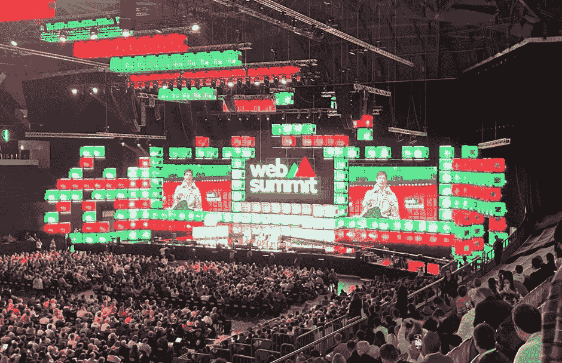
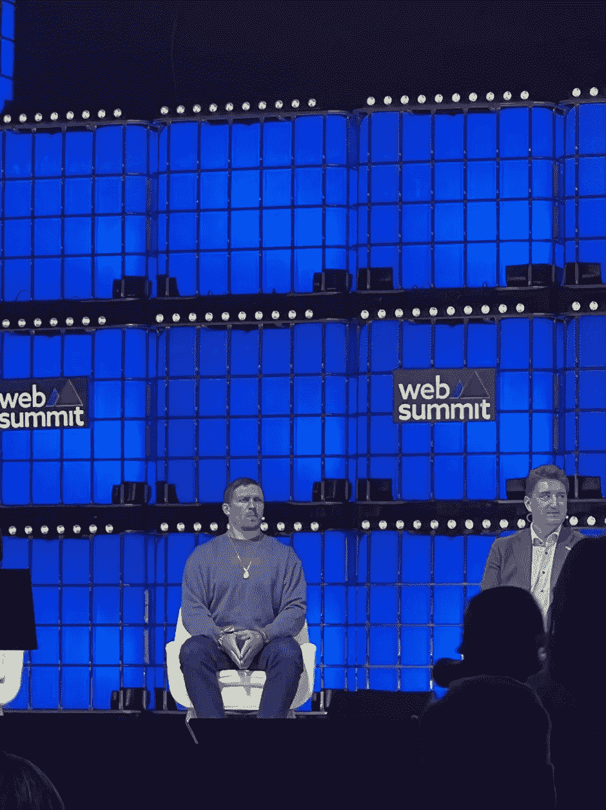

# 作为第一个计时器的网络峰会:如何充分利用它

> 原文：<https://medium.com/codex/web-summit-as-a-first-timer-how-to-make-the-most-out-of-it-66b218a505e6?source=collection_archive---------7----------------------->

这个月早些时候，我参加了我的第一次网络峰会。以下是我对明年第一次去的人的三点建议…

[*卢克·亨纳利*](https://twitter.com/lukehennerley) *，侧钻首席工程师*

作者图片

# 什么是网络峰会？

网络峰会已经成为世界上最大、最好的科技会议之一。他们全年的其他活动在里约热内卢、多伦多(碰撞)、香港，当然还有里斯本举行；Sidetrade 的首席技术官 Mark Sheldon 和我刚刚参加了。

每年有超过 70，000 名与会者参加这个会议，观众包括科技初创企业、投资者、媒体和技术社区。

人们来到网络，向业内最优秀的人学习，带着灵感离开，准备行动。这真的是一次很棒的会议，也是我梦寐以求多年的会议。

然而，这也是一个巨大的事件，回想起来，重要的是要做好准备，以确保你充分利用它。

很难将此归纳为一个简明的列表，因为正如我们所提到的，在活动中有太多的事情要做，现实是我们可能只看到了活动的 25-30 %(如果是这样的话),但我试图在我们的第一次网络峰会后将我们的建议归纳为三点。

# 提示 1:获得免费(或大幅折扣！)票

我们必须大声喊出[网络峰会](https://websummit.com/)组织者的惊人举措，他们明确承诺确保该活动尽可能为编码人员、构建人员和程序员所用。

在今年的活动之前，我利用了[开发者计划](https://websummit.com/blog/developer-programme-tickets-tech-conference)，在那里你可以作为开发者通过你的 [Github](https://github.com/) 申请免费门票。还有其他人，包括我遇到的科技赛道上的女性，他们也提供大折扣的门票。

因此，我们的第一个建议是，在买票时，看看你有哪些不同的选择。你可能不需要为欧洲最大的科技会议支付全额费用(该会议的费用最高可达€1000 英镑)。有选择获得大幅折扣，甚至像我们一样免费门票！

# 提示 2:为你的旅行和住宿做好充分准备

到达目的地

活动在[高地竞技场](https://arena.altice.pt/)举行，该竞技场朝向机场和最近的地铁站 [Oriente](https://www.lisbonportugaltourism.com/transportation/oriente-station.html) 。

如果你住在里斯本的市中心，有一小段路程，交通有时会很混乱——记住，有超过 70，000 人走上会场，高峰时间是上午 9 点到 10 点。

所以，我的建议是，尽量减少旅行压力，去机场拿你的证件。有了这个，你可以通过网站顶端的第二个入口，而不是通过主入口，这可能被视为一个更快的方式进入。

*在活动现场*

就网站的结构而言，当你看地图时，这个活动的规模令人望而生畏。除了在主舞台上容纳数千人的巨大竞技场之外，在快餐车的“食品峰会”之间还有六个展馆，其中有一些归巢式的多个舞台，包括类似谷歌云的运行研讨会和大师班，从 SRE 的相关主题到使用他们的启动程序。一些边会非常精彩，我们最喜欢的阶段是“FullSTK”阶段，深入探讨一些在边会上引起我们共鸣的酷话题。

*里斯本内外*

就我们住的地方而言，里斯本市中心的马克斯·德·庞巴尔是我们这几天的好去处。如果你不能待在那里，任何靠近地铁干线的地方都不错。

在网络峰会期间，里斯本会有很多不同的外围活动，所以明智地利用活动之外的空闲时间是很重要的。从冰镇网络饮料到大卫·盖塔等人的亮相，每个人都有自己的选择。如果你不喜欢这些，你可以出去探索里斯本这个美妙的城市。

这完全取决于你想从你的时间中得到什么，但有一点是肯定的，里斯本的红热技术场景在一年中的这一周聚集了最好的技术，所以在你去之前做你的研究，并确保节省时间出去探索，而不仅仅是会议。

作者图片

# 提示 3:为你想从活动中得到的东西定义明确的目标

因为这个事件的规模是巨大的，同时又是鼓舞人心的，令人无法抗拒的，如果你想充分利用你在那里的时间，重要的是定义你的“为什么”,并不断提醒自己。

**在你到达里斯本之前，一定要确定你想从这次活动中获得的一些明确的目标，并概述它们将如何在未来对你有益。**

由于 [Sidetrade](http://www.sidetrade.com/) 是一家人工智能公司，对我们来说，我们特别专注于听取数据、人工智能/人工智能领域的最新趋势，并找到一些关于市场未来的鼓舞人心的话，我们可以将这些话带回 Sidetrade 的[超级英雄研发团队](https://sidetrade-tech-hub.medium.com/building-a-superhero-culture-inside-engineering-4e88438ee93b)，纳入我们的路线图，并确定发展机会。

确定目标后，确保提前查看会议议程。研究活动，找到与您自己的主题相关的话题，但也要确保查看这些讲座的阶段。你需要现实地对待你的时间，并认识到由于会议的规模，你不可能看到所有的东西，即使是在你自己定义的焦点区域内。

尽可能把你参加的会谈安排在一起。否则，你会在会场来回跑得筋疲力尽，很可能会错过重要的东西！第二天，我们在 FullSTK 舞台上进行了 3-4 次会谈！

# 额外内容:我认为里斯本 2022 年网络峰会的三大亮点…

主题演讲的排列和变化令人难以置信。来自科技巨头的重量级创始人，比如:

[革命报](https://www.revolut.com/)尼古拉·斯托龙斯基

韦尔塞尔的吉列尔莫·劳赫

[蒙特卡洛的](https://www.montecarlodata.com/about-us/)巴尔摩西

…来自技术领域之外的演讲者的鼓舞人心的演讲，包括:

梅赛德斯 F1 的 Toto Wolff 讲述了他们本赛季的挑战，以及他们如何获得优势

世界重量级拳王亚历山大·乌塞克在一个讲台上用乌克兰语发表了一篇震撼人心的演讲，让我们想起了他在祖国所面临的麻烦。

世界重量级冠军，亚历山大·乌塞克——图片由作者提供

对我来说，我的三个最精彩的演讲是:

1) [蒙特卡洛](https://www.montecarlodata.com/about-us/)(自制数据可观察性市场的独角兽)讲述了数据质量如何侵蚀以数据为中心的公司的时间及其引发的问题，引用了一个关于一个简单的数据质量问题如何拖垮网飞数小时并使他们损失数百万美元的故事。在构建我们的数据湖方面，我们 Sidetrade 确实处于这一新兴数据基础设施市场的尖端，您可以通过我们的[数据湖浏览器](https://datalake.sidetrade.com/)查看这一点，我们非常重视我们的数据质量，听到来自该领域一家公司的这种验证真是太酷了。

2)人工智能/人工智能和分析主题的广泛多样性也给我留下了深刻的印象，例如，[数据库](https://www.dataiku.com/)的创始人兼首席执行官 Florian Douetteau 的演讲题为“是时候定义人工智能了”。我们正在 Sidetrade 进行我们自己的旅程，听到这里的一些参考资料以及围绕 MLOps 等主题与我们自己的内部讨论保持一致，确实引起了我们的共鸣。

3)但是真正让我们印象深刻的一个演讲来自我们最喜欢的舞台，来自牛津量子电路公司的 Ilana Wisby 博士谈论的是一个“量子驱动的未来”。这一次真的让我们大吃一惊，尤其是维斯比博士是如何设法以一种所有观众都能理解的方式讲述如此复杂的话题的。这是非常迷人的，我们从她的演讲中获得了兴奋和灵感，关于数据和量子计算世界在未来可能的交集。

在市场动荡和消极的时候，超过 70，000 名技术爱好者参加的活动让我们看到了一个事实，即我们作为技术人员一如既往地创新和坚定。

许多勇敢的建设者仍在建设，正如“iPhone 之父”托尼·法德尔(Tony Fadell)在主舞台上提出的观点之一，最好的公司是在市场动荡期间建设和诞生的，提供了 2008 年 Airbnb 和优步的例子……建设的最佳时机是现在，他说。

如你所见，参加网络峰会有很多收获。我希望这些建议对你有所帮助，请在下面的评论中分享你的其他建议。

希望明年能在那里见到你，同时，给我们一个关注，以跟上我们在 [Sidetrade 的技术中心](https://sidetrade-tech-hub.medium.com/)所做的事情！