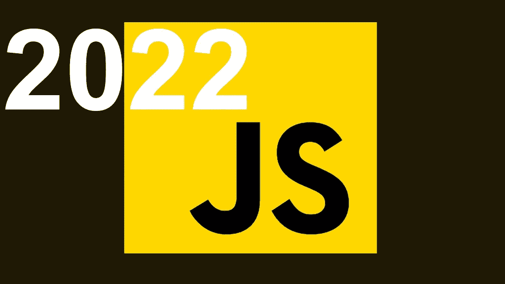

# Web3.0 构建模块:2022 年关于 JavaScript 你需要知道的 8 个特性

> 原文：<https://medium.com/codex/web3-0-building-block-8-features-you-need-to-know-about-javascript-in-2022-a806749bd277?source=collection_archive---------9----------------------->

根据 Stack Overflow 的 2020 年开发者调查，JavaScript 目前是世界上最常用的语言(69.7%)，其次是 HTML/CSS (62.4%)、SQL (56.9%)、Python (41.6%)和 Java (38.4%)。它也是最受招聘经理青睐的编程语言。