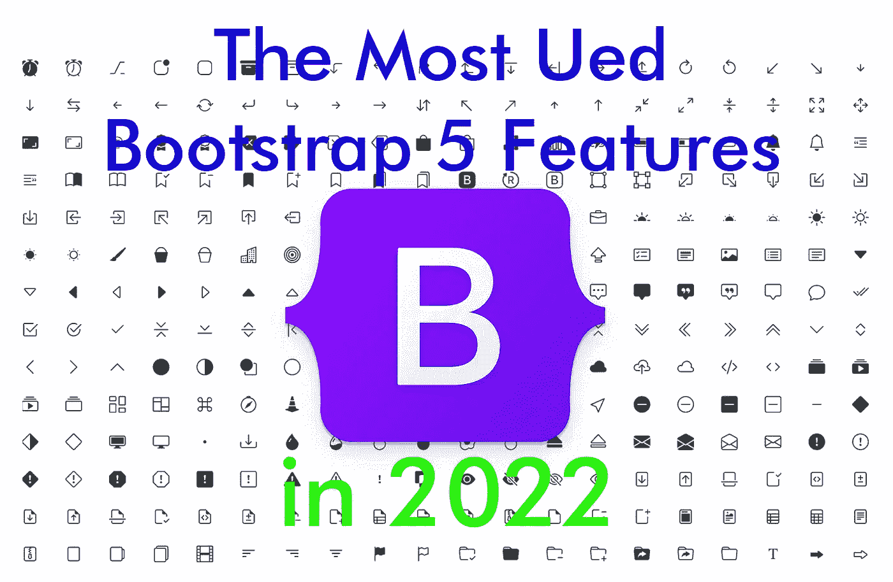

# web 3.0:2022 年最常用的 Bootstrap 5 特性

> 原文：<https://medium.com/codex/web3-0-the-most-frequently-used-bootstrap-5-features-in-2022-29a07d58d40a?source=collection_archive---------9----------------------->

Bootstrap 是响应式网站设计最流行的前端开源框架之一。但是如果你是 bootstrap 概念的新手，你会发现它的文档相当吓人。

下面，我将向您展示对您在 Bootstrap 5 中更好地构建代码有用的关键特性。