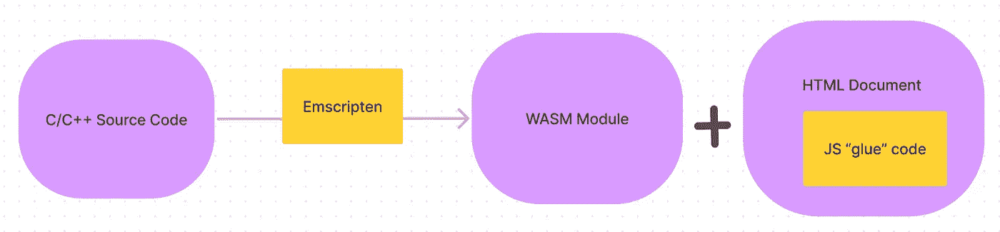

# WebAssembly:桥梁

> 原文：<https://medium.com/codex/webassembly-the-bridge-19d0e999064f?source=collection_archive---------10----------------------->

WebAssembly 又名 WASM，可以被视为 JavaScript 和机器代码之间的桥梁。WebAssembly 是一种低级语言，具有紧凑的二进制格式，以接近本机的性能运行。它是像 **Rust、AssemblyScript、C/C++** 等语言的**编译目标**！

# WASM 为什么有用？

WASM 旨在为网络提供高度优化的计算和性能。JavaScript 是一种很棒的语言，它并没有考虑到性能，但当它与其他语言和 WebAssembly 一起使用时，它可以带来出色的性能和两个世界的最佳特性！。

WASM 可以在现代浏览器中重复利用用完全不兼容的语言为完全不同的平台编写的代码。

虽然 WebAssembly 被设计为在 Web 上运行[，但是它也能够在其他环境中很好地执行，包括从外壳到成熟的应用环境，例如在数据中心的服务器上、在物联网设备上等等。比如—桌面 WebAssembly，](https://webassembly.org/docs/web/)[Nebulet](https://github.com/nebulet/nebulet)—只运行 WebAssembly 的操作系统微内核。

它旨在但不限于帮助浏览器运行密集的计算任务，如仿真、VR/AR、图像识别等。更有效率。

使用 WebAssembly 将 Google Earth 移植到浏览器

Unity、Tensorflow.js、Google Earth 是利用 WASM 的一些主要项目。这是完整的名单——https://madewithwebassembly.com/

# WASM 的工作

让我们以 C/C++源代码为例来看看它的工作原理:

汇编通常是指类似于机器代码的人类可读语言。机器码是你的处理器理解的，0 和 1。每一种高级编程语言都被翻译成机器代码，以便在处理器上运行。

不同种类的处理器架构(x86、ARM 等。)需要不同的机器码和不同种类的装配。当浏览器下载 WebAssembly 代码时，它可以快速将其转换为任何机器的程序集。

1.  Emscripten 将源代码转换或编译成. wasm 二进制文件或 wasm 模块。
2.  WebAssembly 当前无法直接访问 DOM。因此，要访问任何 Web API，WebAssembly 需要调用 JavaScript，然后 JavaScript 调用 Web API。因此，Emscripten 创建了实现这一目标所需的 HTML 和 JavaScript 粘合代码。

粘合代码——源代码中使用的库的功能，调用 JavaScript APIs 获取、加载和运行。wasm 文件。

HTML 文档—它显示代码的结果

WebAssembly 有一个易于阅读的文本格式。wat) ，但是二进制表示是你实际交付给浏览器的*(。wasm)* 。

# WASM 特色

*   **高效-** 正如WASM 是一种低级二进制格式，体积较小，在网络浏览器中加载速度较快。当这些浏览器执行 WASM 代码时，它们会更快地从服务器获取代码。它支持**流编译**，即在下载文件时编译成机器码*。更详细地说，JavaScript 引擎可以将文件编译成本机代码，但是需要先下载文件。然而，另一方面，WebAssembly 可以在字节进入时编译成机器码，从而显著加快启动时间。*
*   **安全** - WebAssembly 是**沙箱化的**，沙箱化意味着出于安全目的隔离或限制脚本可以做的事情的范围。它不能直接访问用户的操作系统，它只能访问与 JavaScript 相同的 API。WebAssembly 还为 C/C++等语言提供了额外的安全性。
*   **低级字节码**——高级编程语言代码(如 C++或 Rust)被编译成机器可读的二进制目标代码，也就是字节码。字节码是为软件高效执行而设计的指令集，通常这种软件是虚拟机。这使得它非常低级，这使得性能优化，但仍然是可移植的；你不用担心哪个 CPU (x64，ARM 等。)你的用户有。
*   **开放 web 平台**的一部分——web assembly 被设计成保持 web 的无版本、经过功能测试且向后兼容的[特性。WebAssembly 模块将能够调入和调出 JavaScript 上下文，并通过可从 JavaScript 访问的相同 Web APIs 访问浏览器功能。](https://webassembly.org/docs/web/)

# 如何开始或使用 WebAssembly？

以下是使用 WebAssembly 进行开发的一些方法:

*   WebAssembly 模块可以导入到 web(或 Node.js)应用程序中，通过 JavaScript 公开 WebAssembly 函数以供使用。
*   使用类似于 TypeScript 的 AssemblyScript 编译成 WebAssembly 二进制文件。
*   使用 Emscripten 传输 C/C++应用程序(将 C/C++编译成 wasm)。

以下是 wasm 代码“Hello World”的入门链接—[https://wasmbyexample . dev/examples/Hello-World/Hello-World . c . en-us . html](https://wasmbyexample.dev/examples/hello-world/hello-world.c.en-us.html)

最后，WebAssembly 是从高级代码到机器代码的桥梁，也是通向更强大浏览器的桥梁。它鼓励使用更多用于开发的语言。它将很快被广泛使用，而不仅仅是浏览器。一定要看看 [awsm-wasm](https://github.com/mbasso/awesome-wasm) 关于 wasm 的一切！。