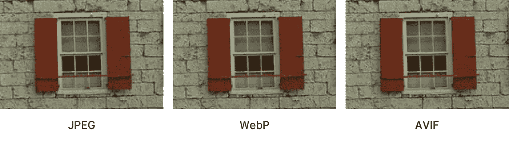

# WEBP、AVIF 和 JPEG XL，更好的网站图像格式

> 原文：<https://medium.com/codex/webp-avif-and-jpeg-xl-better-image-formats-for-websites-31df8e48c507?source=collection_archive---------1----------------------->

图片来自 Johannes Slipola 关于 WEBP 和 AVIF 的文章

过去 25 年的障碍之一是浏览器制造商对新图像格式支持的缓慢采用。它基本上让 JPEG2000 这样的高级编码方法胎死腹中，只是因为缺乏供应商的支持。

说真的，如果你看看 JPEG2000 支持: