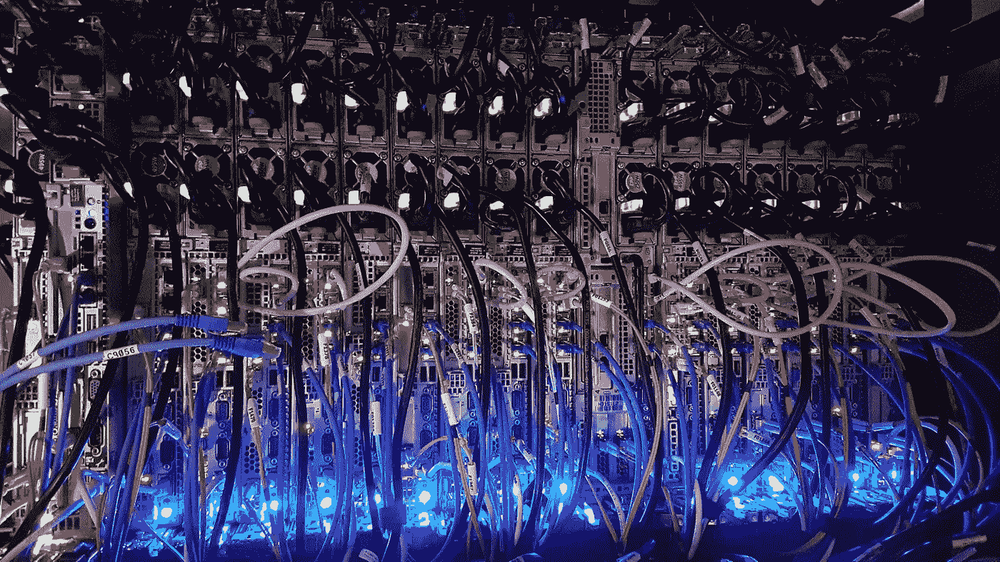

# web sockets——它还有用吗？

> 原文：<https://medium.com/codex/websockets-is-it-still-useful-3c6b3b2da7c4?source=collection_archive---------1----------------------->

马西莫·博图里在 [Unsplash](https://unsplash.com/s/photos/network?utm_source=unsplash&utm_medium=referral&utm_content=creditCopyText) 上拍摄的照片

在这篇文章中，我将讨论 Websockets。Websockets 已经存在了一段时间，所以您很可能已经知道或听说过它。这篇文章是为那些想知道它是什么或者想快速更新知识的人准备的。我们还将看到一个示例 WebSocket 服务器和一个客户机，以了解它是什么。

## 什么是 Websocket？