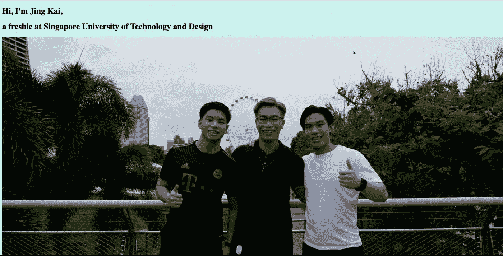
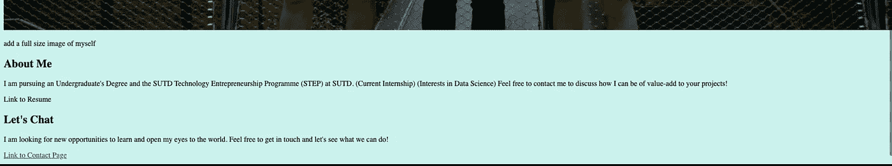
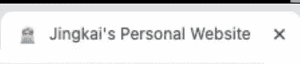
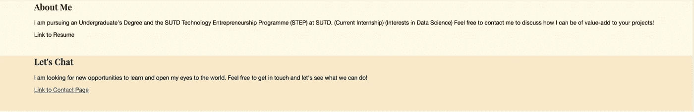
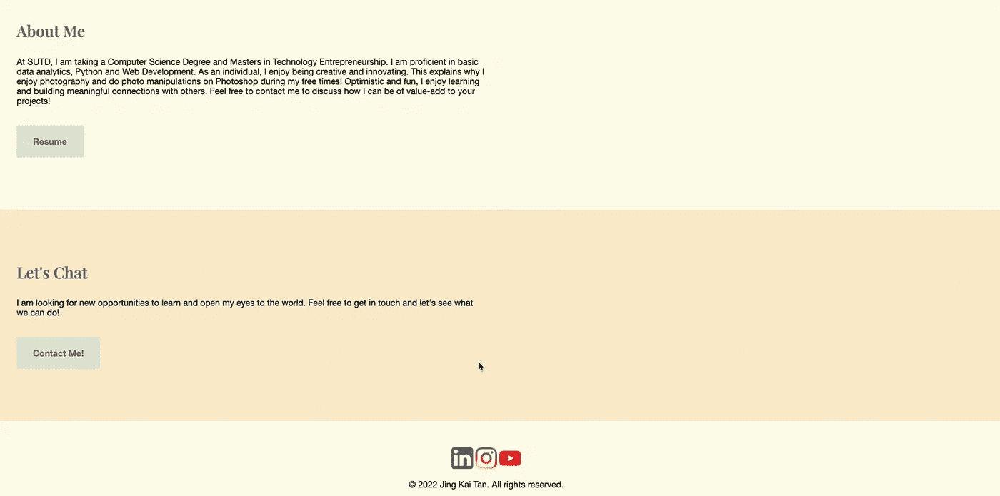
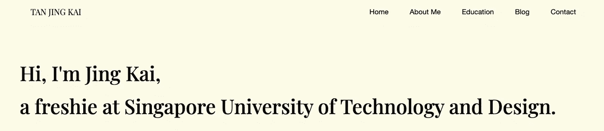
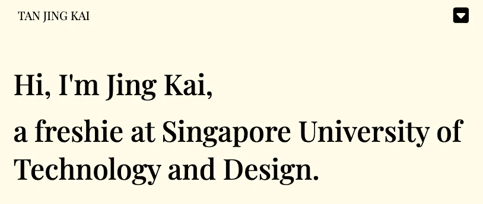
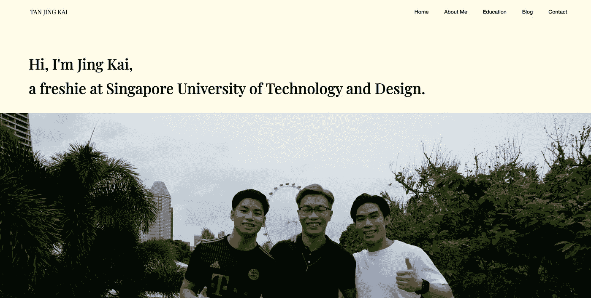

# 第一周:基础——网络开发

> 原文：<https://medium.com/codex/week-1-foundations-webdev-96cb491056ae?source=collection_archive---------20----------------------->

嘿大家好！我希望这一周你们都过得很好。在上个月学习了 SQL 和数据分析之后，我决定开始一个新项目，**用 HTML 和 CSS** 建立自己的个人网站。希望这能激励你们中的一些人去尝试新的东西，去追求你一直想做的事情！现在，让我们来看看我在第 1 周的进展吧！

# 第一天[170522]

我想出了只有 HTML 的主页的基本结构。该图像被添加了一个<*图像>* 标签。我还把文字分离成不同的标签，分别是<*h1><H3>*和 *< p >标签*。

先看网页。

我使用了<*和>标签*来链接后续网页，以备将来使用。我创建了一个文件 *styles.css* 来改变主体的背景颜色为浅蓝色。我还学会了如何在我的网站上添加一个**图标**，这使得我的网站的标签栏看起来更漂亮。

向下滚动，这就是你将看到的。

向我的网站添加收藏夹图标

# 第二天

第二天，我开始处理主页的 CSS 元素。我添加了 *< div >* 标签来将我的网页分成 4 个不同的部分，并添加了*边距*来将文本从屏幕的角落移开。我还从谷歌字体中为我的 *< h1 >* 和 *< h3 >* 标签导入了 Playfair 显示字体，并将 *< p >* 的字体改为了 Helvetica。

对主页的修改

我改变了不同区域之间的颜色，使这些区域更加明显。

为不同的分区添加不同的颜色

# 第三天[190522]

第三天，我的重点是提高“关于我”和“让我们聊天”部分的美感。我没有让文字一直延伸到边缘，而是使用边距来缩短描述的宽度。我改变了 *< h3 >* 标题标签的字体和颜色，并添加了链接后续页面的按钮。

我还在页脚添加了我各自的社交媒体网站的链接，并用它们各自的图标美化它们。

# 第四天

第四天，我非常专注于创建一个导航栏。我使用了

元素并从 fontawesome 中导入了下拉图标来制作这个简单的导航栏。导航栏还提供了必要的链接，将浏览者引向其他可用的页面。

完全展开时的导航栏。

较小屏幕尺寸的导航栏。

这是我这周的进展。我很期待看到最终产品的样子。在那之前，注意安全，希望你们都有一个愉快的周末！

第一周结束时的网站

景凯:)