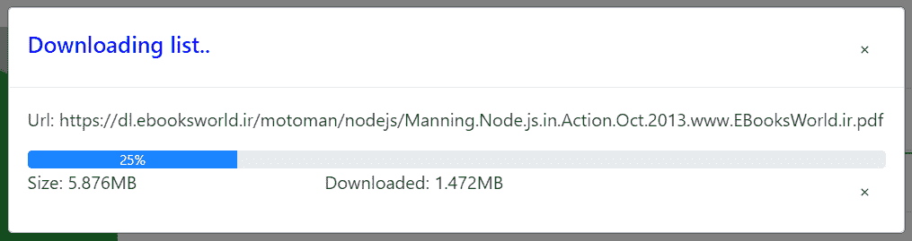

# 欢迎来到 pl-core-utils-library

> 原文：<https://medium.com/codex/welcome-to-pl-core-utils-library-611776d7b99e?source=collection_archive---------18----------------------->

支持新旧应用程序的核心库，负责向开发人员展示一些已经准备好并经过测试的服务，用于管理页面导航、网络服务等方面的所有控制流，例如截取所使用的浏览器，以及专门化该类型浏览器可能缺少的其他功能。在软件包中有说明软件包各种特性的文档。

# 特征

1.  网络服务对于 ajax 调用，所有暴露的方法都可以被解除，这样就不会留下挂起的 ajax 调用，如应用程序路由更改或其他。
2.  网络缓存服务，独立管理已配置调用的缓存历史化。通过此服务，可以返回到缓存，从而避免对 BE 的进一步调用
3.  组件，通过调用它的打开，可以返回到所有当前活动的后台进程，并逐个终止它们的执行
4.  浏览器拦截服务能够触发主机系统的身份验证过程，并在每个系统的基础上安装附加功能。例如，根据 IE，文件下载机制被调整，因为不同浏览器的行为不同
5.  支持阻塞声明不兼容的浏览器，在应用程序启动时自动阻塞
6.  增加了对复杂流程虚拟化的支持。能够虚拟化繁重的流程，使其不会影响应用程序性能
7.  添加了图形功能，如页面截图
8.  增加了实时拦截系统来检查网页的大小，以确定其大小
9.  自动插入字符串、数组和 json 的新特性
10.  服务从当前显示的页面标题中检索信息。
11.  二分搜索法等要素的实用程序类
12.  增加了实用装饰器来加速 DOM 组件转换或抑制过程
13.  模拟服务，执行自主网络呼叫模拟的可能性
14.  在网络端增加了创建和删除 blobs 的功能。
15.  BaseComponent 的创建，它的扩展允许包含所有就绪和可用的服务，它还接收路由参数

# 恰玛特 HTTP

该系统配备了对 BE 呼叫有用的服务，这些呼叫有可能在某些事件发生时被终止

```
callMock(p1: any, p2: any): Observable<any> {
    return new Observable<any>(obs => {
        let plHttpRequest: PlHttpRequest = new PlHttpRequest(
            environment.http.api.mock,
            Object({ api: "api", files: "files" }),
            Object({ api: p1, files: p2 }),
            null);
    this.httpService.GETFILE(plHttpRequest, RESPONSE_TYPE.ARRAYBUFFER, (idAjax => {
        setTimeout((id) => {
           PlCoreUtils.progressBars[id].interrupt.next(true);
        }, 10,idAjax);
    }), null).subscribe(sb => {
    obs.next(sb);
    obs.complete()
    }, error => {
        obs.error(error);
    }, () => { })
    })
}
```

在这个例子中，服务在 10 毫秒后终止，显然在文件下载的情况下，这结束了文件的下载。终止事件也可以不同的方式开始，例如通过按钮。

可以声明包含 pathParams 的 url，系统将自动提供它的增强功能。

```
mock: {
    url: "@cachable@/example/:api/:files",
    mocked: true,
    method:"GET"
}
```

通过 plHttpRequest 传递对象，这将自动替换参数值，例如“api”和“文件”

```
let plHttpRequest: PlHttpRequest = new PlHttpRequest(
    environment.http.api.mock,
    Object({ api: "api", files: "files" }),
    Object({ api: p1, files: p2 }),
    null);
```

> 我们警告，如果不匹配，包含要在 pathparams 中设置的值的对象的键必须与 pathparam 本身相同，但不包含“:”..替换不会发生，随之而来的是 URL 格式的错误。

# 启用网络呼叫缓存的示例

如上所述，该系统还提供缓存服务，以避免由于对具有相同请求和明显相同响应的 BE 的突然调用而造成的网络负担。对于缓存配置，建议在服务的 url 中插入一个简单的注释。

```
/**
    @author l.piciollo
    si riporta un esempio di una api riconosciuta come storable, grazie al tag @cachable@ presente nella URL.
    si nota come i parametri sono passati con {0} e {1}.. il sistema è equipagiato da una funzionalita che specializza
    le stringhe ad avere il format function.. quindi .. è possibile formattare la url richimandola in questo modo:
    E.S.
    let url = environment.exampleApi.format("P1","P2")
    quindi avviene una formattazione per posizione dei paraetri..
    exampleApi: `@cachable@/example/cacable/api?param1={0}&param2={1}`
*/
exampleApi: `@cachable@/example/cache/api?param1={0}&param2={1}`,
exampleApeNoCache: `example/no/cache/api?param1={0}&param2={1}`
```

> 如您所见，@cachable@已经作为 url 的前缀，这表明在调用网络和响应客户端时，url 都必须提交给缓存引擎。
> 
> 默认情况下，要插入的标签是 [@cacable](http://twitter.com/cacable) ，您可以用任何值替换它，在应用程序启动模块中适当地配置服务

{ provide: MAX_CACHE_AGE，useValue: 300000 }，

{ provide: CACHE_TAG，useValue: "@cachable@" }

像标签一样，也可以配置缓存的有效时间。一旦时间到期，它将从缓存中删除，以便您可以请求新的更新

# 进度条打开

已经创建了用于 BE 调用的排队系统，可以监控它们的进程或停止它们的执行。

> 这个特性在调用下载或上传文件时非常有用，因为它们可能需要很长时间..对于“简单”的调用，显然这个实用程序没有用。

有两种方式显示进度条

1.  显示所有进度事件队列；
2.  仅显示一个进度事件队列；

要显示所有队列，请调用 follow 方法

```
this.progressService.showQueueDownload(".test");
```



> 你可以看到，传递一个 css 类是必要的，这是用来获取容器，它可以插入进度条组件来显示它
> 
> 所有的进度条组件，有一个按钮“x ”,这杀死运行的进程和杀死调用网络，在这种情况下，将为前端和后端释放内存

为了显示一个网络调用的单个进程，有必要获取 id 调用网络，在调用 BE 时通过，并跟踪进程事件。

所以可以为注册事件创建两个实用函数

对于注册，可以进行如下操作

> *同样的，也可以用 folow 命令杀死 progressino】*

plcoreutils . progress bars[IDA jax]. interrupt . next(true)；

# 装饰工示例

```
 @PLTraceHooks( )
export class AppComponent/**
    configurable decorator, if enabled, inhibits the creation of DOM components based on
    of the parameters launch
    document.dispatchEvent(new CustomEvent('PL:SET-PERMISSION', { detail
    [PROFILO1,PROFILO2,PROFILO3,...] }));
    insert in the DOM<input permission="READONLY" type="text>"
    and pass to decorator @PLPermission(true)
    dom element will be deleted as it does not contain the READONLY permission.
*/@PLPermission(environment.production)
export class AppComponent
```

# 其他特性的示例

代码将扩展为字符串、数组、JSON 的新功能，遵循一个示例调用

```
let user = {
    nome:"Luca" ,
    surname: "Pic"
}user=JSON.changeValuesByKey(user,"surname","Piciollo");
console.log(user);
```

> *将被打印——{诺姆:“卢卡”，姓氏:“皮乔洛”}*
> 
> *其他功能，可以同样的方式使用*

```
String {
    format: (...params) => string;
    isNullOrEmpty: (val: string) => boolean;
    truncateUrlIfNoParams: (val: any) => string;
    truncateUrlCache: (val: any) => string;
}Array<T> {
    moveDown: (from) => void;
    moveTo: (from, to) => void;
    moveUp: (from) => void;
    delete: (position) => void;
    differences: (items) => Array<any>;
    inArray: (item) => Number;
    insert: (index: number, item: any) => void;
}JSON {
    changeValues: (json,previousValue, nextValue) => any;
    changeValuesByKey: (json,key, nextValue) => any;
    findByValue: (json, value) => any;
    json2flat: (json) => any;
    json2array: (json) => any;
    json2flatObj: (json) => any;
    findKey: (json, keyFind) => any;
}
```

# mok 服务示例

下面显示了如何启用模拟服务来模拟 BE 调用，这在 BE 关闭或未实现的情况下是必要的。

```
/**
    esempio di chiamata http
*/callMock(p1: any, p2: any): Observable<any> {
    return new Observable<any>(obs => {
        let plHttpRequest: PlHttpRequest = new PlHttpRequest(
        environment.http.api.mock ,
        Object({ api: "api", files: "files" }),
        Object({ api: p1, files: p2 }),
        null); this.httpService.GETFILE(plHttpRequest, RESPONSE_TYPE.ARRAYBUFFER, null, null).subscribe(sb => {
        obs.next(sb);
        obs.complete()
    }, error => {
         obs.error(error);
     }, () => { })
  })
}
```

在环境属性中声明，这

> *仅以*为例

```
/**
    @author l.piciollo
    it is possible to declare a call to a mock, it is advisable to respect the following declarative format
    E.S.
    mock: {
        url: "@cachable@/example/:api/:files",
        mocked: true,
        method:"GET"
    }
    the mock to true, forces the system to go back to the folder                     
    assets/public/mock/example/no/cache/api/122 and get the relative json , then 
 post||get||put||delete||patch .json
*/mock: {
    url: "@cachable@/example/:api/:files",
    mocked: true,
    method:"GET"
}
```

创建一个文件夹结构来存放存根文件。该结构必须从路径资产开始放置，并且必须有文件夹和子文件夹作为 url 的路径，显然不包括 queryparams。

*   对于调用类型 GET:**assets/public/mock/**example/:API/:file/**GET . JSON**
*   对于调用类型的 POST:**assets/public/mock/**example/:API/:file/* ***POST . JSON**

和其他。

> 路径 url 可以包含用 name 表示的变量，系统将自动截取路径参数，并自动用请求中传递的路径参数值替换这些值。
> 
> *Es。*

```
let plHttpRequest: PlHttpRequest = new PlHttpRequest( environment.http.api.mock , Object({ api: "api", files: "files" }), Object({ api: p1, files: p2 }), null);
```

HTTP 调用将 plHttpRequest 对象作为输入，该对象包含要调用的 URL、查询参数、主体参数和路径参数。在上面的示例中，我们看到对象包含 Object ({api: "api "，files: "files"})，对象的键必须与路径名 param 和值匹配，它将替换第一个名称。

其他方法也一样

> 例如，也可以用包含路径参数的 url 来模仿服务
> 
> / example /: id，在这种情况下创建文件夹结构，不包括文件夹名称中的“:”。
> 
> 可以更改模拟文件的引用路径，但是在任何情况下，它总是在 assets 下，必须在启动模块中添加以下指令

```
/**
    initializing path for mock structure
*/{ provide: DEFAULT_PATH_MOCK, useValue: "nuovo/path" }
```

# 相同的实用程序功能

可以利用一些有用的功能，例如图像管理。以下是可用于图形管理的功能

```
/**
    deals with converting an image exposed via blob url, in base 64 format
    @param imageUrl
*/public image2base64(imageUrl: string): Promise<any>/**
   Function that exports the entire svg element to a file for viewing in a browser,
    the construct will be faithfully maintained
    SVG element
    @param elementSVG : elementsvg to eleborate
    @param nameFIle : name saved file
*/public svg2File(elementSVG: HTMLElement, nameFIle: string): Observable<boolean>/**
    Function for the creation of the jpeg starting from a dom.
    the observer returns the link to the image for download
    @param elementSVG element SVG dom to capture
*/public dom2jpeg(elementSVG: HTMLElement): Observable<string>/**
    Funzione per la creazione del canvas, contenente l'immagine del DOM referenziato. non verranno presi in considerazione
    tag SVG grafici. ma solo html semplice comprese le immagini
    la funzione restituisce in callback il canvas creato, in modo da poterlo aggiungere al dom o altro.
    mentre in observer torna la url da passare alla funaione di download
    @param elementoDom : element to capture
    @param call : callback  where send  canvas created.
*/public domToCanvas(elementoDom: HTMLElement, call: (canvas: HTMLElement) => void): Observable<string>/**
    Function that deals with downloading an image from a canvas container, the canvas must contain an image not an html.
    this function can be used in response to domToCanvas
    the URL of the blob to download is returned
    @param canvas :object canvas to download
*/public canvasToImg(canvas: HTMLElement): Observable<string>/**
    Functionality for creating an image from a svg. the function eventually returns a canvas in callback
    to be shown on the screen and the url of the file in blob format in the observable
    @param svgElement : svg element   dom
    @param callBack : callback function for retrieve canvas
*/public svgToImage(svgElement: HTMLElement, call: (canvas) => void): Observable<any>
```

# alert()消息示例

引入了一个自定义 alert()系统，当窗口函数 alert()被调用时..将触发一个例程，该例程将以引导格式显示一个模态对话框。创建该功能是为了加速对消息的呼叫。

```
showMessage(){
	alert(title,message);
}
```


如您所见，该函数的使用非常简单和直接。

通过简单地禁用它，可以返回到默认的窗口功能。

```
constructor(private alertService: AlertService) {
	 this.alertService.enableAlertMessage(false);
 }
```

# PlBaseComponent

组件生来就是要扩展的，它提供了通过路由导航的有用功能。这里甚至可以通过 URL 传递复杂的参数，因为这些参数是经过编码的

```
/** call to menu with passage of parameters */
export class HomeComponent extends PlBaseComponent{
    go() {
        this.goToPage("home/menu", null, { P1: "param1", p2: { param2: "param2" }, p3: { param3: "param3" } });
    }
}/** reading of the parameters arrived */
export class MenuComponent extends PlBaseComponent{
    ngOnInit() {
          this.queryParams.subscribe(user => {
            this.user = user;
            this.userName = String(Object.keys(user)[0]);
            this.pathDetailUser = user[(Object.keys(user)[0])];
          })
          this.data.subscribe(user => {
            .....
          })
          this.params.subscribe(user => {
            .....
          })
    }       
}
```

> *ES:*T12*http://localhost:4200/#/home？OBJ = eyjob 21 lmsi 6 imnpyw 8 ILC job 21 LMI 6 imnpyw 8 ifq % 3D % 3D*

# 可配置选项

可以对某些服务进行个人配置，例如缓存标签及其有效期。当前可用的配置有

> *{ provide: BROWSER_VALID，useValue: [BROWSER。所有] }，*
> 
> *{提供:禁用日志，使用值:假}，*
> 
> *{ provide: MAX_CACHE_AGE，useValue: 300000 }，*
> 
> *{ provide: CACHE_TAG，useValue: "@cachable@" }，*
> 
> *{ provide: DEFAULT_PATH_MOCK，useValue: "public/mock" }*

# 文档和下载

[这里的](https://www.npmjs.com/package/pl-core-utils-library)可能是 installa 库