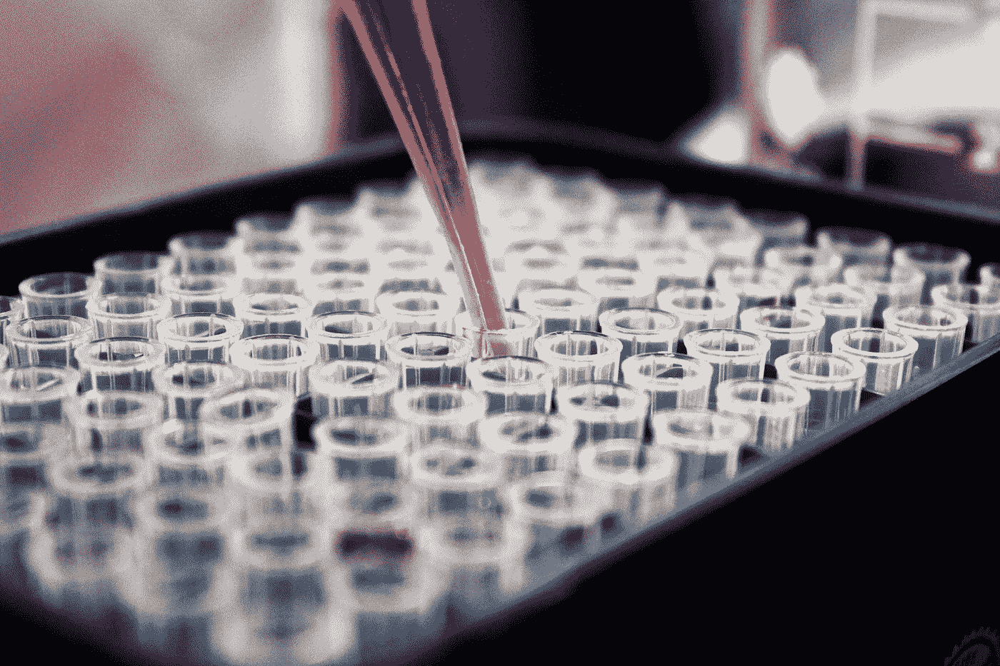
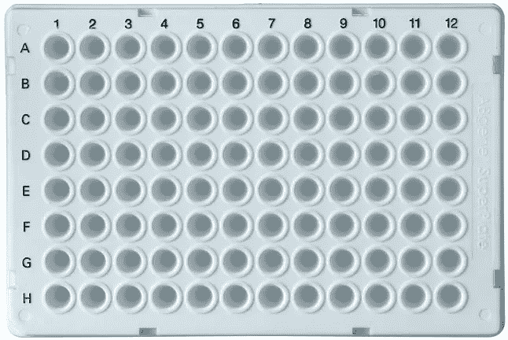
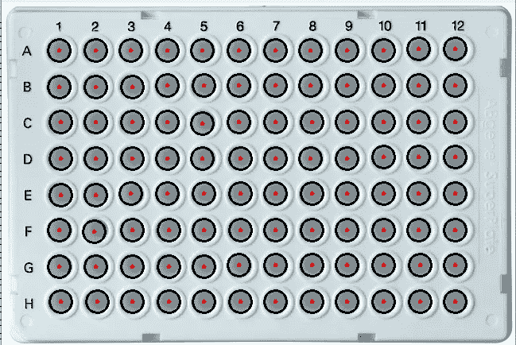
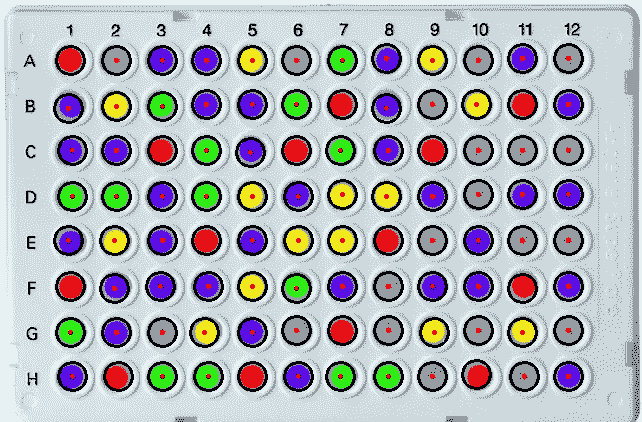

# 用 Python 和 OpenCV 实现 PCR 板的颜色检测

> 原文：<https://medium.com/codex/well-and-color-detection-of-pcr-plate-using-python-and-opencv-edb0aaa0ef9d?source=collection_archive---------4----------------------->

## 以下是如何在 PCR 96 孔板中检测每个孔及其颜色



在 [Unsplash](https://unsplash.com/s/photos/covid-test?utm_source=unsplash&utm_medium=referral&utm_content=creditCopyText) 上由[路易斯·里德](https://unsplash.com/@_louisreed?utm_source=unsplash&utm_medium=referral&utm_content=creditCopyText)拍摄的照片

[OpenCV](https://opencv.org/) 是一个针对计算机视觉的开源库。它具有强大的功能，使诸如对象和颜色检测等任务变得简单而直观。

为了检测每个孔的颜色，我们需要首先获得每个孔在图片中的位置。因此，我们的第一个目标是检测 PCR 板中的每个孔。一旦我们做到了这一点，我们就可以很容易地得到这些孔中的像素颜色。

## 我们将使用这些库:

*   numpy
*   KDTree
*   网页颜色
*   cv2

```
import cv2
import numpy as np
import webcolors
from scipy.spatial import KDTree
```



PCR 96 孔板

OpenCV 让我们在内置函数的帮助下轻松检测物体和形状。其中一个这样的函数叫做[](https://docs.opencv.org/master/da/d53/tutorial_py_houghcircles.html)**。*让我们看看它的实际效果。*

```
*# Convert to gray-scale and reduce noise
gray = cv2.cvtColor(img, cv2.COLOR_BGR2GRAY)
img_blur = cv2.medianBlur(gray, 5)circles = cv2.HoughCircles(img_blur,
                           cv2.HOUGH_GRADIENT,
                           1,
                           img.shape[0]/64,
                           param1=200,
                           param2=10,
                           minRadius=14,
                           maxRadius=15
                          )
# Draw detected circles
if circles is not None:
    circles = np.uint16(np.around(circles))
    for i in circles[0, :96]:

        # outer circle
        ## cv2.circle(image, center_coordinates, radius, color, thickness)
        cv2.circle(img, (i[0], i[1]), i[2], (0, 0, 0), 2)

        # rgb values
        b = img[i[1], i[0], 0]
        g = img[i[1], i[0], 1]
        r = img[i[1], i[0], 2]

        color_name = convert_rgb_to_color_name((r, g, b))

        mapped_cell = {
            "well_coordinates": (i[0], i[1]),
            "well_color": color_name
        }
        mapped_cells_list.append(mapped_cell)

        # inner circle
        cv2.circle(img, (i[0], i[1]), 1, (0, 0, 255), 2)*
```

*cv2。HoughCircles()根据我们提供的参数返回圆的坐标。例如，最小半径和最大半径提供了我们的圆应该位于的范围。范围越小，结果越精确。*

*一旦我们获得了圆的坐标，我们就可以使用 cv2.circle()函数重新创建圆。我们将在原始图像上绘制这些圆圈*

```
**# cv2.circle(image, center_coordinates, radius, color, thickness)**
```

***圆圈后的图像:***

```
*# View image in a window
cv2.imshow('Image',img)
cv2.waitKey(0)
cv2.destroyAllWindows()*
```

**

*带有圆圈和中心点的图像*

*现在，我们已经成功地检测到了所有的井，我们可以获得每个中心点的 rgb 值，并将其映射到颜色名称。注意，我们使用了*convert _ RGB _ to _ color _ name()*函数。它是这样做的。*

```
*# Get Color names from RGB values
def convert_rgb_to_color_name(rgb_input):
    hexnames = webcolors.css3_hex_to_names
    names = []
    positions = []for hex, name in hexnames.items():
        names.append(name)
        positions.append(webcolors.hex_to_rgb(hex))spacedb = KDTree(positions)querycolor = rgb_input
    dist, index = spacedb.query(querycolor)
    return names[index]*
```

*它接受 rgb 值，并返回与之最匹配的颜色名称。我已经写了一篇文章解释了它是如何做到的。*

*这是我们的 mapped_cells_list 目前返回的内容。*

```
*[{'well_coordinates': (164, 150), 'well_color': 'lightslategrey'},
 {'well_coordinates': (72, 106), 'well_color': 'slategrey'},
 {'well_coordinates': (208, 150), 'well_color': 'slategrey'},
 {'well_coordinates': (210, 332), 'well_color': 'slategrey'},
  .
  .
  .*
```

*这些灰色意味着井是空的。颜色是盘子的颜色。*

*OpenCV 如何检测圆有一个小问题。它没有任何特定的顺序。它随机地或以最佳匹配的第一顺序进行。例如，如果我们预期有 96 个圆，第一个圆将是 OpenCV 的算法最有把握的一个。因此，如果我们要标记一个井 A1、A2 等等，我们需要知道哪个井是哪个井。*

*让我们按照对我们有意义的顺序对井进行排序。*

```
*# Mapping Well names
sorted_outer_list = sorted(mapped_cells_list, key=lambda k: k['well_coordinates'])for i in range(12):
    sorted_inner_list = sorted(sorted_outer_list[8*i:8*(i+1)], key=lambda k: k['well_coordinates'][1])
    for j in range(len(row_names)):
        sorted_inner_list[j]['well_name'] = row_names[j]+ str(i+1)
        sorted_final_list.append(sorted_inner_list[j])*
```

*让我们遍历排序后的列表。*

```
*for d in sorted_final_list:
    print(d)*
```

*输出:*

```
*{'well_coordinates': (72, 60), 'well_color': 'slategrey', 'well_name': 'A1'}
{'well_coordinates': (72, 106), 'well_color': 'slategrey', 'well_name': 'B1'}
{'well_coordinates': (74, 150), 'well_color': 'slategrey', 'well_name': 'C1'}
{'well_coordinates': (74, 196), 'well_color': 'slategrey', 'well_name': 'D1'}
{'well_coordinates': (74, 242), 'well_color': 'slategrey', 'well_name': 'E1'}
{'well_coordinates': (72, 286), 'well_color': 'lightslategrey', 'well_name': 'F1'}
{'well_coordinates': (72, 332), 'well_color': 'lightslategrey', 'well_name': 'G1'}
{'well_coordinates': (74, 376), 'well_color': 'slategrey', 'well_name': 'H1'}
{'well_coordinates': (118, 60), 'well_color': 'slategrey', 'well_name': 'A2'}
{'well_coordinates': (118, 106), 'well_color': 'slategrey', 'well_name': 'B2'}
{'well_coordinates': (118, 150), 'well_color': 'slategrey', 'well_name': 'C2'}
{'well_coordinates': (118, 196), 'well_color': 'slategrey', 'well_name': 'D2'}
{'well_coordinates': (118, 242), 'well_color': 'slategrey', 'well_name': 'E2'}
{'well_coordinates': (116, 288), 'well_color': 'lightslategrey', 'well_name': 'F2'}
{'well_coordinates': (118, 332), 'well_color': 'slategrey', 'well_name': 'G2'}
{'well_coordinates': (120, 376), 'well_color': 'slategrey', 'well_name': 'H2'}
.
.
.*
```

*现在我们把事情安排好了。它仍然是灰色的。让我们在井里放一些颜色，看看它是否能识别它们。*

**

*带有彩色孔的图像*

*输出:*

```
*{'well_coordinates': (72, 60), 'well_color': 'red', 'well_name': 'A1'}
{'well_coordinates': (70, 108), 'well_color': 'darkviolet', 'well_name': 'B1'}
{'well_coordinates': (74, 150), 'well_color': 'blue', 'well_name': 'C1'}
{'well_coordinates': (74, 196), 'well_color': 'lime', 'well_name': 'D1'}
{'well_coordinates': (70, 240), 'well_color': 'blue', 'well_name': 'E1'}
{'well_coordinates': (72, 286), 'well_color': 'red', 'well_name': 'F1'}
{'well_coordinates': (72, 332), 'well_color': 'lime', 'well_name': 'G1'}
{'well_coordinates': (74, 376), 'well_color': 'blue', 'well_name': 'H1'}
{'well_coordinates': (118, 60), 'well_color': 'slategrey', 'well_name': 'A2'}
{'well_coordinates': (118, 106), 'well_color': 'yellow', 'well_name': 'B2'}
{'well_coordinates': (118, 150), 'well_color': 'darkviolet', 'well_name': 'C2'}
{'well_coordinates': (118, 196), 'well_color': 'lime', 'well_name': 'D2'}
{'well_coordinates': (116, 240), 'well_color': 'yellow', 'well_name': 'E2'}
{'well_coordinates': (116, 288), 'well_color': 'darkviolet', 'well_name': 'F2'}
{'well_coordinates': (118, 332), 'well_color': 'darkviolet', 'well_name': 'G2'}
{'well_coordinates': (120, 376), 'well_color': 'red', 'well_name': 'H2'}*
```

*注意:*一些井是空的，因此是灰色的*。*

***完整代码:***

*你可以在这里找到完整的工作代码。*

## *结论*

*看起来我们不得不自己做很多事情，但是 OpenCV 让大多数困难的工作变得很容易。您可以根据自己的需求修改这段代码。尽情享受吧！*