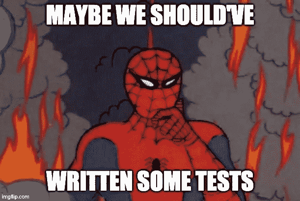

# 我们可能完全做错了 TDD

> 原文：<https://medium.com/codex/were-probably-doing-tdd-all-wrong-17a8721264c7?source=collection_archive---------3----------------------->

## 你见过粗略的代码吗？振作起来。

来源:我自己在 imgflip.com 的创作

写测试就像吃蔬菜。每个人都知道这对你有好处，但大多数人忽视了这一点。我当然也不例外。受不了蔬菜。我也不喜欢测试。其实我是主动回避的。但是，不写测试，你怎么能做出像样的软件呢？你如何预防…