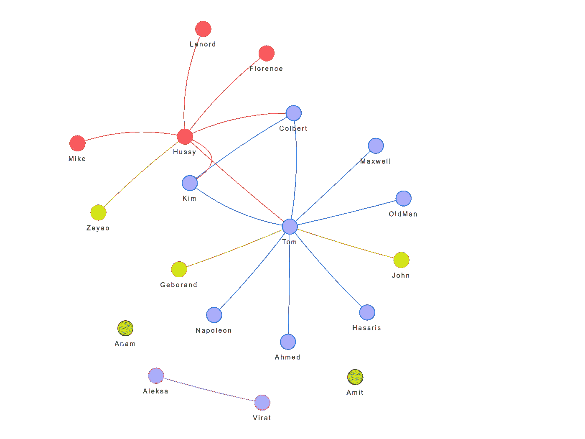
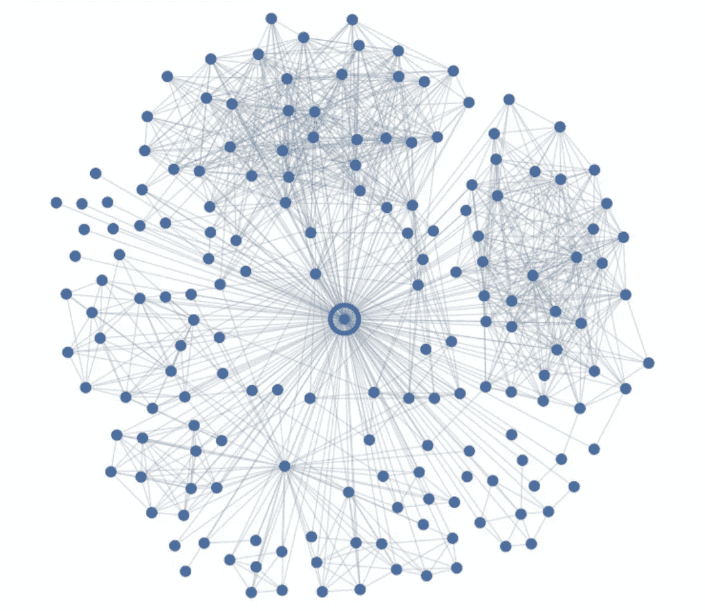

# 社交网络是什么，为什么？

> 原文：<https://medium.com/codex/what-and-why-of-social-networks-6d0483e893e0?source=collection_archive---------0----------------------->

社交网络在其非常基础的层面上代表了各种实体之间的相互联系。经济学家利用社交网络来了解市场的估值和连锁反应，而脸书等社交媒体巨头则利用社交网络来锁定特定的广告受众。该领域的发展可以追溯到 20 世纪初，当时社会网络的概念作为社会图被引入精神病学和心理学等领域[1]。网络社区的发展给了我们以前所未有的方式理解社会的新机会。因此，社会网络分析领域在计算机和社会科学家中得到大肆宣传是很自然的。

让我们看看应用于全球社交网络的一些图论技术，以及它们在理解群体行为方面的有效性。首先，让我们看看图论是如何自然地类比于社会网络的。假设我们有一个图 **G = (V，E)** 那么图中的顶点用来表示人，而边则表示主体之间的关系[2]。因为图是用来表示网络的，所以调整图的属性(如连通性和结构)来探索网络中的社会关系和信息传播是很自然的[3]。

上图是一个假设的社交网络，展示了社交网络的几个属性。上图中的一个关键观察点是**连接的**节点(社交媒体平台上的用户)与**孤立的**节点。图形的连通性引出了**组件**【2】的概念，一些应用包括分析这些组件的大小和增长。在社交媒体平台上，普遍的观察是，与孤立的用户相比，拥有更大网络的用户不太可能离开平台。因此，研究组件的动态对于促进平台上的用户增长非常重要。

为了理解社会网络分析(SNA)是如何导致用户增长的，让我们回顾一下 Backstrom 和 Kleinberg 的一项研究[4]。这项研究的重点是预测用户之间的浪漫关系。Backstrom 和 Kleinberg 研究了 130 万名声称自己有配偶或关系伴侣的脸书用户。研究了图边的关键结构特征，主要关注于**嵌入性**和**分散性**。**嵌入度**是两个用户 **A** 和 **B** 共同好友的数量，使得社交图中存在一条边 **(A，B)** 。**离差**是这样的度量，即高离差意味着用户 **A** 和 **B** 的邻居不是强连接的。如果我们看一下下面的图表[4],分散现象可以很容易地看到。

上图中值得注意的显著特征是顶部和右侧的两个高密度用户集群，而图中其余部分的用户分布稀疏。实验仅使用嵌入性，并且实现了 24.7%的准确度，表明了结构化信息在网络中的价值。然后，作者研究了离差，并针对不同的用户群(如已婚用户和订婚用户)实现了 68.2% — 71.6%的准确度。了解网络中的分散性有助于了解特定用户的消费和内容生产，方法是了解他们的社会邻域的不同部分。然后，这种理解可以导致将这些邻域构建成特定的结构，以向用户推荐有吸引力的内容[4]。

社交网络出现在计算机科学和心理学的界面上。这种网络的想法非常琐碎，但通过将社会网络的想法与图论和分析相结合，我们可以从一个完全不同的框架来分析和理解社会。离差的例子表明，图形的内部结构可以挖掘出潜在的模式，而这些模式对人类来说可能并不明显。社交网络可用于了解选民的群体行为，以提高大型组织的运营效率。这篇文章对读者来说是一个起点，旨在激发你对社交网络分析的更多创造性应用的好奇心。

## 参考

1.  **第一章:概述**
    Easley D .，Kleinberg J .，2010。网络、人群和市场:对高度互联世界的推理，第 1-8 页。剑桥大学出版社，2010 年。
2.  **社交与信息网络**[【PDF】](http://www.cs.toronto.edu/~bor/303s19/docs/W1.pdf)
    鲍罗丁 a，2019。社会与信息网络，第 7-76 页。多伦多大学。
3.  **社会与经济网络**
    杰克逊 M.O .，2018。社会和经济网络:模型和分析，Coursera 讲座 1.4。斯坦福大学。
4.  浪漫的伙伴关系和社会关系的分散。浪漫的伙伴关系和社会关系的分散:脸书关系状态的网络分析，第 1-8 页。ACM。[引用:arXiv:1310.6753v1](https://arxiv.org/abs/1310.6753v1)