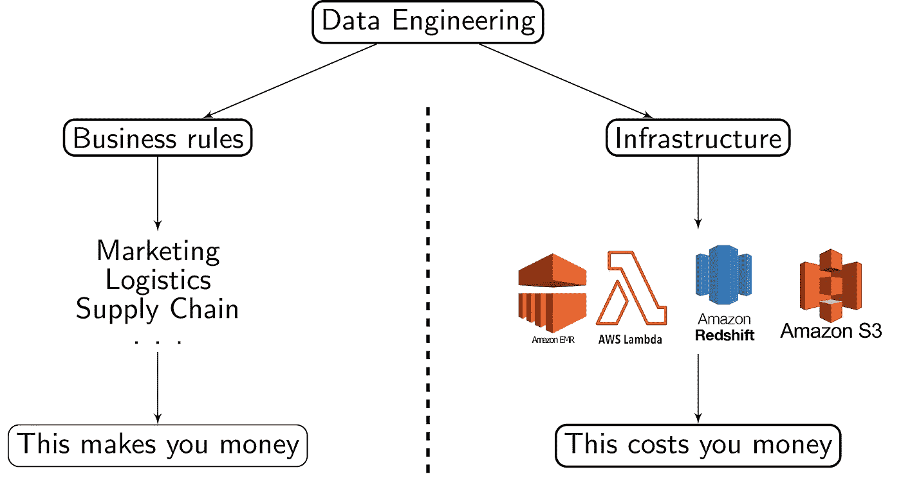

# 什么是抽象数据流，为什么要使用它们？

> 原文：<https://medium.com/codex/what-are-abstract-data-flows-and-why-should-you-use-them-8a95cb330931?source=collection_archive---------6----------------------->


# 无需基础设施承诺的自动化

想象一下，如果您只需点击几下，就可以在您选择的任何基础设施上部署一个生产就绪的工业级数据平台**，并轻松地在不同的基础设施之间切换。显然，这将大大降低您的开发成本。 [**【抽象数据流(ADF)**](https://github.com/ticowiko/adf) 通过从根本上解耦 2 个问题来实现这一点:**

1.  我想如何处理我的数据？
2.  我想怎么做？

实际上，该框架只是将您的管道规范分成两个完全独立的部分:

*   您的**流配置**表达了您的管道的功能细节(数据血统、元数据、聚合等)。).
*   您的**实现者配置**，它包含实际的基础设施细节。可以实现*任何*流程配置。

ADF 框架的强大之处在于，所有的**实现者配置文件都是完全可互换的**，允许最终用户部署基础设施、编排基础设施、对基础设施进行基准测试以及切换到另一个基础设施，所有这些都只需点击几下鼠标。让我们通过一个简单的例子来看看这是什么样子的。

# 这一切是如何运作的


## 流量配置

我们要做的第一件事是编写我们的**流配置文件**。这描述了我们数据流的实际结构，特别是数据谱系和元数据，作为一系列相互关联的处理步骤。这是一个非常简单的配置，其中`light`和`heavy`层中的两个着陆步骤通过在`expose`层中的简单连接结合在一起:

注意，虽然每个处理步骤指向一个层名称(`light`、`heavy`和`expose`，但是这个名称实际上对应的是什么仍未确定。在这一点上，我们仍然是基础设施不可知的。在 Web UI 中(由一个[姊妹库](https://github.com/ticowiko/adf_app)提供)，我们可以看到我们的流配置对应的是什么。为了更好地展示这个框架，我们在上面的例子中的流配置中增加了几个步骤:


## 处理功能

现在我有了一个与基础设施无关的数据流结构，我如何以一种与基础设施无关的方式定义我的处理需求呢？答案就在我的流配置中的每一步所指向的处理函数中。这些函数操纵**抽象数据结构(ADS)** ，抽象数据结构是类似数据帧的对象，其实际处理细节尚未确定，直到我们选择一个实现者。例如，下面是我们在上面的流配置中提到的连接操作:

## 实施者配置

我们现在已经定义了我们的功能需求，但对我们的处理基础设施最终会是什么样子却没有一点头绪。为了实际运行我们的管道，我们现在需要将我们的流配置插入到我们选择的的 ***任何*实现者配置中，指定每个层名称对应的内容。假设我们只想在本地机器上运行一个简单的测试，让我们的`light`层基于 Pandas，我们的`heavy`层基于 PySpark，我们的`expose`层基于 SQLite。我们的实现者配置需要的唯一信息是我们选择的实现者**的**类、写入数据的**根路径**和**层名称对应关系**:**

既然框架已经有了它需要的所有信息，我们可以在命令行上或通过 Web UI 运行 setup 命令:

```
adf-launcher.py implementer.yaml setup-implementer
adf-launcher.py implementer.yaml setup-flows flows.yaml
```

这样做应该会修改我们的根数据目录，如下所示:

实现者已经为每个处理步骤创建了一个目录，它期望在那里存储用于`Pandas`和`PySpark`层的 CSV，以及用于`expose`层的`expose.db`文件。`state.db`文件是一个包含处理状态信息的 sqlite 数据库。框架唯一不能为我们做的是创建源数据，所以让我们继续以 CSV 文件的形式将一些样本数据复制到登陆步骤中，然后我们可以运行 **orchestrator** ，再次使用命令行或 web 界面:

```
adf-launcher.py implementer.yaml orchestrate flows.yaml
```

这样，我们可以看到我们的数据批沿着管道传输:


我们的目录内容应该变成这样:

在登录步骤之外，我们可以看到正在创建 CSV 文件，其中包含已按要求处理的数据。因为最后一步是在`expose`层，我们可以在`expose.db`数据库中看到它的结果:


## 切换到可伸缩的 AWS 实现者

这很简单:实现者根据我们的层规范自动构建了一个数据平台，然后根据我们的功能需求编排它并处理我们的数据。但是数据平台本身有点乏味:它是一堆 CSV 和一个 sqlite 数据库。非常适合原型开发，但是不适合扩展。换句话说，我们现在想要在完全不同的架构上运行**完全相同的流配置。**

ADF 框架的强大之处在于它能够通过更改单个配置文件来操作这个开关:**实现者配置文件**。为了从根本上改变我们的基础设施，我们保留了相同的流配置文件和相同的处理功能，并且我们只将上面的实现者配置文件更改为:

与本地实现者相比，这里发生了更多的事情，但并不多。特别是，除了指定层名和它们对应的具体基础设施之间的对应关系，我们还提供了规模信息。因此，我们已经将我们的`light`层映射到 Lambda 函数，用于使用 Pandas 的无服务器计算，将我们的`heavy`层映射到 EMR 集群，用于使用 PySpark 的分布式计算，将我们的`expose`层映射到红移数据库，以使我们的数据可以使用 SQL 消费。

这一次，setup 命令将根据规范创建每个 AWS 资源。它还将使用红移光谱连接基于 EMR 和红移的层，创建外部表以在两个数据层之间无缝转换数据。它还为所有新创建的资源创建了一个 VPC，为每个资源创建了安全组，并创建了一整套附加资源，旨在提供一个全功能的工业级数据平台。所有这些都是在幕后完成的，最终用户只需为每个数据层提供他所需的规模。使用这个新的实现者运行 orchestrator，我们应该看到我们的数据在 AWS S3 存储桶上沿着管道传输:

这一次，不是在 **sqlite** 数据库上公开数据，而是在**红移**上提供数据:

现在你知道了！只需切换一个配置文件，我们就可以在预先构建的基础架构上部署和运行完全相同的处理管道，我们可以轻松地根据自己的需要进行扩展。

## 流控制

在这一点上，最重要的是基础设施无关的接口足够灵活，以适应我们希望表达的任何需求。为了实现这一点，ADF 使用基于 Python hook 的方法让用户控制通过管道的数据流。提供的挂钩有:

*   **批处理排序挂钩**:定义下一组要运行的批处理 id。
    *默认行为*:对于每个成功的批处理，创建一个具有相同批处理 ID 的下游批处理。
*   **数据加载器钩子**:定义每一步要加载的输入数据。
    *默认行为*:对于给定的批次 ID，加载上游步骤中该批次 ID 对应的数据。
*   **批次依赖挂钩**:定义删除给定批次时，要删除哪些下游批次。
    *默认行为*:对于给定的批次 ID，删除所有具有相同批次 ID 的下游批次。

当 orchestrator 启动处理作业时，这些挂钩提供了对其行为的完全控制。因此，您对数据流的控制力几乎没有限制。 ***能码就能有！***

# 为什么这应该是您的新数据平台模式



现代数据堆栈的宽度和深度一样大。ADF 框架的目标是提供数据平台自动化的好处(便宜、快速和高质量的数据基础设施),而没有主要的缺点:被任何特定的基础设施所束缚。这种方法有许多优点:

*   **大量预先构建的基础设施**:在几分钟内，用户就可以选择适合其用例的实施者，并开始部署基础设施和运行管道。
*   **共同数据平台开发**:最终用户很少会开发自己的实现者。左拷贝许可保证了所有未来的 ADF 实现者也将是开源的。这意味着实施者将由社区开发，为最常见的基础设施用例(大容量实施者、流实施者、多云实施者等)提供更高质量的解决方案。)，而不是每个数据工程团队重新发明轮子。
*   **减少对云的依赖**:因为您对实现者的选择可以通过切换单个配置文件来实现，所以更改您的目标基础设施变得微不足道。这意味着您不仅可以切换您的数据平台正在使用的服务，甚至可以完全切换云，在几分钟内将您的整个数据平台从内部迁移到 AWS、GCP、Azure、雪花以及其他任何地方。
*   **简化的开发体验**:本地实现者是一个至关重要的工具，因为它允许管道的快速原型化和测试。管道结果甚至可以在研讨会期间与利益相关方“实时”验证，并在部署到云上之前即时修改以满足他们的需求，因为本地实施者只需几秒钟即可完成设置和运行。
*   **自动化数据治理**:您的流配置包含了您轻松自动化数据治理所需的所有信息:您的数据血统和元数据。因为 orchestrator 使用这种流配置，所以可以有力地保证您的治理元数据将严格匹配您的实际处理。
*   **以数据为中心的编排**:基本的编排单元是一批数据，而不是抽象的运行 ID。这意味着您的 DAG 定义和状态与处理和存储直接相关。作为交换，所有实现者将授予现成的数据版本和批量重置。


在您的数据堆栈中定位 ADF

从根本上说，ADF 不是一个 DAG 工具:它是一个数据处理工具。当您定义 DAG 来定义管道结构时，ADF 框架保证 DAG 中的每个节点都将系统地创建和持久化一批数据。通过在每个节点施加这种行为，框架可以为我们处理几乎所有的事情，并且可以在几乎任何平台上进行。通过比传统的 orchestrator 或 scheduler 更加专注，ADF 框架可以大大降低开发成本，同时保证高质量的最终结果。

# 链接

*   [核心 ADF 库](https://github.com/ticowiko/adf):包含核心 ADF 代码和配置文件和类 API 的详细文档。
*   ADF Web UI 存储库:包含 Web UI 姐妹存储库以及一个简单的入门教程。