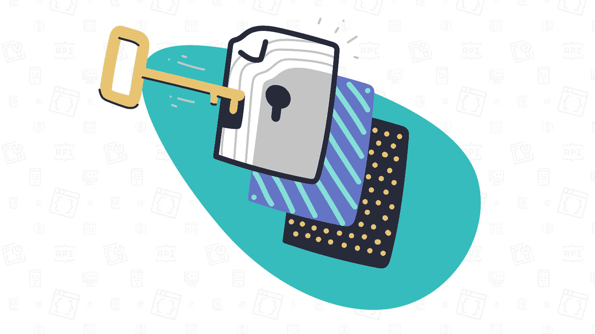
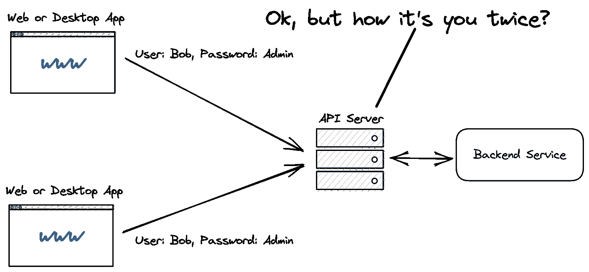
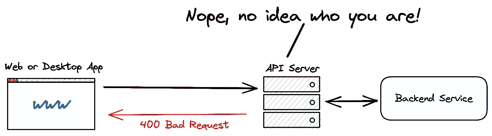
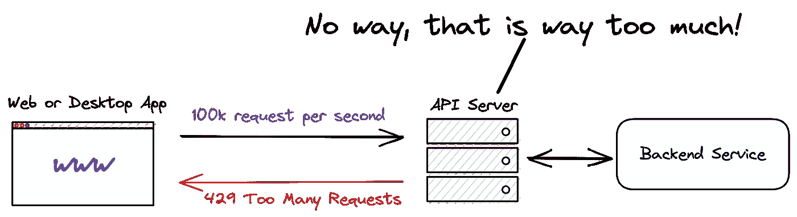

# 什么是 API 键，为什么它们如此重要？

> 原文：<https://medium.com/codex/what-are-api-keys-and-why-are-they-so-important-7fb4307575e?source=collection_archive---------2----------------------->

## 系统设计

## API 密钥是一种允许 API 服务器识别客户端应用程序的机制。这开启了一些意想不到的安全功能…

作为一名计算机科学学生或软件工程师，您可能已经在开发一些应用程序时遇到过几次 API 键。

如果你想访问一些 API，你需要发送这个很长的加密字符串和你的 API 请求。

为什么会这样？为什么 API 键如此重要？

API 密钥身份验证是一种技术，发明这种技术是为了克服共享凭证的弱点，而共享凭证是 HTTP 基本身份验证中的一个大问题。当多个客户端使用相同的有效凭证时，服务器不可能区分不同的客户端应用程序。

用技术术语来说，API 键提供了:

*   客户端应用程序识别—识别调用后端 API 的应用程序。
*   客户端应用程序授权—检查调用应用程序是否已被授予调用 API 的权限。

让我们讨论几个场景…

如果 API 密钥无效，服务器可以简单地阻止对 API 的访问。

如果 API 密钥可以被服务器验证，则该密钥还可以作为唯一的标识符，允许记录所有活动，并发现和应对恶意行为。

例如，API 提供者可以设置一个速率限制，限制每分钟允许的请求数量。因此，api key 可以帮助您建立针对拒绝服务攻击的第一道防线。

再来回答几个动手问题。

## **从哪里获得这样的 API 密匙？**

API 提供商通常有一个 web 应用程序来管理您对他们服务的访问。在那里，您通常可以找到一个可以生成 API 密钥的部分。然后将 API 键添加到每个请求的头或 URL 中。

然后“瞧”你就可以访问 API 了。

如果您使用 API 密钥，有两个新手错误会破坏您的应用程序安全性。但是一旦你意识到它们，就很容易避开它们！

## 1.不安全的 API 密钥存储

1.  不要在代码中直接嵌入 API 键。
2.  不要将 API 键存储在应用程序源代码树内的文件中。

这两者都非常重要，否则你几乎可以肯定，在某一点上，你或你团队中的某个人会把它推到 github 上，最终它会公开。

**不要把你的 API 密匙嵌入到你的应用程序中，而是把它们存储在环境变量中！**

## **2。API 键！=用户认证**

永远不要混淆用户认证的 API 键，API 键只识别应用程序！对于用户认证来说，它们完全没有用。

*   API 密钥可以很容易地直接从开发控制台复制和粘贴，或者从未加密的网络流量中嗅探。
*   一旦密钥被盗，它就可以无限期地使用，因为它没有过期时间。
*   API 提供者可以采取一些对策来缓解这个问题，但是还有更有效的方法来认证用户！

感谢阅读这篇文章！如果你想和我联系，就在 [LinkedIn](https://www.linkedin.com/in/fabianhinsenkamp/) 、 [Twitter](https://twitter.com/hinsencamp) 上和我联系。

如果你想用我在文章中用到的元素来练习你的系统设计技巧，你可以**下载我的免费系统设计元素库**，它是一个天才草图工具 Excalidraw。

 [## Excalidraw 系统设计库

### 要通过 FAANG 系统设计面试，你需要准备和练习！为了帮助你，我创建了一个…

bigtechcoach.gumroad.com](https://bigtechcoach.gumroad.com/l/excalidraw-system-design-symbols)