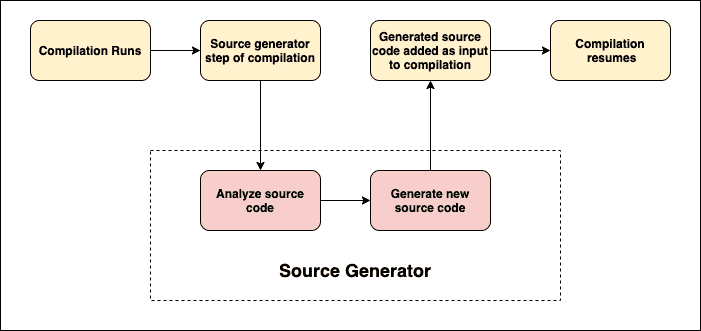

# 什么是 C#源代码生成器

> 原文：<https://medium.com/codex/what-are-c-source-generators-b55e626e9e09?source=collection_archive---------14----------------------->

全球的开发人员都在寻找 C#编译器中的一种新功能，这种新功能允许他们评估用户代码并生成额外的 C#源文件(这些源文件又可以包含在编译中)。

当一种被称为源生成器的新型组件被创建时，他们的请求被批准了。

在这篇文章中，让我们了解你需要知道的关于 C#源代码生成器的一切，以及它对这些开发人员的用处。

**目录**

1.  什么是源生成器？
2.  受益于源生成器的场景
3.  源生成器和提前(AOT)编译
4.  源发生器的下一步是什么？
5.  结论

# 什么是源生成器？

除非你已经仔细跟踪了与 C#语言相关的每一个原型和提议，否则你现在可能会问自己，“什么是源代码生成器？”简单地说，源代码生成器是在编译期间运行的一段代码，它检查您的程序，以生成与其余代码一起编译的附加文件。

源生成器允许他们实现两件事:

*   获取表示所有正在编译的用户代码的编译对象。可以检查这个对象，并且可以编写代码，使用正在编译的代码的语法和语义模型，类似于今天分析器的工作方式。
*   生成可以在编译过程中插入到编译对象中的 C#源文件。换句话说，在生成代码的同时，您可以提交一个新的源代码作为输入。

这两个因素结合起来，使源发生器非常有益。您可以使用编译器在编译期间生成的所有丰富元数据来检查用户代码，然后根据您分析的数据将 C#代码发送回相同的编译中！源代码生成器与 Roslyn 分析器相似，都是可以生成 C#源代码的分析器。

在编译步骤中使用源生成器，如下所示:

源生成器是 a.NET 标准 2.0 程序集，由编译器与任何分析器一起加载。它可用于支持加载和运行 of.NET 标准组件的情况。

# 受益于源生成器的场景

关于源生成器，最重要的是它能做什么，而不是它是什么。运行时反射、IL 编织和杂耍 MSBuild 任务是评估用户代码和基于当今技术所利用的分析创建信息/代码的三种常见方式。源生成器有可能胜过所有其他方法。

运行时反射是 to.NET 最近增加的一个强大功能。它可以用于各种情况。当一个应用程序启动时，一个常见的情况是分析用户代码，并使用结果来构建一些东西。

例如，当您的 web 服务最初运行时，ASP.NET 核心使用反射来查找您定义的结构，这样它就可以“连接”像控制器和剃刀页这样的东西。虽然这允许您编写具有强大抽象的简单代码，但它在运行时会有性能损失:当您的 web 服务或应用程序首次启动时，它将无法接受任何请求，直到所有发现代码信息的运行时反射代码都已运行完毕！尽管性能损失并不显著，但它是一种沉没成本，您无法在软件中消除它。

启动的控制器发现部分可能会在编译时使用源代码生成器进行，它会分析您的源代码并发出“连接”您的应用程序所需的代码。因为现在运行时发生的活动可能会转移到编译时，这可能会导致更快的启动时间。

源生成器可以通过多种方法提高效率，包括使用运行时反射来查找类型。有些情况下需要重复调用 MSBuild C#任务(名为 CSC)来检查编译中的数据。正如您所料，多次使用编译器会对开发程序的总时间产生影响。

可以利用源代码生成器来消除像这样处理 MSBuild 作业的需要，因为源代码生成器不仅提高了性能，还允许工具在适当的抽象级别上工作。

源代码生成器的另一个优点是，它们可以消除对一些“字符串型”API 的需求，比如 ASP.NET 核心中控制器和 razor 页面之间的路由。路由可以用源生成器强类型化，生成适当的字符串作为编译时细节。这将减少错误输入的字符串导致请求被发送到错误控制器的次数。

# 源生成器和提前(AOT)编译

源代码生成器还可以帮助清除基于链接器和 AOT(提前)编译改进的实质性障碍。许多框架和库，比如 System，大量使用了反射或反射发射。

许多最流行的 NuGet 包严重依赖反射在运行时查找类型。因为 most.NET 项目需要包含这些包，所以代码的“可链接性”和利用 AOT 编译器优化的能力会受到严重损害。

# 结论

源代码生成器是一个重要的特性，它让开发人员的生活变得更好。您可以使用该功能以安全和高性能的方式现代化重复编码模式。我强烈建议你试一试。当您生成代码时，您可能会惊讶于您能取得的成就。

*原载于*[*https://www . partech . nl*](https://www.partech.nl/nl/publicaties/2021/07/what-are-c-sharp-source-generators)*。*