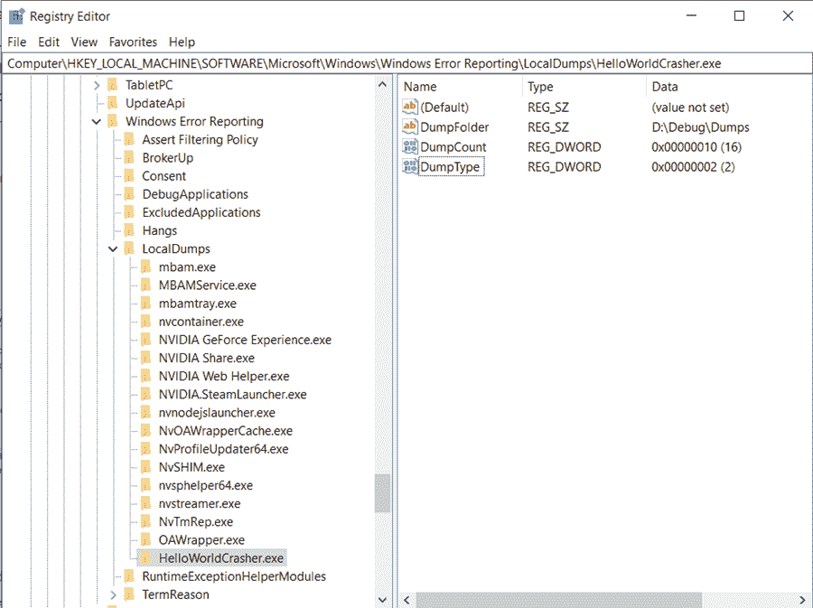

# 什么是转储文件？

> 原文：<https://medium.com/codex/what-are-dump-files-8f290b1abd0c?source=collection_archive---------15----------------------->

对于软件工程师来说，了解如何评估和处理转储以找出他们的程序失败或行为异常的原因是非常重要的。然而，决定从哪里开始这个过程可能是困难的。

当您在 Windows 操作系统上运行 a.NET 应用程序时，这篇文章可以作为调试故障转储文件的良好起点。

**目录**

1.  什么是转储文件？
2.  转储文件的类型
3.  如何自动捕捉转储文件的崩溃过程？
4.  如何创建转储？
5.  使用 Visual studio 调查转储
6.  使用 Windbg 调查转储
7.  结论

# 什么是转储文件？

内存转储文件(。dmp 文件)是在某个时间点(例如在崩溃期间)拍摄的程序内存快照。你可以看到-

*   当前正在执行的代码行
*   本地价值观的价值
*   转储文件中所有堆对象的值。

换句话说，转储文件包含程序被捕获时的完整状态。

转储通常用于故障排除(崩溃转储)，但它们也可以用于其他目的。以下是它们的用法(按最常见到最不常见的顺序)

*   调试崩溃的程序
*   调试挂起的程序
*   查找内存泄漏
*   在不同的机器上调试，甚至在不同的时间调试
*   调试不能附加到调试器的程序
*   用 WinDbg 调试

# 转储文件的类型

全内存转储和小型转储是转储文件的两种形式。完整的内存转储包括程序的整个内存。就空间而言，它通常会变得很大。

“小型转储”一词具有欺骗性。这是一种可以定制的转储格式。它可以包含所有内存，占用与完整内存转储一样多的空间(可能更多),也可以只包含每个配置的一部分内存。

我们通常将转储与整个 RAM for.NET 一起使用，以获得完整的调试体验。它可以是完整的内存转储，也可以是包含整个内存区域的小型转储。

# 如何自动捕捉转储文件的崩溃过程？

您必须调整注册表设置以启用转储文件，因为它不是默认创建的。要启用捕获，您有两种选择。第一个选项是设置事后调试器设置。

在第一个选项中，首先选择一个调试器应用程序，如 Visual Studio、ProcDump、WinDbg 或 ADPlus，然后命令切换程序以创建转储文件或附加到进程进行实时调试(如果它们支持的话)。

第二个选项是设置 WER 为您的程序创建一个转储文件，以防它崩溃。如果您不需要现场调试，只需要在光盘上创建转储文件以供以后分析，这是一条可行的途径。因为此功能内置于 Windows 中，所以不需要额外的软件来进行转储。以下是 WER 转储的注册表设置:

*   如果不存在，构建基本的 WER 本地转储注册表项。
*   HKLM:\ SOFTWARE \ Microsoft \ Windows \ Windows 错误报告\本地转储
*   然后，为特定于应用程序的转储文件设置创建密钥。
*   如果 HelloWorldCrasher.exe 是要保存转储的应用程序，请执行以下操作:
*   新密钥:HKLM:\ SOFTWARE \ Microsoft \ Windows \ Windows 错误报告\ local dumps \ hello world crasher . exe
*   该项下的注册表值:
*   **dump folder**:[REG _ EXPAND _ SZ]存储转储文件的文件夹路径。
*   **转储类型** : [REG_DWORD]为完全转储指定值 **2** 。 **1** 用于小型转储(较小，但不是整个进程内存空间)。
*   **DumpCount** : [REG_DWORD]在覆盖旧的转储文件之前要保存的转储数量。默认值为 10。

在注册表中配置完这些设置后，重新运行 hello world 崩溃应用程序的可执行文件。当这次崩溃时，转储文件应该被写入到我们指定的文件夹中。

# 如何创建转储？

可以通过多种方式创建转储。以下是几个最受欢迎和推荐的:

调试时转到调试|将转储另存为…。

使用 Heap，您将能够保存一个包含整个内存空间的小型转储。

右键单击所需的进程，并从任务管理器的详细信息菜单中选择创建转储文件。这将导致完全的内存转储。

ProcDump 是 SysInternal toolkit 的一个组件，这是一组非常有用的 Windows 开发工具。命令行实用程序 ProcDump 用于创建转储。它可以按需创建转储，或者监视一个程序并在它崩溃或挂起时生成转储。

SysInternal 工具集中的另一个工具是 Process Explorer。它是一个高一级的任务管理器。您可以检查活动线程、注册表项，当然，还可以构建转储来查看哪些进程加载了特定的 DLL 或句柄。

从任何进程的上下文菜单中选择创建转储|创建完全转储。

# 使用 Visual Studio 调试转储

浏览转储文件最直接的方法是打开转储文件(。dmp)。如果您能够匹配符号(.pdb 文件)和源文件。也就是说，代码对您来说就像是站在一个断点上。如果是崩溃转储，您会注意到导致崩溃的异常。线程、调用栈、局部变量、加载的模块等等都应该是可见的。

使用 Visual Studio 进行调试的步骤:

*   在 Visual Studio 中，打开。dmp 文件。
*   从出现的下拉菜单中选择“仅使用托管调试”或“使用混合调试”。
*   等待 Visual Studio 尝试加载符号并将它们与源代码进行比较。
*   如果加载了符号，代码将会出现。否则，调用堆栈、异常信息(如果是在异常时收集的)以及可能的本地值应该是可见的。
*   像在 Visual Studio 中调试一样调查异常或问题。

# 使用 Windbg 调查转储

在研究转储文件时，WinDbg 是大多数人的首选工具。

视觉工作室在功能方面仍在追赶。WinDbg 可以检查对象堆、提取模块、定位死锁，还可以做很多其他 VS 做不到的事情。

如果你不熟悉 WinDbg，它是一个 Windows 调试工具，主要使用命令行。有了 SOS 调试扩展，WinDbg 可以用于本地程序和 managed.NET 程序。

# 结论

在 2021 年，你有太多的工具供你使用，让调试变得相当容易。Visual Studio、DumpMiner、SuperDump 和 WinDbg Preview 只是目前可供您使用的工具中的一部分。你可以找到许多其他的工具来给你一个 360 度的程序视图。

*原载于*[*https://www . partech . nl*](https://www.partech.nl/en/publications/2021/09/what-are-dump-files)*。*