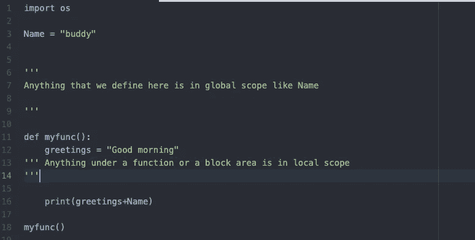
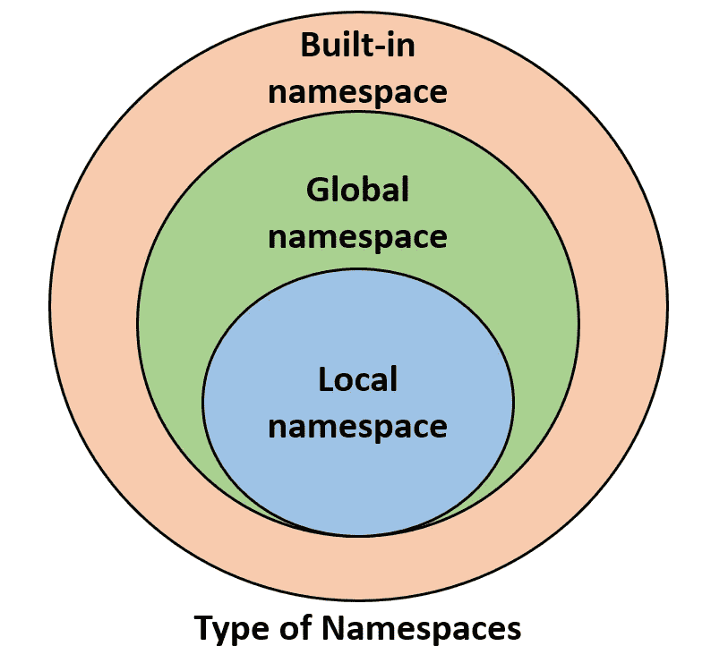

# 什么是一级对象，它们与 Python 编程中的作用域和名称空间有什么关系？

> 原文：<https://medium.com/codex/what-are-first-class-objects-and-how-are-they-related-to-scope-and-namespaces-in-python-programming-9c7229ab8d79?source=collection_archive---------19----------------------->

当我们试图计算代码片段 **a+b** 时，那么名字 **x** 和 **y** 必须事先与作为值的对象相关联。如果我们像这样运行它，那么我们将得到一个 ***名称错误*** *。*确定与标识符关联的值的过程被称为**名称解析**。

因此，每当一个值赋给一个标识符时，这个定义都是用一个特定的**作用域**来定义的。如果我们在顶层定义一些东西，比如**导入操作系统**或者在这种情况下命名变量，那么它通常是在**全局范围内定义的。**在函数体内进行的赋值/声明通常具有该函数调用的局部范围。



Python 中的每一个不同的作用域都用一个叫做**命名空间**的抽象来表示。命名空间管理当前在给定范围内定义的所有标识符。



来源:g [eekforgeeks](https://www.geeksforgeeks.org/namespaces-and-scope-in-python/) 。（同 organic）有机

当我们在没有任何用户自定义模块、方法、类等的情况下运行 python 时。像 **print()、id()** 这样的函数总是存在的，它们是内置的名称空间。当我们创建一个模块时，会创建一个全局名称空间，稍后创建局部函数会创建局部名称空间。

Python 使用其自己的字典来实现名称空间，该字典将每个标识字符串(例如，n)映射到其相关联的值。Python 提供了几种检查给定名称空间的方法。函数 dir 报告给定名称空间中标识符的名称(即字典的键)，而函数 vars 返回完整的字典。默认情况下，对 dir()和 vars()的调用报告执行它们的最接近本地的命名空间。当命令中指示了一个标识符时，Python 会在名称解析过程中搜索一系列名称空间。首先，搜索给定名称的最局部封闭的范围。如果没有找到，则搜索下一个外部范围，依此类推。

# 一等品

第一类对象是类型的实例，当作为参数传递或由函数返回时，可以将其分配给任何类型的标识符。在 python 中，函数和类也被视为一级对象。例如:

```
newprint = print # assign name ’newprint’ to the function denoted as 
                         ’print’
newprint(“I have created an alias of print function”)
# call that function
```

这里我们为打印功能定义了一个别名。它演示了 Python 使用的机制，允许将一个函数作为参数传递给另一个函数。就名称空间而言，像 **newprint = print** 这样的赋值将标识符 **newprint** 引入当前名称空间，其值是表示内置函数 print 的对象。当声明用户定义的函数时，应用相同的机制。例如:

```
def countzero(x):
  .....
```

这样的声明将标识符 countzero 引入到当前名称空间中，其值是表示其实现的函数实例。以类似的方式，新定义的类的名称作为其值与该类的表示相关联。

请分享并为这篇文章加油:)