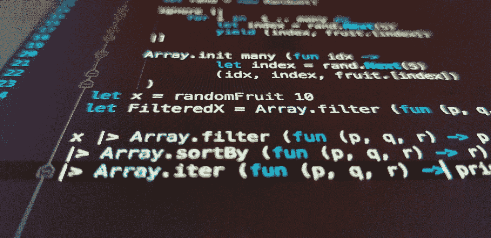

# getter/setter 是干什么用的？

> 原文：<https://medium.com/codex/what-are-getters-setters-for-again-ecd8bb98fd5d?source=collection_archive---------11----------------------->

伊利亚·波什科夫在 [Unsplash](https://unsplash.com?utm_source=medium&utm_medium=referral) 上的照片

所以我想了一会儿这个想法。我最初是在这里写的:

 [## 过于复杂的 Getter Setter 属性被视为有害

### 我第一次用 Java 是在大学。实际上，我在高中就开始使用它了，但是我不知道…

andrewzuo.com](https://andrewzuo.com/overly-complex-getter-setter-properties-considered-harmful-ab94c2a6dd89)