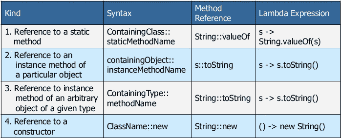

# 什么是 Java 8 Lambda 表达式

> 原文：<https://medium.com/codex/what-are-java-8-lambda-expressions-8a112a7f895d?source=collection_archive---------14----------------------->

lambda 表达式是一个未命名的代码块，带有可选参数
，可以存储、传递，稍后执行&**。**

****

**照片由[伊格纳西奥·阿门纳巴尔](https://unsplash.com/@amenabarladrondeguevara?utm_source=medium&utm_medium=referral)在 [Unsplash](https://unsplash.com?utm_source=medium&utm_medium=referral) 上拍摄**

```
new Thread( 
    **() -> System.*out*.println("hello world")** ).start();
```

**本例中，线程构造函数需要 Runnable 的一个实例。没有λ的等价物将是，**

```
new Thread(new Runnable() {
    @Override
    public void run() {
        System.*out*.println("hello world 2");
    }
}).start();
```

> ****()** 输入参数
> **- >** 箭头将参数列表与 lambda 体分开。
> **system . out . println(" hello world ")**lambda 体定义了计算。**

**Lambda 表达式可以以比匿名内部类更紧凑的方式处理多个参数。他们只关注要执行的计算。**

## **行为参数化**

**Java 的 lambda 表达式支持简洁的“行为参数化”，本质上是获取一段代码，并使其在不执行的情况下可用。例如，它可以传递给一个方法。**自从 Java 8 引入了 lambdas** (最后)，现在可以用匿名函数参数化方法的行为了。**

## **λ作为参数**

**您还可以将 lambda 表达式存储到一个变量中，并将该变量传递给一个方法。**

```
Runnable r = () -> System.*out*.println("hello world 3");
new Thread(r).start();
```

## **有效最终**

**Java 8 还引入了一个新概念，叫做“有效最终”变量。非 final 局部变量或方法参数的值在初始化后从未改变，称为有效 final。在 Java 8 之前，我们不能在匿名类中使用非 final 局部变量。变量仍然必须是 final，但不要求使用 final 关键字，如果违反规则，将抛出错误。**

```
String answer="Nuwan";
new Thread(() ->
        System.*out*.println("The answer is " + answer))
        .start();
```

**这个 lambda 表达式可以访问“answer”的值，这是一个有效的最终变量，它的值在初始化后不会改变。**

**如果你试图改变答案将会出错。**

```
//will not compile
String answer="Nuwan";
new Thread(() ->
        System.*out*.println("The answer is " + answer))
        .start();
answer="change";
```

## **无国籍的**

**Lambda 表达式在“无状态”时最有效&没有
共享可变数据。无状态 lambda 表达式在应用于 Java 并行流时特别有用。**

**当在集合中实现并行时，自动同步被添加以使其线程安全。然而，同步会引入线程争用，从而阻止线程并行运行。因此，当集合不被修改时，可以实现并行的好处。**

**[http://henrikeichenhardt . blogspot . com/2013/06/why-shared-mutable-state-is-root-of-all . html](http://henrikeichenhardt.blogspot.com/2013/06/why-shared-mutable-state-is-root-of-all.html)**

## **类型推理**

***类型推断*是 Java 编译器查看每个方法调用和相应声明以确定使调用适用的类型参数(或多个参数)的能力。**

**lambda 表达式省略了方法名&无关语法。**

```
List<String> list = new ArrayList<>();
list.forEach(s -> System.*out*.println(s));
```

**你可以看到 lambda 中的类型信息 **s** 丢失了，在这个例子中由于 list 是 strings s 也将是一个 string。**

# **关闭**

**Lambda 表达式可以实现“闭包”的(简化)变体。闭包是一个对象，它将一个方法和一个至少有一个绑定变量的环境存储在一起。绑定变量是具有值的名称，例如数字或字符串。**

```
private static void closures() {
    Name name = new Name();
    name.value="Nuwan";
    new Thread(() ->
            System.*out*.println("The answer is " + name.value))
            .start();
    name.value="Chamara";
}

private static class Name{
    public String value;
}
```

**如果你把这个和最终给出的样品进行比较，这就是我们之前没有做到的。这是因为传递给 lambda 的值是一个引用类型，只要引用是固定的，Lambda 就不会抱怨。**

**[https://dzone . com/articles/Java-8-lambas-limits-closures](https://dzone.com/articles/java-8-lambas-limitations-closures)**

# **方法引用**

**方法引用不是 Lambda 表达式，但是它们具有类似 Lambda 的行为。在 Lambda 中，方法引用将使用“**:::**而不是“ **- >** ”。**

****

**方法引用通过创建一个单独的有名称的方法将 Lambda 转换成更可读的格式。使用方法引用可以使我们的代码更干净，可读性更强，并促进代码的重用。因此，尽可能使用方法引用是一个好习惯！**

# **功能界面**

**函数接口是只包含一个抽象方法的接口。当 lambda 表达式或方法引用作为参数传递给方法时，用于参数的类型。**