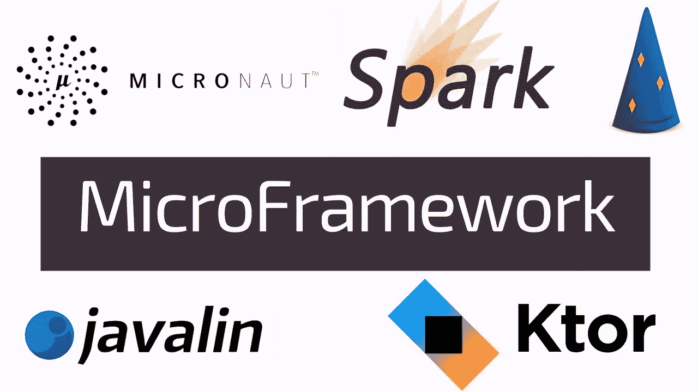
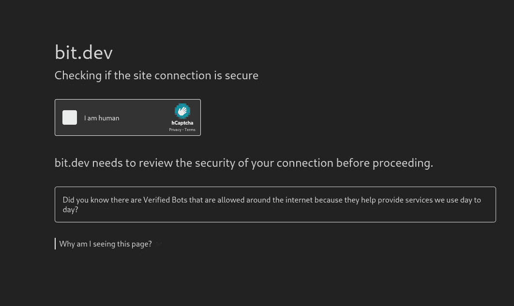
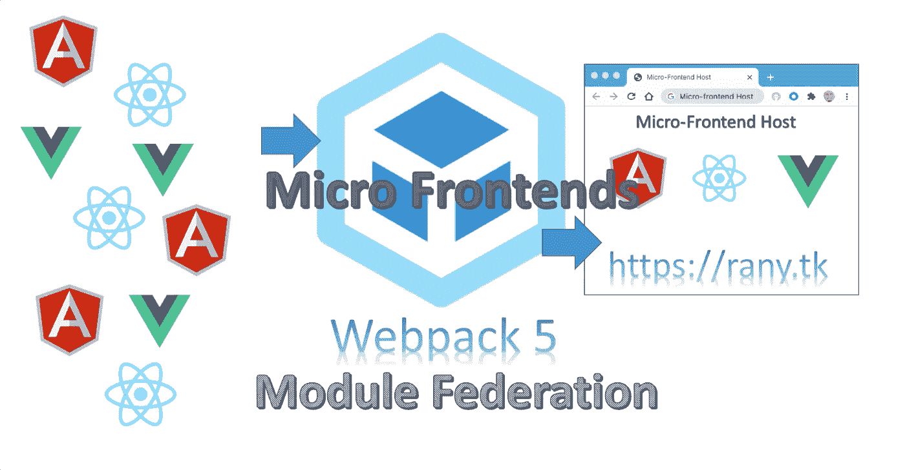
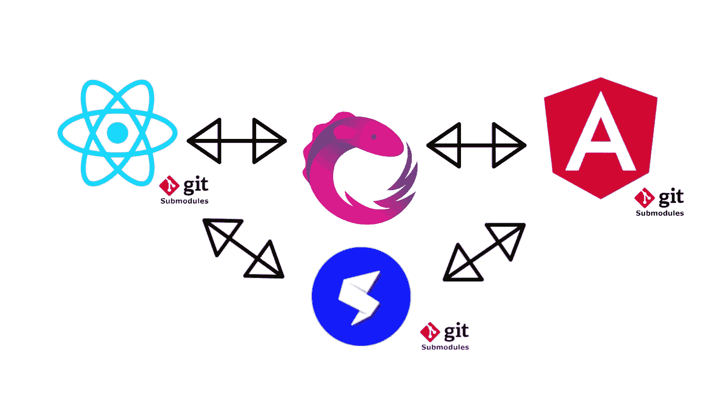
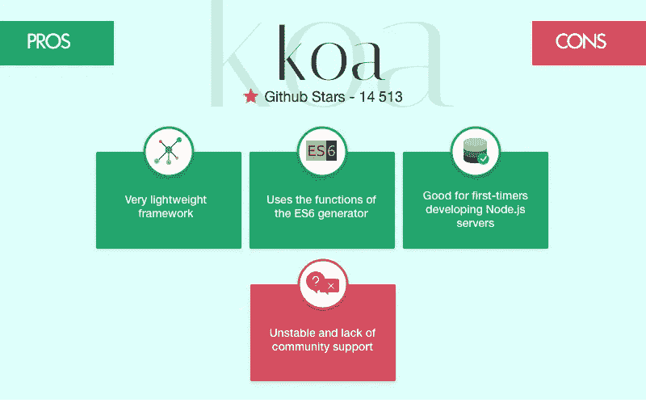
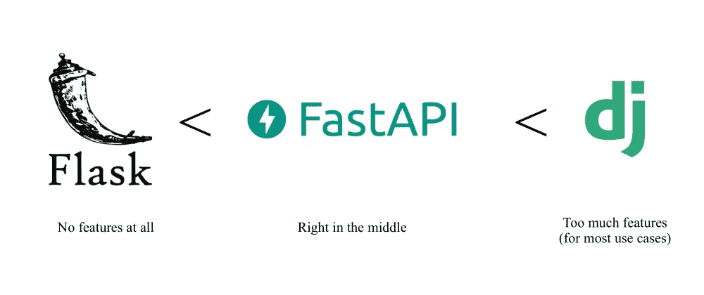

# 什么是微框架？您应该考虑使用的最佳选择…

> 原文：<https://medium.com/codex/what-are-microframeworks-best-ones-you-should-consider-using-f77eacc44dcb?source=collection_archive---------0----------------------->

## 编码应该是你尽可能少的工作以得到最好的结果，这篇文章将带给你一个循序渐进的过程。

微框架……我认为在被错误重视的同时被使用是非常不受重视的。因此，这篇文章将会给你一个完美的想法，让你知道它是如何工作的，以及如何开始使用它。

信用:[https://i.ytimg.com/vi/0HWD8ulTtu4/maxresdefault.jpg](https://i.ytimg.com/vi/0HWD8ulTtu4/maxresdefault.jpg)

# 这是什么？

它被定义为一个从基础框架派生出来的“扩展”框架。简而言之，这个框架只有在你安装了一个特定的基础框架后才能使用。这可以给一个框架提供额外的特性，否则你就不会有。在它的基础之外它是没有用的，但是因为它是专门为一个框架开发的，你可以很容易地得到为你使用的框架优化的非常具体的特性。

# 前端与后端微框架

我想我没必要解释这个。它只需要前端或后端的一切，因此得名。microsoframeworks 通常负责前端或后端的特定部分，使其更容易开发。

# 最好的？

## 前端

**Bit** —这个微框架旨在使用组件系统使你的前端更加模块化，其中你前端的所有东西在技术上都被称为组件，这更像是 flutter 的工作流。bit 的工作流程旨在模拟纯状态下的 flutter。不同的是，它在那里被称为 widgets，但在这里被称为 components，Bit 广泛用于 React JS 和其他 Node JS 应用程序。

**Webpack 5 和模块联盟**——顾名思义，它为创建你的网站提供了各种额外的模块。当我说“网站”时，我顺便包括电子和 tauri 应用程序。

**Single SPA** —这将你的应用程序分离并组织成更小的块，帮助你一次轻松完成一项任务。此外，这有助于你从一个框架切换到另一个框架，它有助于你保留你想要的部分，并很容易地删除你不想要的部分，而不用担心丢失依赖和东西。

## 后端

**Express JS** — Express.js，或简称 Express，是 Node.js 的后端 web 应用程序框架，在 MIT 许可下作为免费开源软件发布。它是为构建 web 应用程序和 API 而设计的。它被称为 Node.js 事实上的标准服务器框架

Koa 是由 Express 背后的团队设计的一个新的 web 框架，它的目标是成为一个更小、更有表现力、更健壮的 web 应用和 API 的基础。通过利用异步函数，Koa 允许您放弃回调并大大提高错误处理能力。Koa 在其核心中没有捆绑任何中间件，它提供了一套优雅的方法，使得编写服务器变得快速而愉快。

**Fast API** — FastAPI 是一个现代、快速(高性能)的 web 框架，用于基于标准 Python 类型提示使用 Python 3.7+构建 API。它还通过更简单的语法和更容易编码的标识符来防止错误。它基于 Pydantic 和类型提示来验证、序列化和反序列化数据，并自动生成 OpenAPI。

我会写更多关于所有其他微框架的文章，这对几乎每个开发者都有帮助。这更像是对其工作原理的介绍。也就是说，如果你考虑支持我的 YouTube 视频、Substack 和 Medium 文章，你可以通过 patreon 这样做。我希望您能从中有所收获，我们将在下一篇文章中见面。

**你真棒:)**

> 法丁吉克