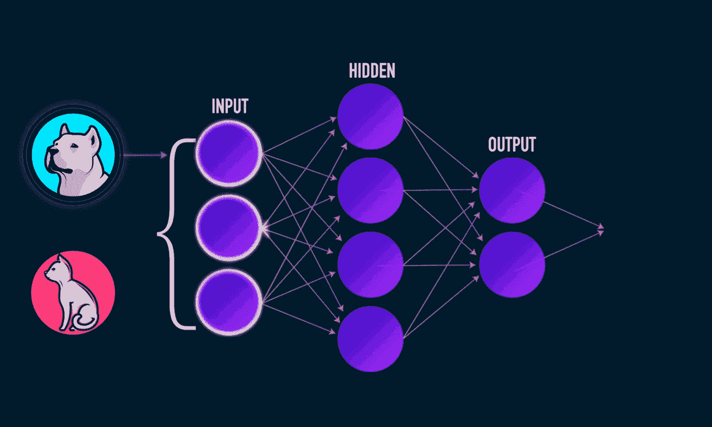
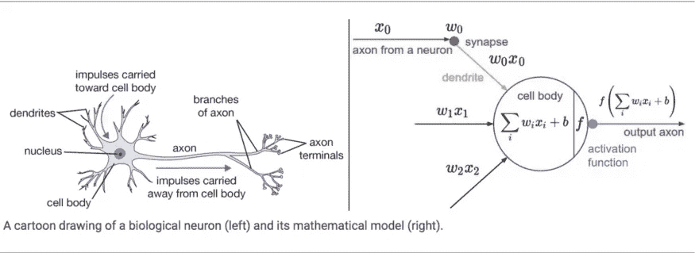
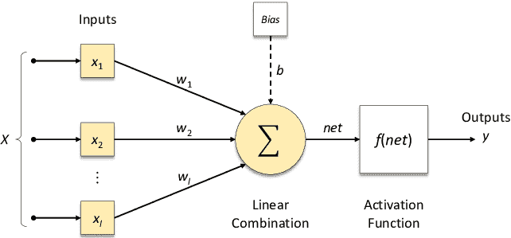
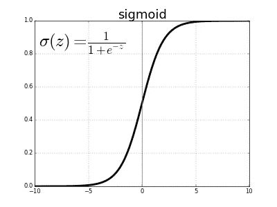
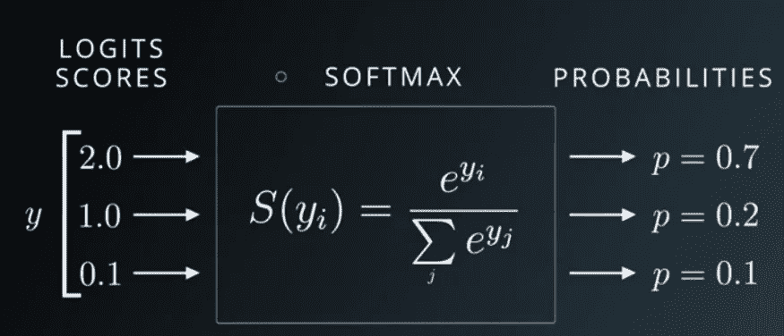
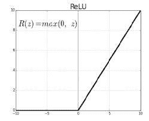
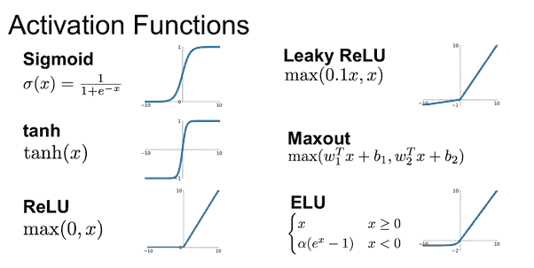
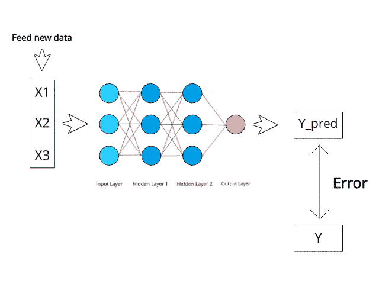
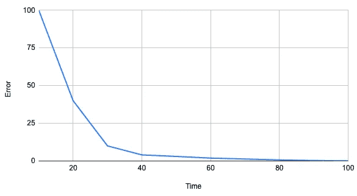

# 什么是神经网络？

> 原文：<https://medium.com/codex/what-are-neural-networks-3a0965e2ebfb?source=collection_archive---------4----------------------->

> **“神经网络是这种不是算法的技术，它是一个上面有权重的网络，你可以调整权重，让它学习。你通过试验来教授它。”—霍华德·莱茵戈德**

作为该系列的延续，我们将在本帖中探讨神经网络。这篇文章旨在指导一个完全的新手了解关于神经网络的一切。如果你已经有了一些专业知识，你应该回顾一下其中的一些，但是你可能从中有所收获。

在这篇文章中，我们将了解什么是神经网络，它们是用来做什么的，以及它们是如何工作的，这是你们一直在等待的！

要做到这一点，你不需要精通技术，或者拥有数学或计算机科学学位；我将把重点放在基础上，将来我可能会发表一篇关于基础数学的更深入的文章。让我们开始派对吧！

## 什么是神经网络？

人工神经网络，也称为神经网络(NNs)或模拟神经网络(SNNs)，是提供深度学习技术核心的机器学习的子集。神经网络是试图模仿大脑的算法。这些灵感来自于构成动物大脑的生物神经网络，但并不相同。这种系统通过检查例子来“学习”执行任务，并且通常没有用特定于任务的规则来编码。

他们通过观察一个物体的例子来学习，比如一只猫或一幅画，并识别重要的特征，这将允许他们在未来的照片中识别这个物体。这些网络不需要知道被分析对象的任何信息。它们足够聪明，只需看几个样本，就能迅速对事物进行分类、预测等等。

现在你知道什么是神经网络，让我们看看它们是如何工作的。

## 为什么要使用神经网络？

凭借其从复杂或不准确的数据中提取意义的惊人能力，神经网络可用于识别模式和发现趋势，这些模式和趋势对于人或其他计算机算法来说太复杂而无法检测。一个经过训练的神经网络可以被认为是它所负责分析的数据类别中的“专家”。然后，该专家可用于响应新的感兴趣的场景进行预测，并回答“假设”查询。

## 神经网络是如何工作的？

这个解释将分为四个部分:感知器，正向传播，激活函数，反向传播算法。

## **感知器**

感知器是最基本的神经网络类型。它最初是为了更好地理解大脑，并以神经元为模型。由 Rosenblatt 开发，它是今天几乎所有神经网络的基础。

感知器是机器学习中二进制分类器的监督学习算法。二进制分类器是确定由数字向量表示的输入是否属于特定类别的函数。它是一种线性分类器，或一种基于线性预测函数进行预测的分类方法，该线性预测函数将一组权重与特征向量相结合。

感知器可以被视为神经网络的单层中的这种构建块，包括四个不同的部分:

1.  输入值或一个输入图层
2.  权重和偏差
3.  净和
4.  激活功能

## 正向传播

上述网络采用数值输入 **X1** 和 **X2** ，并且具有与这些输入相关联的权重 **w1** 和 **w2** 。此外，还有另一个与权重 **b** 相关联的输入 **1** (称为**偏差**)。

遵循感知器如何操作的图很简单:将偏差(b)加到加权输入的净和(来自前一层的每个输入乘以它们的 weight[wᵢxᵢ]).的乘积)上输入可以来自输入层或前一层的感知器。然后通过激活函数发送加权净和，该函数标准化该值并返回值 0 或 1。然后，感知器的选择被传递到下一层，供下一个感知器在决策中使用。这些部分一起构成了神经网络层中的单个感知器。

## **激活功能**

来源:来自 Researchgate 的安东尼奥·拉斐尔·萨比努·帕梅赞

如上图所示，计算神经元的输出 Y。非线性函数 f 被称为激活函数。激活函数的目标是给神经元的输出增加非线性。这很重要，因为现实世界的大部分输入是非线性的，我们希望神经元学习非线性表示。每个激活函数(或非线性)从单个整数开始，然后对其应用定义的数学运算。

实际上，您可能会遇到以下激活功能:

*   **Sigmoid:** 接受一个实值输入，并将其压缩到 0 到 1 之间。sigmoid 的公式如下:σ(x) = 1 / (1 + e⁻ˣ)

Sigmoid 激活函数

*   **Softmax 函数:**在分类任务中，我们经常使用 Softmax 函数作为多层感知器输出层中的激活函数，以确保输出是概率，并且总和为 1。
    soft max 函数获取一个实值分数的无界向量，并将其压缩为一个值介于 0 和 1 之间的向量，其总和为 1。
    因此，在这种情况下，**概率(通过)+概率(失败)= 1。**

Softmax 函数

*   **tanh:** 接受一个实值输入，并将其压缩到范围[-1，1]。公式如下:tanh(x)=(2/(1+e⁻ˣ)-1

Sigmoid 和 Tanh 激活函数的比较

*   **ReLU** : ReLU 代表整流线性单元。它接受一个实值输入，并将其阈值设置为零(用零替换负值)。ReLU 的公式如下:f(x) = max(0，x)

ReLU 激活功能

下图显示了其他几种激活功能:

**偏置的重要性:**偏置的主要作用是为每个节点提供一个可训练的常数值(除了节点接收到的正常输入)。参见 [**此链接**](http://stackoverflow.com/q/2480650/3297280) 了解更多关于神经元中偏见的作用。

## 反向传播

反向传播是一种用于改变*权重*和*偏差*的技术，以便感知器的输出变得更加准确。为了计算梯度，我们计算输出节点的总误差，并使用反向传播通过网络传播这些误差。然后，使用优化算法，如梯度下降，我们“调整”网络中的所有权重，以减少输出层的误差。

下图显示了一个神经网络误差图的示例。误差的度量是神经网络的预测与实际值之间的差距。

神经网络在训练时可能具有的误差图示例。

反向传播使用微积分技术来确定误差线在任一时间点的梯度。如上图所示，陡峭的梯度表明仍然存在较高的误差，但平坦的线表明神经网络相当准确。发现神经网络有多精确，意味着算法可以决定改变多少*权重*和*偏差*(例如，不精确时改变很多，非常精确时稍微调整)。

这些部分共同组成了一个神经网络。

# 结论

今天我们看到了感知器、前向传播、激活函数、反向传播等神经网络的概念。

# 如果你喜欢这篇文章，那么看看我在这个系列中的其他文章

## 1.[什么是机器学习？](/@jagajith23/what-is-machine-learning-daeac9a2ceca)

## 2.[机器学习有哪些类型？](/codex/what-are-the-types-of-machine-learning-53360b7db8b4)

## 3.[一元线性回归](/codex/linear-regression-on-single-variable-f35e6a73dab6)

## 4.[多元线性回归](/codex/linear-regression-on-multiple-variables-1893e4d940b1)

## 5.[逻辑回归](/codex/logistic-regression-eee2fd028ffd)

## 6.[使用神经网络的数字分类器](/@jagajith23/digit-classifier-using-neural-networks-ad17749a8f00)

## 7.[利用 K 均值聚类进行图像压缩](/@jagajith23/image-compression-with-k-means-clustering-48e989055729)

## 8.[使用 PCA 对人脸进行降维](/@jagajith23/dimensionality-reduction-on-face-using-pca-e3fec3bb4cee)

## 9.[使用异常检测来检测网络上的故障服务器](https://jagajith23.medium.com/detect-failing-servers-on-a-network-using-anomaly-detection-1c447bc8a46a)

# 最后做的事

如果你喜欢我的文章，请鼓掌👏一个追随者将是✨perceptionatic✨和这是有益的媒体推广这篇文章，使其他人可能会阅读它。*我是贾加吉思，下一场再来抓你。*