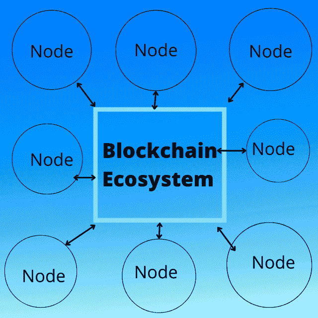

# 区块链生态系统中的节点有哪些？终极指南

> 原文：<https://medium.com/codex/what-are-nodes-in-the-blockchain-ecosystem-ultimate-guide-15d3104a45ed?source=collection_archive---------15----------------------->

照片由[钟登祥](https://unsplash.com/@dengxiangs?utm_source=medium&utm_medium=referral)在 [Unsplash](https://unsplash.com?utm_source=medium&utm_medium=referral) 上拍摄

任何谈论区块链生态系统的人都把它称为一个共享的、不可改变的账本。但是你知道是谁维护着这个分散的区块链生态系统，谁分享着这个账本吗？答案是区块链节点。本文将讨论区块链生态系统中节点的关键概念。

# 区块链生态系统中的节点是什么？

有必要知道什么是节点，我们为什么需要节点。让我们以板球迷为例。他们知道打板球的规则，他们有自己喜欢的球员球队。他们喜欢欣赏他们喜爱的球队之间的比赛。但是如果板球场不能使用会发生什么呢？

在上面的例子中，我们可以比较区块链平台的玩家。团队是不同的区块链，如私有、公共和混合区块链平台，关键因素操场是区块链生态系统中的节点。这意味着区块链节点对于区块链的执行是必要的。

## 节点的用途

开发区块链应用的主要原因是为了确保数据完整性和网络可信度。这些属性通过在多个分布式系统之间共享相同的分类帐来维护。

区块链概念指出，每个包含数据的区块都以加密方式链接到下一个区块。如果您更改或修改一个块，所有后续块都会更改，因为它们的值或散列依赖于前一个块。

如果所有块都集中在一个地方，黑客可以改变这个密码链中所有块的值。区块链是一个分布式网络，在多个系统之间共享账本或数据的相同副本，以确保数据完整性。每一个区块链网络都需要全球分布的系统真正去中心化。

如果一个系统上的分类帐被更改，另一个系统上的分类帐将作为数据完整性的证明。因此，这些系统或区块链节点的可用性使它们变得分散和可信。如果没有节点，区块链只不过是一个受加密哈希保护的数据库。

无论区块链是私有的还是公共的，全球分布的网络对于数据的持久性都是必要的。它将交易记录存储在区块链节点上。节点上不可变的记录是区块链对数据或交易记录无可置疑的可审计性的原因。

此外，该网络可以通过在全球范围内分散不同的区块链节点来抵御集中攻击和自然灾害。

一个区块链节点必须向网络提供区块链账本，即使整个国家因为任何原因被摧毁。

在区块链网络中，节点是用 IP 地址连接到网络的电子设备。一般来说，节点充当通信端点，这意味着任何希望与区块链交互的用户或应用程序都必须通过节点进行交互。因此，节点充当了通信再分布的点。

一个常见的误解是，所有节点都提供相同的功能，所有参与区块链的用户也被视为节点。

这里有两个因素需要考虑。首先，并不是每个连接到区块链网络的设备都是节点。第二，区块链网络上的每个节点并不执行相同的功能。

特定区块链网络的要求定义了该网络中节点扮演的各种角色。

例如， [Corda 区块链](https://blockchainshiksha.com/r3_corda/)有两种类型的节点:一种用于客户端，一种用于验证交易的数字公证人。

另一个值得注意的例子是[Hyperledger Fabric block chain](https://blockchainshiksha.com/hyperledger-fabric/)网络，它需要多个角色来提供模块化架构。包括成员资格服务提供商、用户、背书者、锚和其他实体的节点。

由于每个节点负责执行特定数量的任务，因此创建不同的角色可以使区块链高效运行。

# 功能:

在这种情况下，节点接收事务，接受或拒绝它，记录数据，并将其返回给对等节点。该节点可能需要与其他节点共享该数据并保持同步。通过这种方式，区块链可以跟踪交易。

因此，节点负责确保访问存储在区块链上的数据。虽然区块链中有各种类型的节点，正如本文中已经提到的，但这是基于节点存储数据的想法。

**节点类型**

**(1)完整节点:**当我们在谷歌上随机搜索某样东西时，搜索结果会从存储所有这些信息的最近的服务器返回。同样，满节点维护区块链中的所有交易记录。他们是区块链服务器。

此外，完整节点是区块链治理模式的组成部分。尽管存在各种治理模式的可能性，但区块链通常只会在大多数完整节点批准后进行更新或改进。这样一来，满节点对区块链就有了投票权。

关键是要明白，有很多时候，大量的完整节点同意某些区块链修改，但没有形成多数。例如，55%的节点可能同意特定的更改，而 45%的节点不同意。在这种情况下，硬加密货币分叉是可能的，这意味着区块链被一分为二。新的区块链和旧的区块链都将像以前一样运行，只是增加了 55%满节点所建议的变化。

**完整节点分为以下子类型。**

已被修剪的完整节点下载块，以保持块链分类帐最新。当达到某个阈值时，它会删除最旧的块，为新块腾出空间，从而保持区块链大小。然而，旧块不会被完全删除，因为它们在区块链中的基本元数据和序列仍然存在，以维护区块链的基本原则。

此时，权威节点开始发挥作用。这些节点的名称是指它们负责或负责批准其他节点进入区块链网络。

甚至定义其他节点对特定数据通道的访问，有时也是一些区块链平台中权限节点的责任。例如，Corda 中的门卫服务和 Hyperledger Fabric 中的成员服务提供商将跟踪每个节点的数字身份。

堆叠包括基于预定义的标准(如硬币或网络时间)选择节点。一旦交易通过验证，被选中的节点就可以获得奖励。打桩节点是不需要大量计算能力的节点。

**(2)轻节点:**还记得谷歌搜索中全节点的例子吗？您的本地服务器不会保留所有信息。该服务器仅存储基于最近活动的相关信息，允许您快速访问数据。如果您搜索新的内容，该服务器必须从主服务器检索数据。

一个光节点完成了这个任务。

轻型节点仅存储和提供支持日常活动或更快事务所需的数据。它们不验证块，只存储块头。简化的支付验证节点是这些(SPV 节点)的另一个名称。

**底线**

区块链网络中节点的作用类似于互联网上的服务器。无论您是学生、开发人员、解决方案架构师、研究人员、顾问、企业主，还是参与区块链世界的任何其他人，理解节点的概念都至关重要。

例如，企业主应该了解区块链节点，因为开发区块链应用程序的成本和基础设施在很大程度上取决于节点要求。了解区块链节点使区块链建筑师能够通过利用节点可用性、计算能力等因素来创建最佳解决方案。

每个区块链应用程序都依赖于区块链节点，就像依赖于共识算法或加密技术一样。在下面的文章中，我们将讨论区块链中的共识机制是什么，以及它的变体是什么。敬请关注区块链 Shiksha。快乐阅读

*原载于 2022 年 7 月 2 日*[*【https://blockchainshiksha.com】*](https://blockchainshiksha.com/nodes-blockchain-ultimate-guide/)*。*