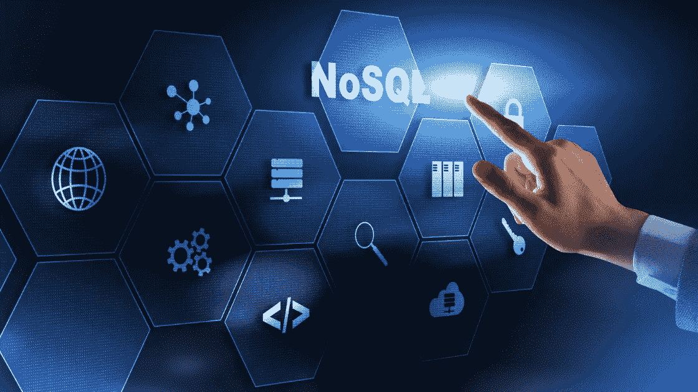

# 什么是 NoSQL 数据库？它们是如何工作的？

> 原文：<https://medium.com/codex/what-are-nosql-databases-how-do-they-work-a9d79b784522?source=collection_archive---------17----------------------->

NoSQL 数据库越来越受欢迎。大型公司使用它们来存储成千上万 Pb 的数据，并每秒执行数百万次查询。

NoSQL 数据库是如何工作的？

但是什么是 NoSQL 数据库呢？

它的机制是什么，为什么它的伸缩性比标准的关系数据库好得多？

让我们先简单描述一下 MySQL、MariaDB、SQL Server 等关系数据库的问题。

它们被设计成以最有效可行的方式存储关系数据。

您可以创建一个包含客户、订单和商品的表，它们在逻辑上联系在一起:客户下订单，订单包含产品。

这种紧密的组织有助于数据管理，但这是有代价的:关系数据库难以增长。

它们必须维护这些链接，这是一项耗时的操作，需要大量的内存和计算能力。

因此，虽然您可以在一段时间内不断更新您的数据库服务器，但它最终将无法管理需求。

关系数据库只能垂直伸缩，不能水平伸缩，而 NoSQL 数据库可以垂直和水平伸缩。

例如，垂直扩展需要在现有建筑上增加楼层，而水平扩展则需要增加新的结构。

您本能地意识到垂直扩展在范围上是有限的，但是水平扩展要强大得多。

为什么 NoSQL 数据库如此具有可扩展性？

首先，他们取消了这些昂贵的领带。

NoSQL 数据库中的每一项都是独立的。

由于这一微小的变化，它们基本上是键值存储。

每个数据库条目只有两个字段:唯一键和值。

例如，在存储产品信息时，您可以使用产品的条形码作为键，使用产品名称作为值。

这似乎是一个约束，但是值可能类似于带有额外数据的 JSON 文档，比如价格和描述。

由于其简化的体系结构，NoSQL 数据库可以很好地伸缩。

如果单个数据库服务器无法保存您的所有数据或执行您的所有查询，则可以在两个或更多服务器之间分配负担。

因此，每台服务器将负责数据库的一个子集。

举个例子:苹果公司运营着一个由 75000 台服务器组成的 NoSQL 数据库。

数据库的这些部分在 NoSQL 被称为分区，这引发了一个有趣的问题。

如果您的数据库被划分成潜在的数千个分区，您如何知道一个项目保存在哪里？

这就是主键发挥作用的地方。

请记住，NoSQL 数据库是键值存储，键决定了项保存在哪里。

NoSQL 数据库在后台利用散列函数将每个项目的主键转换成一个在预定义范围内的数字。

假设值在 0 到 100 之间。

然后，这个哈希值和范围用于决定项目应该存储在哪里。

如果您的数据库足够小或者没有收到大量查询，您可以将所有内容放在一台服务器上。

这位将负责整个系列。

如果该服务器变得过于拥挤，您可以安装一个备份服务器，将范围分成两半。

服务器 1 将负责散列值在 0 到 50 之间的所有事情，而服务器 2 将负责散列值在 50 到 100 之间的所有事情。

从理论上讲，无论是在存储方面还是在可以运行的查询数量方面，您的数据库容量都增加了一倍以上。

这个范围也称为键空间。这是一个直截了当的解决方案，解决了两个问题:在哪里存储新的东西，在哪里定位旧的东西。

您所需要做的就是计算一个条目的键的散列，并跟踪哪个服务器负责键空间的哪个部分。

现在，在这种情况下，0 到 100 的范围非常有限。

它只能让您将数据库分成最多 100 个部分。

因此，真正的 NoSQL 数据库有相当大的键空间，允许它们几乎无限地扩展。

除了可伸缩性，NoSQL 是无模式的，这意味着数据库条目不必具有相同的结构。

每一个都是独一无二的。

在关系数据库中，您必须首先指定您的表的结构，然后每个项目都必须遵守它。

更改这种结构很困难，可能会导致数据丢失。

如果您的应用程序和数据结构不断发展，没有模式可能是一个巨大的好处。

此时，很明显 NoSQL 数据库比关系数据库有几个优点。

但这并不意味着关系数据库过时了；远非如此。

NoSQL 对访问数据的方式有更多的限制，只能通过主键来检索。

按 ID 查找订单很简单，但是查找超过特定金额的所有订单非常耗时。

另一方面，关系数据库没有这样的问题。

这个问题有解决方案，但前提是你知道如何访问你的数据。

情况可能并不总是如此。

另一个缺点是 NoSQL 数据库逐渐变得一致。

当您向数据库中写入一个新项并立即尝试取回它时，它可能无法被检索到。

如前所述，NoSQL 分割你的数据库。

但是，每个分区都在许多服务器上复制。

因此，服务器可以关闭而不会造成太大的损害。

当您向数据库中添加一个新项目时，其中一个镜像会在将它复制到后台的其他镜像之前保存它。

这个过程可能需要一些时间。

当您读取该项时，NoSQL 数据库可能会尝试从可能尚不包含该项的镜像中读取它。

实际上，这并不是一件大事，因为数据复制只需几毫秒。

而且，如果您需要一致性，大多数 NoSQL 数据库都可以提供。

总之，在可预见的将来，NoSQL 和关系数据库都将存在。

每个人都有自己的一套技能和缺点。

既然你已经理解了 NoSQL 是如何工作的，让我们来看一些例子。

云公司积极推动 NoSQL，因为它让他们增长更快。

DynamoDB 在 AWS 上可用，BigTable 在 Google Cloud 上可用，CosmosDB 在 Azure 上可用。

为了给你提供另一个可扩展性的例子，亚马逊的 NoSQL 数据库在 2019 年亚马逊 Prime Day 期间达到了每秒 4500 万次查询的峰值。

太不可思议了！

但是，您可以使用 Cassandra(由脸书创建)、Scylla、CouchDB、MongoDB 等工具自己操作 NoSQL 数据库。

在我们结束这段视频之前，让我们先简要了解一下术语“NoSQL”

这有点令人费解，因为它可能有两种解读方式。

首先，“NoSQL”可能意味着“不仅仅是 SQL”，指的是一些 NoSQL 数据库除了它们自己的查询能力之外，还理解 SQL 查询语言。

其次，在“非关系”的意义上，它经常被称为“NoSQL ”,因为它不能容易地保存关系数据。

这篇博文到此结束。

如果你从中学到了什么，请跟我来，我希望看到一些掌声！！