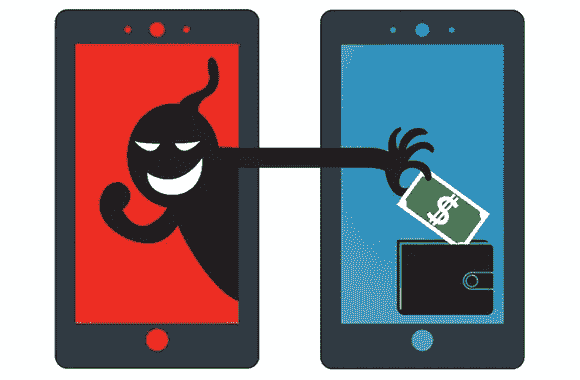

# 什么是流氓手机应用？

> 原文：<https://medium.com/codex/what-are-rogue-mobile-apps-29bf80d5871f?source=collection_archive---------12----------------------->

流氓移动应用可能是网络罪犯中增长最快的现象。

它们是未经授权和授权的移动应用商店的一个经常性问题，包括 Google Play 和 App Store。

流氓移动应用程序是假冒应用程序，旨在模仿可信品牌或具有非广告恶意功能的应用程序。在这两种情况下，目标都是不知情的用户安装应用程序，以窃取敏感信息，如信用卡数据或登录凭据。

安装应用的常见方式是使用官方应用商店。默认情况下，安卓和苹果的 iPhone 都不允许用户安装来源不明的应用。然而，这并不意味着我们可以相信官方应用商店。

这是一种新形式的数字欺诈，仅在过去几年中就开始流行。完成起来也简单得吓人。有人只需要建一个看似无害的 app，把你的 logo 贴上去，免费放上去。然后，当您的客户下载它时，认为这是您公司的一个有趣的奖励，您和他们都受到以下一个或多个问题的困扰:

1.  **数据盗窃** —身份盗窃是指出售非法获取的私人数据，如今这种行为几乎已经达到了泛滥的程度。网络罪犯总是在寻找新的方法从不知情的受害者那里窃取信息，而您的客户详细信息数据库是一个诱人的目标。他们只需要你的客户的帐户登录或其他授权，并不难保护那些带有你信任的标志的假冒应用程序。
2.  **品牌假冒** —冒充您公司的犯罪分子可以使用未经授权的应用程序与您的客户沟通，向他们发送短信或电子邮件，或通过社交媒体与他们联系，以提供欺诈性产品和服务或索取敏感信息，他们可以用这些信息来实施许多其他骗局。这样一来，你的公司就要为造成的任何伤害承担责任。
3.  **财务损失**——如果你的公司通过移动应用程序进行任何形式的在线交易，客户的信用卡号、个人识别码和类似信息都可能通过伪装成合法业务的虚假应用程序被窃取。你的业务也可能暴露在勒索软件之下，你的网络被加密，实际上被扣为人质，直到你支付黑客的要求。

## 如何识别恶意应用程序

防范恶意应用程序风险的最佳方法之一是能够识别它们。无论您是在下载前发现它们，还是在下载后发现它们，识别危险信号都有可能为您的企业节省资金或阻止数据泄露。了解如何防止流氓安全软件和其他威胁性应用程序将您的数据置于风险之中是非常重要的。

虽然发现恶意应用程序可能是故意的，但您可以通过几种方式来识别恶意应用程序:

*   **下载站点:**如果一个 app 在不可靠的下载站点上，可能不值得信任。从网站或电子邮件下载应用程序的链接通常是有风险的，但你可以轻松地自行搜索。检查是否有合法网站提供该应用程序，如 Google Play 或 iOS 应用商店。此外，如果应用程序安装失败，请留意任何可疑活动的迹象，因为下载可能仍然会在您的设备上安装恶意软件。
*   **条款和条件:**没有人喜欢在应用程序的条款和条件页面中挖掘法律术语。但它可以让你了解一个应用程序是否合法。即使他们看起来写得很好，也要更深入地检查关于指控或其他违反安全的亮点。
*   **权限:**当你下载一个新的应用程序并第一次打开它时，许多提示用户允许该软件访问手机的其他部分。您可能会看到一个弹出窗口，要求访问硬件，如您的麦克风或相机，或者存储信息的应用程序，如您的照片或联系人。如果您向流氓应用程序授予权限，可能会危及您的安全。判断一个应用程序可能是流氓的一种方法是，如果它要求访问一个它不应该需要的应用程序。除非它们是一种社交媒体或编辑软件，否则大多数应用程序都没有理由读取你的联系人或照片。
*   **评级和创建者:**合法下载网站上的应用程序将附带以前和当前用户的评级和评论。这些人有使用该应用程序的经验，可能会提供关于它是否值得信赖的见解。如果您看到持续的低评级或包含其他危险信号的评论，它可能是一个流氓应用程序。应用程序的详细信息对于确定程序的来源和验证程序的真实性也很有用。应该列出一个创建者或开发团队。如果你正在下载一个银行应用程序或其他处理敏感信息的软件，请确保创建者匹配。例如，如果你正在访问一家特定银行的移动应用程序，检查一下是否是同一家公司创建的。
*   **电话账单:**你的电话账单或许能让你洞察流氓应用带来的任何可疑活动。如果你怀疑你下载了一个流氓应用程序，每个月检查你的声明多次。如果您看到任何异常情况，您可以致电您的服务提供商了解更多详情。

## 流氓移动应用防护技巧

知道如何保护自己免受这些流氓应用程序的攻击很重要。这里有一些提示:

*   始终从合法商店下载应用程序和应用程序更新，如 iTunes 或 Google Play。不要点击电子邮件或网站上的应用链接。去合法商店搜索你想要的应用程序。
*   看看是谁开发了这个应用程序。如果一个银行应用不是由银行自己开发的，它可能是不合法的。
*   检查应用程序在您的移动设备上需要哪些权限。例如，如果一个 Torch 应用程序需要访问你的联系人列表或者需要发送短信的许可，就要怀疑。
*   在安装新应用程序之前，阅读应用程序商店上的评论。其他人已经帮你做了跑腿的工作。用它！

通过攻击移动设备进行诈骗正变得越来越普遍。虽然主要是在 Android 领域，但苹果、Windows 和其他设备从来都不是完全安全的。在安装新的应用程序之前，一定要做好调查，并且要意识到你在移动设备上进行的任何在线交易都有可能让你面临网络攻击的风险。

*来源:*
[https://www . cyber shark . com/what-are-rogue-applications-and-how-can-you-identify-them/](https://www.cybershark.com/what-are-rogue-applications-and-how-can-you-identify-them/)
[https://fraudwatchinternational . com/mobile-applications/ways-rogue-mobile-apps-can-harm-your-brand/](https://fraudwatchinternational.com/mobile-applications/ways-rogue-mobile-apps-can-harm-your-brand/)
[https://fraudwatchinternational . com/all/identify-avoid-rogue-mobile-apps/](https://fraudwatchinternational.com/all/identify-avoid-rogue-mobile-apps/)
[https://securityblog.switch.ch/2019/01/30/rogue-mobile-app/](https://securityblog.switch.ch/2019/01/30/rogue-mobile-app/)