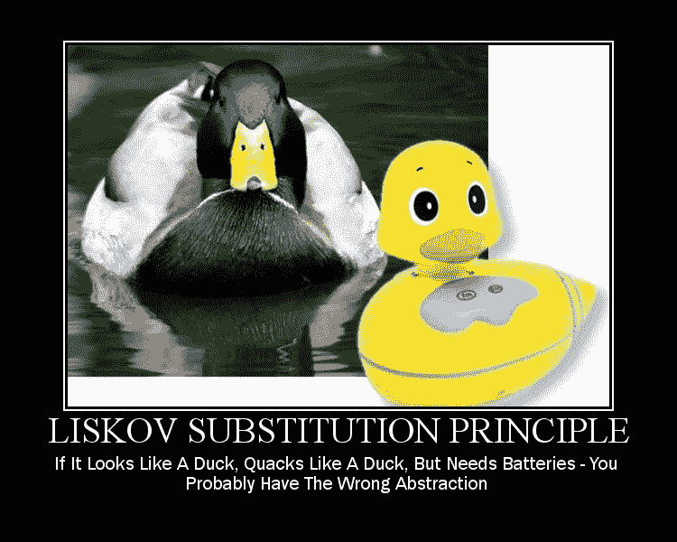

# 有哪些扎实的原则？

> 原文：<https://medium.com/codex/what-are-solid-principles-1a863b782e91?source=collection_archive---------12----------------------->

有时在你的代码中使用软件原则是完美的。它在许多方面帮助你提高代码质量。每项原则在《守则》中都有具体的用法。然而，在选择原则时最好要小心，因为它有时会增加复杂性而不是好处。所以今天，我想谈谈坚实的原则。

罗伯特·c·马丁在 2000 年提出了坚实的原则，从那时起，它一直很受欢迎。坚实原则的主要目标是提高开发质量。

坚实的原则代表着:

1.  s——单一责任原则
2.  O —开闭原则
3.  李斯科夫替代原理
4.  I——界面分离原则
5.  依赖倒置原则

所以我们将讨论所有的原则。

## 什么是单一责任原则？(温泉)

> 一个类应该只有一个改变的理由

假设我们有一个通知类，负责通知用户即将发生的事件。用户可以选择在哪里接收通知，可以是电子邮件，也可以是电话。因此，如果事件发生，我们应该根据用户的设置向她发送通知。

让我们来看看这个例子

实现细节是隐藏的。

那么代码有什么问题呢？正如您已经注意到的，我们的 NotificationService 已经有两个职责。首先，它发送电子邮件，其次，它发送短信到手机。有时，我们的代码会变大，变得混乱不堪，以至于一个变化可能会破坏系统的其他部分，这导致我们将时间花在维护上，而不是开发上。

为了避免这样的问题，我们需要划分责任。NotificationService 已经有多个责任。例如，它通过 NotificationService 向手机发送电子邮件和短信。为了利用 SRP，我们需要有单独的类，并赋予它们各自的职责。

让我们做一些重构，把所有的东西放回原处。

重构后

现在，我们的 NotificationService 责任已经被分成了几个类。每个阶层都有一个改变的理由。

## 开闭原理是什么？(OCP)

> 软件实体(类、模块、功能等)。)应该对扩展开放，但对修改关闭

改变现有的代码总是很危险的。已经在生产中测试和部署。但幸运的是，有很多方法可以避免这样的问题。其中之一是利用开闭原理。

让我们假设我们正在开发一个用户可以画多边形的画布工具。

实现细节是隐藏的。

从上面的代码可以看出，我们有 Figure 类负责绘制多边形。此外，我们有一些方法用于绘制特定的图形，例如，三角形。但是如果我想增加更多的数字呢？更改现有代码可能会导致我们破坏某些东西。另外，代码本身看起来很糟糕。因此，矩形、三角形和圆形方法在 Figure 类中是公开的。因此，我不能添加更多的数字，因为我最终会一塌糊涂。此外，这个人物还有许多责任。我们已经说过，一个类必须只有一个改变的理由。因此，要利用 SRP 和 OCP，我们应该分离责任。

首先，我们必须创建一个抽象类，负责根据参数绘制图形。最后，我们必须为数字创建类。

抽象类帮助我们在不改变图形类的情况下添加更多的图形。此外，它已经包含了为派生类绘制图形的必要方法。

重构之后，我们可以安全地添加任意数量的图形，而不需要接触图形类。

## 什么是利斯科夫替代原理？

> *设φ(x)是关于 T 类型的对象 x 的一个可证明的性质。那么φ(y)对于 S 类型的对象 y 应该是真的，其中 S 是 T 的子类型"*

让我们假设我们有能走路、飞和吃东西的鸟抽象类。我们根据这种鸟创建了一个企鹅类。所以我们期待一只企鹅会飞，但是出乎意料的是，该方法没有在 Penguin 类中实现，导致了意外的行为。

另一个例子，假设你正在开发一个开放的 API，你有一个抽象类和派生类，一些派生类不支持抽象类。然后，当一个开发者开始使用你的 API 时，他会很困惑，有些派生类不能用了。

让我们看一下鸟的例子:

正如您在 Penguine 类中看到的，我们扩展了 Fly 方法，该方法没有实现，因为企鹅不会飞。但是用户预计 Fly 方法将适用于所有 Bird 派生类。但是 Penguin 类会让用户产生意想不到的行为，因为它不支持抽象类。

为了改进代码，我们可以有两个抽象类，一个用于能飞的鸟，另一个用于不能飞的鸟。

现在我们的企鹅和麻雀类支持抽象类。

## 什么是界面分离原理？

> 不应该强迫客户端依赖他们不使用的接口。

当我们开发软件时，代码总是在增长，更多的需求会不时地被添加进来。于是，一些界面不断增长，变得凌乱不堪。因此，让接口尽可能小总是一个好习惯。

让我们来看看这个例子:

在上面的代码中，我们有在电话和计算器中使用的 IDevice 接口。然而，由于它们都是设备，你只能用电话打电话给别人。因此，根本不使用计算器中实现的 Call 方法。此外，设备的功能非常丰富。如果我们把它们都包括在内，我们最终会陷入一片混乱。我们的类将依赖于他们不使用的方法。

为了避免这样的问题，我们可以将接口分成更小的组件，并为设备使用合适的接口。

让我们看看这个例子。

这样，我们可以利用 ISP。

## 依赖倒置原理是什么？

> 1.高层模块不应该依赖低层模块。两者都应该依赖于抽象
> 
> 2.抽象不应该依赖于细节。细节应该依赖于抽象。

考虑一个场景，其中有一个类被上百个类引用。有一天，你决定改变引用，所以你必须经历一百个类，然后一个一个地改变它们。所以你会花很多时间去修改代码。此外，您必须测试系统的每个部分，以确保您没有破坏任何东西，这是一项耗时的任务，我们开发人员需要始终避免。

让我们看看这个例子。

所以我们的应用程序支持两个数据库，SQL 和 Mongo。此外，我们还有用户存储库

如您所见，存储库直接引用了一个数据库。出于几个原因，这并不好。首先，存储库关心的是谁做操作，而不是它做什么。其次，如果我们想用 SQL 修改 Mongo，我们必须遍历所有引用 Mongo 的存储库，并逐个修改它们。最后，我们正在向我们的存储库引入复杂性。所以基本上，它与 Mongo 紧密耦合。

要应用 DIP，我们必须更改我们的用户存储库:

现在，我们的用户存储库依赖于高层抽象。它只关心写操作，而不关心谁做写操作。

我希望它给了你一些什么是坚实的原则的基本概念。

以下是一些有用的参考资料:

1.  [https://en.wikipedia.org/wiki/SOLID](https://en.wikipedia.org/wiki/SOLID)
2.  https://daedtech.com/dependency-injection-or-inversion/