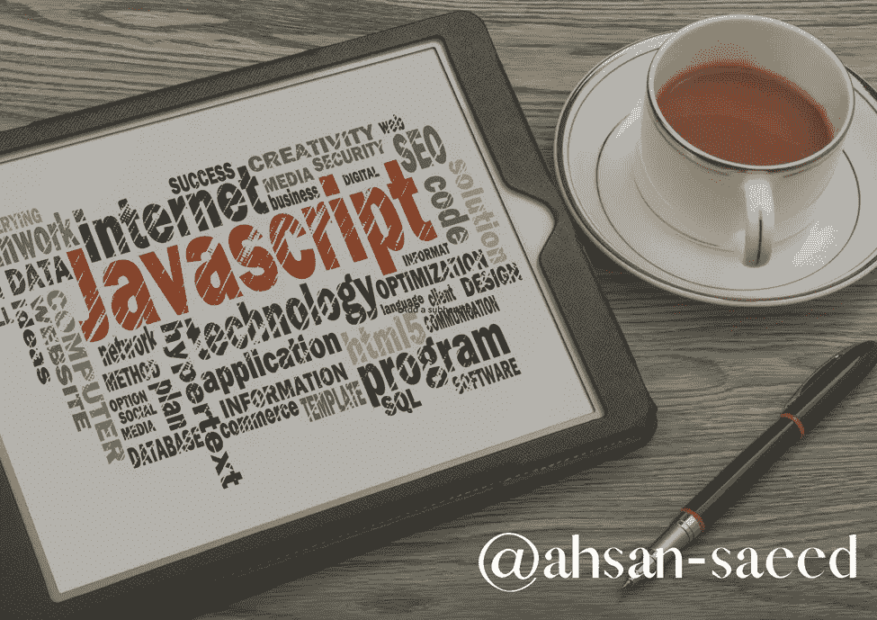

# 编写 JavaScript 库 API 的一些最佳实践是什么？

> 原文：<https://medium.com/codex/what-are-some-best-practices-for-writing-javascript-library-apis-b5934a090d17?source=collection_archive---------16----------------------->

## “通过成熟的策略释放编写 JavaScript 库的力量”

开发 JavaScript 库 API 可能是一项艰巨的任务，尤其是对于那些 web 开发新手来说。然而，创建一个实用的、有帮助的库 API 在遵循某些最佳的…