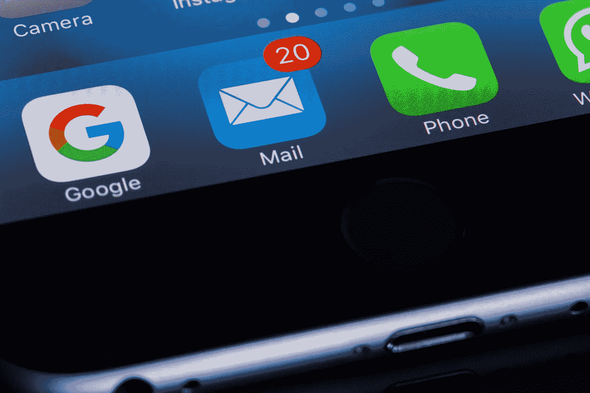

# 学习编程最好的 app 有哪些？

> 原文：<https://medium.com/codex/what-are-the-best-apps-to-learn-programming-a353e6f86536?source=collection_archive---------3----------------------->

## 这里有两个我最喜欢的！

由来自 [Pexels](https://www.pexels.com/photo/black-and-gray-digital-device-193003/?utm_content=attributionCopyText&utm_medium=referral&utm_source=pexels) 的 [Torsten Dettlaff](https://www.pexels.com/@tdcat?utm_content=attributionCopyText&utm_medium=referral&utm_source=pexels) 拍摄

"这个国家的每个人都应该学习电脑编程，因为它教会你思考。"史蒂夫·乔布斯。

编程可能是目前最受欢迎的技能之一。即使你不渴望成为一名软件工程师，也不想与任何技术相关联，我仍然…