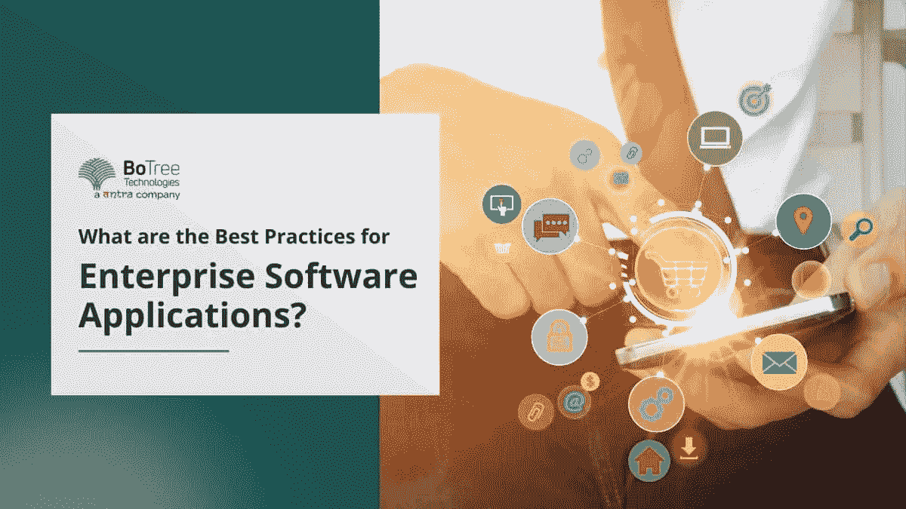

# 企业软件应用的最佳实践是什么？

> 原文：<https://medium.com/codex/what-are-the-best-practices-for-enterprise-software-applications-b2588ab0ab51?source=collection_archive---------19----------------------->

在我们直接进入企业应用软件开发的最佳实践之前，我们必须问自己——什么是企业软件应用？

企业软件应用程序是专业软件开发公司设计的平台，用于解决关键问题、降低效率并改善员工在公司内的体验。

企业应用程序开发过程不能满足少数个人的需求；相反，它侧重于满足一个拥有适当系统的组织的需求。因此，可以委托一家[可信的企业软件开发公司](https://www.botreetechnologies.com/enterprise-software-development-company) 基于公司的框架和需求来设计产品。

商业企业在企业软件上投入了大量资金。大约在 2022 年

预计用于企业应用的 IT 支出约为[6750 亿美元](https://www.statista.com/statistics/203428/total-enterprise-software-revenue-forecast/)。然而，虽然企业软件应用程序已经成为人们谈论的话题，但它的实现却不是一个玩笑。

> **阅读更多:** [**针对企业软件开发需求的 10 大软件咨询公司**](https://botreetechnologies.medium.com/top-10-software-consulting-companies-for-enterprise-software-development-needs-43bfaa4d1515)

在开发企业应用程序之前，您必须回答的一个最关键的问题是——创建一个定制应用程序需要什么？

这个问题很难回答，因为很多费用都是在项目过程中发生的。有时，项目吸收的资源比预期的多，完成的时间也比决定的长。

幸运的是，一些应用程序开发最佳实践可以帮助构建有效的 CI/CD 管道。这些练习有助于合并不同开发人员的所有代码，并确保代码可以在任何时候快速发布，即使它不断变化。

# 与企业软件开发相关的挑战

BoTree Technologies 等受信任的软件开发公司开发企业软件应用程序，帮助客户提高生产力、效率和功能。然而，即使有最好的意图，开发人员在开发过程中也会面临一些挑战。以下是开发阶段面临的一些挑战

*   **安全**
*   企业应用程序使用敏感数据，这使得它容易受到潜在的网络攻击和黑客攻击。此外，随着公司业务规模的扩大，现有配置也在演变，这为恶意攻击创造了更多的机会。
*   因此，保持应用程序的安全性成为一个持续的挑战。一个好的开发团队始终需要执行快速的错误修复和预防措施。
*   **快速适应的必要性**
*   关于市场，我们能说的一件事是——它在变化。因此，公司必须对周围环境有一个灵活的定位。
*   公司的 IT 需求也随着变化而变化。不幸的是，这使得开发企业软件应用程序成为一项艰巨的任务。
*   灵活性和使用最佳开发方法快速响应变化的能力是所有成功的[软件解决方案公司的标志。](https://botreetechnologies.medium.com/top-10-custom-software-development-companies-in-2022-5045e31cadd3)
*   **找到并留住合适的人才**
*   您可能需要具备特定技能的开发人员来开发适合您业务需求的企业软件解决方案。不幸的是，找到这样的开发者是一个巨大的挑战。
*   然而，你可以通过小心地将[软件开发服务](https://www.botreetechnologies.com/blog/what-services-does-a-software-development-firm-provide/) 外包给经验丰富的[定制应用](https://www.botreetechnologies.com/custom-application-development)开发者，比如 BoTree Technologies，来轻松解决这个问题。
*   **多家供应商**
*   有时，在开发过程中会涉及到不同的开发团队。为了成功的开发，所有的供应商必须和谐地工作。
*   确保开发周期不偏离轨道是一项挑战。因此，需要一个运行在流畅的工作流管理系统上的开发策略来管理您的软件开发生命周期。
*   **存储和处理数据**
*   出于生产目的存储和使用数据始终是一项挑战。大量数据是非结构化的，因此难以使用、存储和分析。
*   一个适当的数据存储机制是必要的，以便以一种有组织的形式存储大量数据，从而可以对其进行充分的分析。公司可以根据需要选择基于云的存储解决方案来解决这些问题。

# 6 大企业应用软件开发最佳实践

尽管有这些挑战，开发和使用企业应用程序还是有很多好处的。Top [企业应用开发](https://www.botreetechnologies.com/blog/why-companies-use-net-for-enterprise-development/)最佳实践可以帮助您应对挑战。

1.  **测试过程自动化**

*   在正确的测试结束之前，任何开发过程都是没有帮助的。一个好的测试过程有助于确定使用哪些测试，创建这些测试，然后推动功能。
*   在开发过程中自动化测试阶段是非常有益的。测试是这一过程的关键部分，它有助于确保软件在发布或部署到客户机服务器之前没有错误和问题。
*   自动化将帮助您优化您的资源，并管理一个更好的、功能更强的开发过程。

**2。确保应用安全**

*   一家公司最不希望的事情就是数据泄露。如果公司的私人数据遭到破坏，可能会导致巨大的损失，最轻微的是名誉受损。
*   有必要确保数据安全合规性。然而，这可能会耗费时间，令人沮丧。此外，将其搁置会导致数据泄露、审计失败和品牌信誉下降。
*   企业应用软件工程师可以从开发项目的开始就进行安全测试。它可以帮助他们识别任何危险的漏洞或风险，并快速修复它们。
*   不同的开发库和工具，如 Veracode、DeepScan、GitLab 等。可用于消除任何可能耗费组织时间和金钱的人为错误。

**3。定义你的目标**

*   在开始你的发展过程之前，你必须明确你的目标。确保你向所有项目干系人清楚地定义了你试图达到的目标。
*   回答以下问题
*   为什么要开发这些企业软件应用？
*   它将服务于什么商业目的？
*   你准备在这个项目上投资多少？

始终确保所有的关键利益相关者，尤其是开发人员，都知道你的目标。这个首要目标应该从第一天就明确设定。

1.  **概述所需的特性和功能**

*   如果开发范围经常变化，可能会影响开发过程和交付时间表。[专门的开发团队](https://www.botreetechnologies.com/blog/how-to-hire-a-dedicated-software-development-team-in-2022/) 可能会发现，如果客户不断改变他们软件的特性或功能，跟上时间表是一项挑战。
*   这是令人沮丧的，并且还会延迟项目交付和增加预算。为了避免这种情况，请清楚地概述您需要企业软件应用程序的哪些特性和功能。

**2。确定构建应用程序的编程语言和平台**

*   软件应用程序是使用特定的语言构建的，例如 Python、Java、C、Ruby on Rails 等。
*   如果你拥有合适的技术专长，确保[聘请 IT 顾问](https://www.botreetechnologies.com/blog/what-to-consider-while-hiring-an-it-consultant/)为你的开发过程提供建议，包括为你的应用选择最佳语言。
*   同时，有必要决定你的软件将在哪个平台上运行。这包括移动或桌面设备。对于桌面，您可以在 Windows、macOS、Linux 等平台上构建。另一方面，只有两个主要的移动平台——Android 和 iOS。

**3。选择合适的团队**

*   因为项目的最终成功掌握在开发人员的手中，所以您必须建立专门的开发团队，专注于不同的技能来构建软件的各种元素。
*   一个好的软件开发团队将帮助你提供完整的端到端解决方案，从领导战略到基础实施。一旦整个项目结束，软件团队将继续为应用程序提供支持和维护。

> **阅读更多:** [**软件架构在企业软件开发中的特点和重要性**](https://topappdevelopmentcompanies.com/software/characteristics-and-importance-of-software-architecture-in-enterprise-software-development)

# 结论

[企业应用](https://www.botreetechnologies.com/blog/complete-guide-to-enterprise-application-integration/)软件开发帮助企业更好地管理运营。为了确保您在行业中保持领先地位，您需要创新的定制解决方案来帮助您应对业务挑战和实现目标。

值得信赖的软件开发公司可以帮助您开发健壮的、可伸缩的软件。有了上面提到的最佳实践的帮助，一个公司可以开发一个持久的软件应用程序。

你在寻找最好的软件开发团队吗？作为领先的[企业软件开发公司](https://www.botreetechnologies.com/blog/types-of-enterprise-software-for-companies/)，BoTree Technologies 使用最好的[开发工具](https://www.botreetechnologies.com/blog/top-software-development-tools/)为我们的客户提供他们期望的定制应用。

**常见问题**

开发企业软件应用程序的最佳实践有哪些？

以下是 BoTree while [企业应用软件开发](https://www.botreetechnologies.com/blog/enterprise-vs-standard-software-development/)遵循的最佳实践

1.  明确定义目标
2.  选择正确的团队
3.  指定功能和设计
4.  确保安全
5.  定义时间表和目标

阅读博客，了解 ERP 应用程序开发的最佳实践。

**ERP 软件解决方案的灵活性如何？**

每个商业组织都有[定制软件](https://www.botreetechnologies.com/blog/customized-software-what-is-it-types-and-examples/)需求。多年来，ERP 软件开发已经发展到适应企业的定制需求。此外，应用程序允许功能的灵活性和可配置性，使更改变得容易。

**有哪些企业软件应用** [**统计**](https://www.deskera.com/blog/frequently-asked-questions-about-erp/) **？**

1.  几乎 50%不包括第三方实施监督的 ERP 部署最终第一次就失败了。
2.  接近 74%的 ERP 项目需要的时间比业务部门估计的要多。
3.  ERP 系统将准时交付速度提高了 24%
4.  2018 年 Oracle 的一项研究报告称，76%的企业已经将流程转移到了云

*原载于 2022 年 9 月 28 日*[*https://www.botreetechnologies.com*](https://www.botreetechnologies.com/blog/best-practices-for-enterprise-software-applications/)*。*