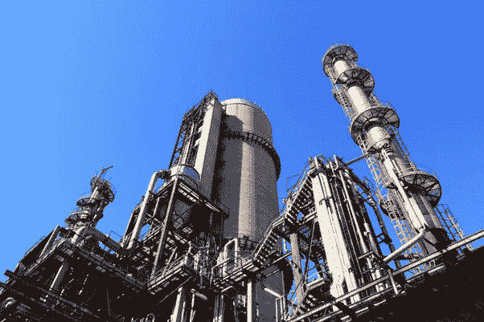

# 工业自动化有哪些网络安全风险？

> 原文：<https://medium.com/codex/what-are-the-cybersecurity-risks-for-industrial-automation-6b15230bba9c?source=collection_archive---------13----------------------->

## [工业网络安全](/@patrickberry/list/industrial-cybersecurity-d1de4d9130e9)

## 评估威胁和后果

资料来源:http://www.pexels.com

# 介绍

越来越多的数字控制系统控制着我们的工业设施(炼油厂、发电站、水处理、牛奶场、食品加工等)。)是否连接了互联网，以及…