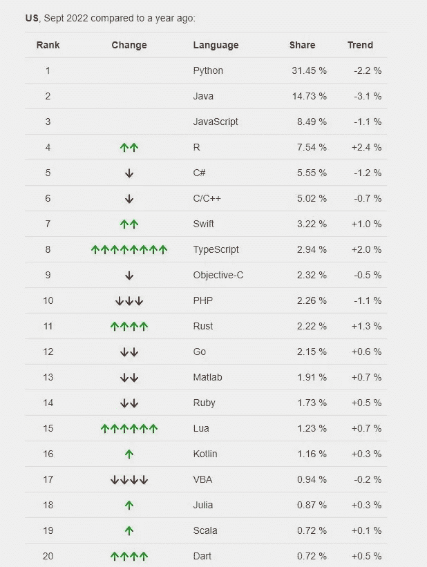

# 美国最流行的编程语言是什么？

> 原文：<https://medium.com/codex/what-are-the-most-popular-programming-languages-in-the-usa-d2348e989a3b?source=collection_archive---------5----------------------->

*作者玛丽·摩尔，**文案*

**

*Lena Vargas 的插图*

*软件和移动应用程序开发是蓬勃发展的行业。由于技术进步，它们将在未来几年继续受益。为了获得最大的收入，选择一个适合发展 it 业务的国家也是至关重要的。虽然我们生活在全球化时代，但有些市场比其他市场更容易征服。例如，美国公司进入的速度更快，因为它为其他软件公司所熟悉。*

*事实上，美国主导了开发市场的很大一部分。2021 年带来了超过 [31.83%](https://www.appmysite.com/blog/mobile-app-development-market-share/) 的营收份额。根据 Zippia 的数据，这一领域的平均工资约为 100，076 美元。所以，如果你是企业主或开发商，与美国客户合作是值得考虑的。*

*然而，在开始一个项目之前，明智的做法是搜索哪些工具在美国流行。这一知识对小企业和初创公司至关重要，因为任何错误都会导致费用上升。*

*当然，每个领域的流行技能都不尽相同。在这篇文章中，你将会发现美国市场对 web 和应用程序开发需求很高的语言。*

# *美国最流行的编程语言是什么？*

*下面的 GitHub 统计数据是基于 [PYPL](https://pypl.github.io/PYPL.html?country=US) 指数，该指数分析了人们在谷歌上搜索某些语言的信息和教程的频率。*

**

*美国 20 种流行的编程语言*

*如你所见，这三种顶级语言已经整整一年没有失去他们的位置了。这一事实是又一个迹象表明，他们真的是有需求的。*

*让我们仔细看看这个列表中适合 web 或 app 开发的 7 种编程语言。*

**

# *计算机编程语言*

*Python 的工作始于 80 年代末，当时人们想为 ABC 创建一个继任者。第一版于 1991 年发布。目前，Python 用于后端开发，它是创建可伸缩 web 应用程序的一种很好的语言。YouTube、Instagram、Pinterest 和 SurveyMonkey 等大型企业都是在 Python 的帮助下创建的。此外，它一直是世界上排名第一的语言。根据 StackOverflow 2022 开发者调查， [48%](https://survey.stackoverflow.co/2022/#technology) 的受访者使用 Python。有几个原因。*

*最主要的一点是它对初学者很友好。有大量免费和付费的课程可供选择。人们在 YouTube 上发布教程，创建小型视频游戏，并出版解释其编码原理的书籍。此外，一个人可以加入数百个社区一起研究一切。*

*Python 编程语言给应用程序开发人员提供了很多机会，但它仍然有一些优点和缺点，可能会扰乱工作。*

***优点:***

*   *支持各种库*
*   *代码可读性高*
*   *复杂应用的可扩展性*
*   *开源语言*
*   *在多个平台上工作*

***缺点:***

*   *缓慢的速度和执行*
*   *消耗大量内存*
*   *不适合客户端编程*

**

# *Java 语言(一种计算机语言，尤用于创建网站)*

*Java 是 Sun Microsystems，Inc .开发的，他们努力创造一种编程语言，帮助普通设备相互连接。它于 1995 年发布，允许 web 开发人员在网页中实现各种多媒体。今天，Stack Overflow 的最常用语言列表将 Java 排在第五位。*

*它是电子商务网站和企业财务平台以及 Android 应用程序的流行编程语言。谷歌甚至建立了一个 Java 框架，用于在这个名为 Android Studio 的操作系统上进行开发。*

*Java 的优缺点是什么？*

***优点:***

*   *高安全标准*
*   *维护成本低*
*   *独立于平台且非常灵活*
*   *提供内存分配和自动垃圾收集*
*   *支持多线程*

***缺点:***

*   *可怜的 GUI 生成器*
*   *没有备份功能*
*   *付费商业许可证*

**

# *Java Script 语言*

*1995 年，Brendan Eich 为 Netscape 2 浏览器开发了 JavaScript。后来，Mozilla 团队继续为他们的 Firefox 浏览器支持这种编程语言。虽然它最初只用于构建浏览器，但现在开发人员使用 JavaScript 来部署网站服务器和浏览器应用程序。许多小企业和初创公司使用 JavaScript 运行时环境或所谓的 Node.js 来编写服务器和客户端脚本。此功能有助于在页面实际加载到客户端浏览器之前创建动态网页内容。*

*这种前端语言拥有大约 1200 万用户，这使得它成为美国最受欢迎的编程语言之一。尽管有大量的追随者，JavaScript 还是有一些缺点。*

***优点:***

*   *快速运行的客户端脚本*
*   *与其他语言的高互操作性*
*   *降低了服务器的负载*
*   *创建吸引人的 GUI 的工具*
*   *可用于前端和后端*

***缺点:***

*   *客户端安全性低*
*   *性能取决于浏览器*
*   *有限的调试工具*

**

# *C++*

*贝尔实验室从 1979 年到 1985 年一直在开发 C++。创建者比雅尼·斯特劳斯特鲁普希望在普通 C 语言中加入面向对象的特性，这就是为什么新代码被命名为 C++，意思是“C 递增”。*

*虽然 C++是在 80 年代创建的，但仍然很受欢迎。人们将这种流行的编程语言用于底层系统，如操作系统和文件系统。开发人员也使用 C++构建桌面、移动或网络应用程序。由于与 Unity 引擎配合良好，C++可以作为虚拟现实和视频游戏的基础。*

*程序员更喜欢用这种代码编写，因为它还提供了 STL 或标准模板库。这些是各种操作、特性和算法的现成代码块。*

***优点:***

*   *可移植到其他操作系统*
*   *方便的内存管理*
*   *巨大的社区*
*   *可量测性*

***缺点:***

*   *没有垃圾收集*
*   *安全问题*

**

# *迅速发生的*

*Swift 是苹果在 2014 年创建的，作为 Objective-C 的替代产品。因此，它支持类似的概念，但以更安全的方式，因此更容易找到并修复 bug。随着时间的推移，Swift 已经成为开源，现在它也有了社区支持。这并不奇怪——由于方便的错误预防和其他功能，Swift 编程语言鼓励开发人员编写一致、外观整洁的代码。*

*Swift 习惯于为各种苹果设备(如 iPhone、iPad 和 Apple Watch)创建 iOS 和 macOS X 应用程序。由于它们非常受欢迎，研究 Swift 或使其成为主工具包的一部分对于移动开发者来说是一个明智的决定。*

***优点:***

*   *开源语言*
*   *关注安保和安全*
*   *高可扩展性*
*   *出色的可读性和可维护性*
*   *可与 Objective-C 互操作*

***缺点:***

*   *社区小，学习资源少*
*   *仅用于苹果设备*
*   *支持 iOS7 或更高版本*

**

# *红宝石*

*Ruby 是由松本幸宏在 90 年代开发的。它深受 Lisp、Perl、BASIC 和其他语言的影响。它的主要目的是提高开发人员的生产力，并帮助他们享受编码。自 2006 年以来，这种用于编程的开源语言在 web 开发人员和数据科学家中广受欢迎。尤其是在发布了 Ruby on Rails 之后，这是一个特殊的框架，将 web 开发带到了一个新的水平。它允许程序员在短时间内创建复杂的应用程序，而没有任何质量损失。这就是为什么 Ruby on Rails 是创业公司的一个趋势。然而，像 Twitch、Kickstarter 和 Hulu 这样的企业也使用这个框架来满足他们的需求。*

*尽管 Ruby 主要用于开发 web 应用程序，但它是一种通用语言，可以在其他情况下以较慢的速度工作。到 2022 年，美国将成为 Ruby 和 Ruby on Rails 使用的领先国家。超过 10 万个美国网站运行在这种流行的编程语言上。*

***优点:***

*   *Web 应用程序框架(Ruby on Rails)*
*   *开源的，有一个很大的社区*
*   *可读性高，易于理解*

***缺点:***

*   *难以调试*
*   *最适合 web*
*   *缓慢处理*

**

# *科特林*

*它是由 JetBrains 开发的，后来作为 Project Kotlin 发布。该团队需要一种具有可与 Java 互操作的编译速度的表达性语言。开发人员使用 Kotlin 创建 Android 应用程序，以及 web 和桌面应用程序。也适合服务器端开发。许多公司都与 Kotlin 合作，包括谷歌、Pinterest、Coursera 等。*

*Kotlin 是大多数企业计划在 2022 年将其应用程序迁移到的三大语言之一。送货和出租车预订市场的主要参与者优步已经将移动应用程序从 Java 迁移到 Kotlin。*

***优点**:*

*   *与 Java 兼容*
*   *易于采用*
*   *该代码没有其他语言那么广泛*

***缺点**:*

*   *没有静态关键字*
*   *编译速度不稳定*

**

# *去*

*Go，或 Golang，由谷歌于 2007 年创建，于 2012 年发布。他们希望混合其他语言的酷功能，同时还保留网络和处理的高性能。结果，Go 从 Python 中获得了可读性，从 C 编程语言中获得了运行时效率。*

*谷歌在其应用中实现了 Go；网飞、优步和 Twitch 等其他公司也与 Golang 合作开发应用程序。尽管它相对年轻，但 Go 提供了一个巨大的库和大量的文档。由于这种语言在位于不同网络的多个系统上都能很好地工作，所以它适合经常处理大量数据的应用程序。此外，Go 编程语言通常用于创建信使、视频会议软件、在线游戏、微服务、网络和云计算。*

***优点:***

*   *丰富的语法库*
*   *高度自动化*
*   *与 C 兼容*
*   *轻松记忆控制*

***缺点:***

*   *缺乏多样性*
*   *太年轻，没有太多支持*

# *汇总层级列表*

*我们详细讨论了在美国流行的 7 种编程语言。每一种都适用于特定的任务或项目。例如，如果你需要为 iOS 开发[移动应用](https://shakuro.com/native-mobile-development/)，你可以考虑学习 Swift。如果你更喜欢使用 Android 系统，那么值得去看看 Kotlin。*

**最初发表于*【https://shakuro.com】*