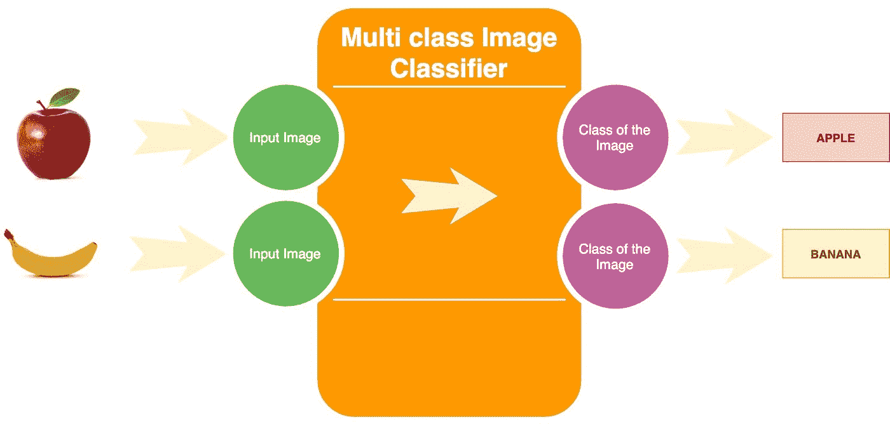
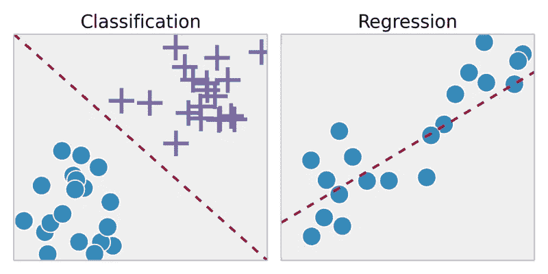
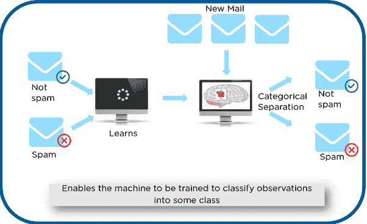
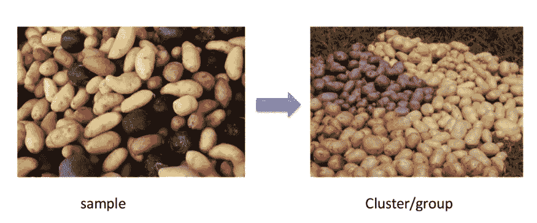
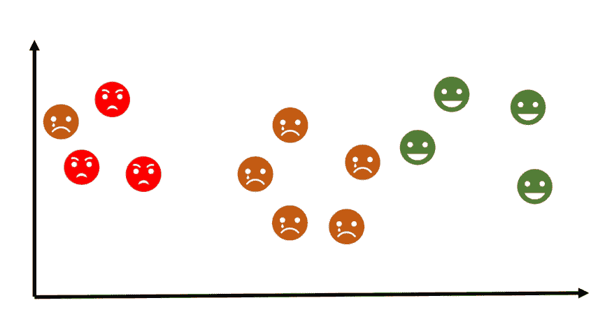
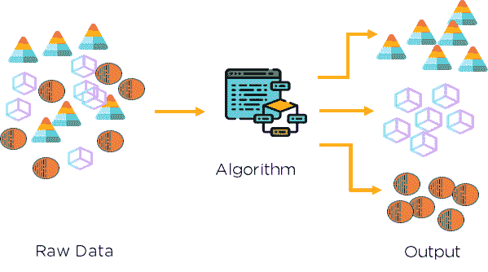
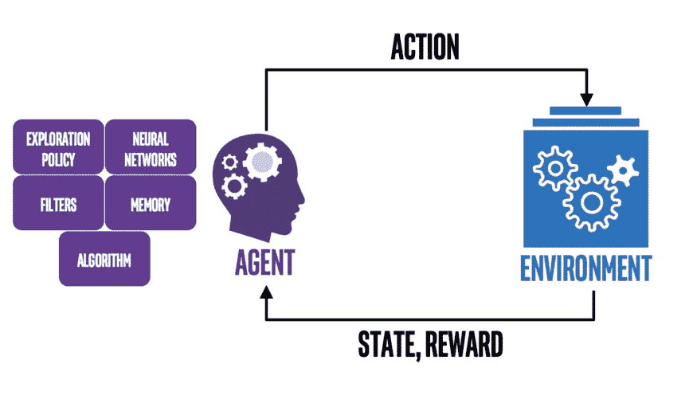

# 机器学习的类型有哪些？

> 原文：<https://medium.com/codex/what-are-the-types-of-machine-learning-53360b7db8b4?source=collection_archive---------19----------------------->

作为上一篇关于机器学习的后续，在这篇文章中，我将谈论不同类型的机器学习算法以及如何使用它们。这将帮助你更好地理解今天使用的不同的机器学习算法。

本帖中经常使用的术语:

*   **标记数据**:由一系列训练样本[(x1，y1)，(x2，y2)，…，(xn，yn)]组成的数据，其中每个样本是由样本的输入和输出值组成的一对。给出“ ***正确答案*** ”为数据中的每个例子。这里 y1，…，yn 是一个具体例子的正确答案。
*   **未标记数据:**仅由输入值[(x1)，(x2)，…，(xn)]组成的数据。它没有附带“ ***正确答案*** ”。

# 机器学习的类型:

以下是机器学习的几种类型:

*   监督学习
*   无监督学习
*   推荐系统
*   强化学习

# 监督学习

最广泛使用的机器学习方法是监督学习。这是最容易掌握和执行的。类似于教一个孩子东西。

*   监督学习算法试图对模型的预测(输出)和输入要素之间的关系进行建模，以便根据从以前的数据集学习到的关系来预测新数据的输出值。
*   我们可以逐个输入样本-标签对形式的学习算法数据，允许算法预测每个样本的标签，并提供关于它是否预测了正确答案的反馈。
    算法将逐渐学会预测样本和标签之间关系的确切性质。
*   监督学习算法将能够观察一个新的、以前从未见过的样本，并在它经过充分训练后为其预测一个好的标签。正因为如此，监督学习经常被定义为面向任务。它高度关注单个任务，为算法提供越来越多的例子，直到它能够准确地执行该任务。

## 例子

假设你有两个球，一个是皮革做的，另一个是普通的球。你很好奇哪一个会被用来打板球。球的主人购买了一台描述球的特征(大小、重量、颜色和材料)的机器。虽然颜色特征对于预测哪一个被用来玩板球是无用的，但是它有助于识别一个是新的还是旧的。在不使用算法的情况下，我们可以看到皮革球的重量和大小是特定的，表明这是用来打球的最佳球。同样，我们的机器学习算法将分析和学习两个球的重量，使它能够预测哪个是皮革，哪个不是。

监督学习可以分为两种类型:回归和分类。

## 回归

回归技术可以应用于连续的数据。它也被称为最佳拟合 的“ ***线”，我们在高中时已经学过，通过绘制一条近似通过图中所有点的线。它使用特征来解释对象之间的关系。因为数据是连续的，所以最能说明有没有直接关系。理想的例子是，如果我们想确定一个癌症患者的业务增长率或肿瘤增长率。***

## 分类

分类技术可以应用于离散的数据(即 0 或 1)。它区分两个或多个项目。如果你想知道这是苹果还是香蕉，答案要么是 1，要么是 0。这被称为二元分类，因为它发生在两个实体之间。

分类与回归

## 监督学习算法

*   最近邻
*   朴素贝叶斯
*   决策树
*   线性回归
*   支持向量机(SVM)
*   神经网络

这里的**支持向量机**是监督学习中使用最广泛的算法。

## 监督学习的应用

*   选择效果好的广告通常是一种监督学习活动。你在互联网上看到的许多广告都在那里，因为一种学习算法确定它们足够受欢迎(和可点击性)。此外，它在某个网站上的位置或对特定查询的响应(如果你使用搜索引擎)很大程度上是由于学习算法表明广告和位置匹配将是有益的。
*   垃圾邮件分类:如果你使用现代电子邮件系统，你可能会遇到垃圾邮件过滤器。监督学习系统就是垃圾邮件过滤器。这些系统通过接收电子邮件示例和标签(垃圾邮件/非垃圾邮件)来学习如何在危险电子邮件到达用户之前过滤掉它们。它们中的许多还允许用户给系统添加新的标签，这使得系统能够了解用户的偏好。
*   **人脸识别**:你用脸书吗？最有可能的是，你的脸已经被训练成使用监督学习算法来识别你。一个受监督的过程是有一个系统，它拍摄一张照片，找到面孔，并猜测照片中的人是谁(建议一个标签)。它包含了几个层次，比如检测人脸，然后识别人脸，但还是有监督的。

垃圾邮件检测

# 无监督学习

*   监督学习的直接对立面是无监督学习。
    这里，学习算法是用无标签数据训练的。我们的算法将被输入大量数据，并被赋予识别数据特征所必需的工具。然后，它可以学习以一种人(或另一种智能算法)可以理解新组织的数据的方式对数据进行分组、聚类和/或组织。
*   无监督学习是一种识别和分析数据集之间隐藏模式的方法。与监督学习不同，不会对机器进行任何训练。该模型限于在未标记的数据中寻找未知的地层。
*   这里根本没有老师，实际上，学习算法在学习了数据模式后可能会教你新的东西，这些算法在人类专家不知道在数据中寻找什么的情况下特别有用。

## 例子

最好的例子是根据所提供的特征来识别特定类型的马铃薯。假设给了你一个土豆的颜色和大小，但是你不知道哪个是哪个，这导致了无标签的数据。我们可以在这里区分它们，而不应用算法，因为它们的颜色。
无监督学习也是如此。

## 不同类型的无监督学习

1.  使聚集
2.  联合

## 使聚集

它处理在未分类的数据中寻找一种结构或模式的方法。
聚类算法会反复迭代分析信息，直到找到一个模式(组)。可以对创建的集群进行修改和标记。

使聚集

## 联合

在有大型数据库的地方，它会发现变量之间有趣的关系。例如，购买新房的人最有可能购买新家具。

## 无监督学习算法

*   分层聚类
*   k 均值聚类
*   k 近邻
*   主成分分析
*   奇异值分解
*   独立成分分析

## 无监督学习的应用

*   **购买习惯**:你的购买习惯几乎肯定存储在一个数据库中，而这些数据现在正在被积极地买卖。
    无监督学习算法可以使用这些购买习惯将客户分组到相似的购买细分市场。这有助于组织向这些细分群体进行营销，甚至可以与推荐系统相提并论。
*   **对用户日志进行分组**:我们可以利用无监督学习对用户日志和问题进行分组，这不太面向用户，但仍然非常有用。这可以帮助企业识别他们的消费者正在经历的问题的主要主题，并通过升级产品或创建 FAQ 来解决普遍问题来解决这些问题。在这两种情况下，这都是积极做的事情，如果你曾经报告过一个产品的问题，它很可能被输入到一个无监督的学习算法中，与其他类似的问题进行聚类。

无监督学习

# 推荐系统

如果你曾经使用过 YouTube 或网飞，你可能已经找到了一个视频推荐算法。这些系统通常处于无人监管的领域。我们知道视频的内容，也许是它的长度、类型等等。我们也知道许多用户的观看历史。随着用户像你一样观看类似的视频，并欣赏你仍然必须观看的其他视频，推荐系统可以在信息中查看这种连接，并提示你这样的建议。

# 强化学习

*   强化学习是人工智能的一个分支，是机器学习的一种形式。与监督学习和非监督学习相比，强化学习是非常不同的。我们很容易看到监督和非监督(标签的存在或不存在)之间的关系，但与强化学习的关系有点不清楚。
*   它使机器和软件代理能够在特定情况下自动选择最佳动作，以提高它们的效率。对于代理人来说，学习它的行动，它只需要简单的奖励反馈，这就是所谓的强化信号。
*   假设有一个游戏，如果预测正确，玩家(模型)前进两步，如果预测错误，则后退一步。这取决于模型是否正确执行，它通过这个过程学习。它在做决定时考虑了哪些因素？这个问题的答案是一种“随意”的方法。

## 例子

假设在自动驾驶汽车中，必须优先考虑安全，遵守规则，坚持安全，减少旅程时间，减少污染。
结果，因为同时做出所有这些决定是具有挑战性的，因此代理被给予 if-else 指令(强化学习算法)。

强化学习

## 常用算法列表

*   q 学习
*   时差
*   深层敌对网络

## 强化学习的应用

*   **电子游戏**:学习玩游戏是强化学习最常见的应用之一。看看 AlphaZero 和 AlphaGo，这两个谷歌强化学习应用程序训练玩围棋。我们的马里奥例子是一个众所周知的例子。我不知道有任何生产就绪的游戏使用强化学习代理作为他们的游戏人工智能，但我预计这将很快成为游戏开发者的一个体面的选择。
*   **工业模拟**:对于许多机器人应用来说(想想装配线)，让我们的机器学习执行工作而不必硬编码它们的方法是有利的。这可能是一个更便宜、更安全的选择，失败的风险更低。我们还可以采取措施，促使我们的机器消耗更少的电力，从而为我们省钱。此外，如果我们的机器出现故障，我们可以在模拟中开始这一过程，以避免浪费金钱。
*   **资源管理**:对于探索复杂环境，强化学习是有益的。它可以处理在几个标准之间取得平衡的必要性。以谷歌的数据中心为例。他们采用强化学习在满足我们电力需求的必要性和降低费用之间取得平衡。这对我们和普通大众有什么影响？我们还将在数据存储方面节省资金，并且对我们共享的环境影响更小。

# 最终注释

有可能使用不同的标准来分类机器学习算法的类型，但我认为使用学习任务是很好的，以可视化 ML 的大画面，我相信根据你的问题和你手中的数据，你可以很容易地决定你将使用监督，无监督或强化学习。在接下来的帖子中，我将深入研究每种类型的机器学习算法。

# 如果你喜欢这篇文章，那么看看我在这个系列中的其他文章

## 1.[什么是机器学习？](/@jagajith23/what-is-machine-learning-daeac9a2ceca)

## 2.[一元线性回归](/codex/linear-regression-on-single-variable-f35e6a73dab6)

## 3.[多元线性回归](/@jagajith23/linear-regression-on-multiple-variables-1893e4d940b1)

## 4.[逻辑回归](/@jagajith23/logistic-regression-eee2fd028ffd)

## 5.[什么是神经网络？](/@jagajith23/what-are-neural-networks-3a0965e2ebfb)

## 6.[使用神经网络的数字分类器](/@jagajith23/digit-classifier-using-neural-networks-ad17749a8f00)

## 7.[利用 K 均值聚类进行图像压缩](/@jagajith23/image-compression-with-k-means-clustering-48e989055729)

## 8.[使用 PCA 对人脸进行降维](/@jagajith23/dimensionality-reduction-on-face-using-pca-e3fec3bb4cee)

## 9.[使用异常检测来检测网络上的故障服务器](https://jagajith23.medium.com/detect-failing-servers-on-a-network-using-anomaly-detection-1c447bc8a46a)

# 最后做的事

如果你喜欢我的文章，请鼓掌👏而且跟风是很可笑的，而且媒体宣传这篇文章是有帮助的，这样其他人也可以阅读。我是 Jagajith，我会在下一个里抓住你。