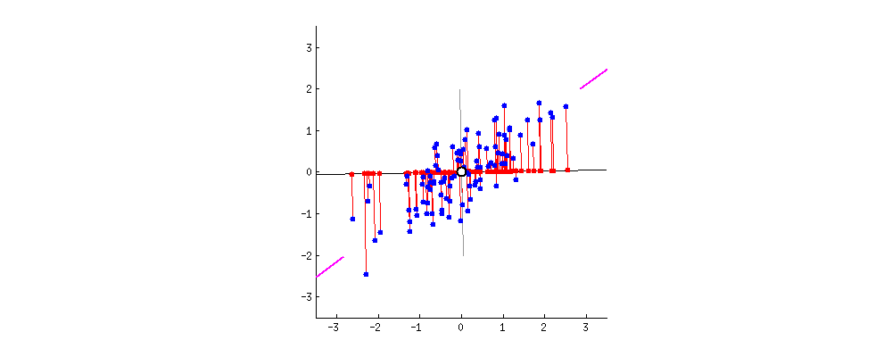

# 变量选择的三种方法是什么，何时使用哪一种

> 原文：<https://medium.com/codex/what-are-three-approaches-for-variable-selection-and-when-to-use-which-54de12f32464?source=collection_archive---------0----------------------->

照片:[阿尔特姆·贝利艾金](https://unsplash.com/photos/GLg0z5z8EQU)

当您处理真实世界的数据时，不可避免地会遇到包含多个变量的数据集。在这些变量中，您将如何选择将哪些变量包含在您的模型中？幸运的是，你有几个选择可以考虑。

# **子集选择**

第一个选项是子集选择，它使用预测因子的子集来进行预测。我们将研究三种类型的子集选择:最佳子集选择、向前逐步选择和向后逐步选择。

## 最佳子集选择

顾名思义，最佳子集选择为每个子集大小找到最佳模型。换句话说，当有 p 个预测值时，它为 1 个变量模型、2 个变量模型和多达 p 个变量模型产生最佳模型。例如，当有 a、b 和 c 变量时，最佳子集选择将对 1 变量模型评估 a、b、c，对 2 变量模型评估 ab、ac、bc，对 3 变量模型评估 abc，以确定最佳模型。其他方法是向前和向后选择。

最佳子集选择如何评估模型

## 向前和向后选择

正向逐步选择从一个空模型开始，并添加一个最能改进模型的变量。因此，对于一个 1 变量模型，它尝试将 a、b 或 c 添加到一个空模型中，并添加一个给出最佳结果的模型。比如说我们选择了 a。然后对于一个 2 变量模型，它将尝试添加 b 或 c，并选择一个改进最多的。

当在一元模型中选择 a 时，前向逐步选择如何评估模型

与向前逐步选择不同，向后逐步选择从所有变量开始，并删除提供最少改进的变量。

## 选择最佳模型

所以这些方法给了我们每个子集大小的模型。但是在这些当中，我们如何选择一个呢？这里可以用 Mallows 的 Cp，调整后的 R，贝叶斯信息准则 *(BIC)* 。

Cp 比较不同模型之间的精度和偏差。因此，较小的 Cp 意味着模型在估计系数和预测响应方面相对精确，这对应于较低的测试误差。BIC 告诉我们，相对于其他模型，该模型对新数据的预测有多好，方法是给具有低测试误差的模型较低的 BIC 值。因此，对于这两个指标，我们希望获得相对较低的值。

另一方面，调整后的 R 告诉我们一个模型对反应变量的解释有多好。与 Cp 和 BIC 不同，高调整 R 对应于低测试误差。

然而，这些只是衡量标准。选择变量最重要的一点是用领域知识研究实际模型，以评估模型是否合理。

# **收缩**

你可以考虑的第二个选择是收缩。与以前的方法不同，收缩方法包含所有预测值，并将系数估计值向零收缩，因此它们对响应的影响较小。使用收缩的方法是岭和套索回归。

## 里脊回归

类似于最小二乘回归通过最小化 RSS 来估计系数，岭回归通过最小化

岭回归的系数估计方程

根据等式，λ称为调谐参数，λ∑βⱼ称为惩罚项。当λ等于零时，惩罚项将不起作用。因此，该方程将成为最小二乘估计。当λ趋近于无穷大时，岭回归系数估计趋近于零，模型成为零模型。如您所见，系数估计值因λ值而异。所以，选一个好的很关键。

需要注意的一点是岭回归不是尺度等变的。例如，1000 厘米对模型的影响比 1 美元大得多，因为 1000 比 1 大得多。因此，在执行回归之前标准化预测值至关重要。

## 套索回归

与岭回归相比，它最小化了

lasso 回归的系数估计方程

用于系数估计。除了 lasso 与岭回归有不同的惩罚项，lasso 回归与岭回归非常相似。与岭回归一样，标准化预测值和选择好的λ至关重要。当λ = 0 时，它也给出最小二乘拟合，但当λ接近无穷大时，它给出零模型。那么拉索和里奇在判罚条款上的区别是什么呢？

因为脊回归的罚项是平方的，而套索回归的罚项是绝对值的，所以由罚项定义的约束区域的边对于脊是圆的，而对于套索是直的。为了更容易理解这个想法，请看下面的图表。

摘自[统计学习简介第 222 页的图:R 中的应用](https://www.statlearning.com/) /蓝色区域是约束区域，红色椭圆是 RSS 值的轮廓。(左)套索回归/(右)岭回归

从上面的图中，红色椭圆是 RSS 值的轮廓，蓝色区域是套索和山脊的约束区域。正如我上面提到的，岭回归的边缘是圆的，因为惩罚项就像一个循环函数: *x + y = r* 。因此，约束区域不能满足系数估计值等于零的轴上的 RSS。

相比之下，由于惩罚项中的绝对值形成直线——想象一下 *|x|+|y|=1* ，lasso 的约束区域具有直边。因此，约束区域可以满足轴上的 RSS，并将系数估计值变为 0。为了简单起见，上面的图是针对 p=2 的，但是当 p > 2 时，同样的概念也适用。

## 选择最佳模型

正如我上面提到的，选择一个好的λ值与选择最佳模型直接相关。然而，我们不知道λ的合适值是多少。因此，我们计算λ值网格的交叉验证误差，并选择最低的一个。

# **降维方法**

最后一种方法涉及转换独立变量，然后使用这些转换后的变量拟合模型。主成分和偏最小二乘法属于这一类。

## 主成分分析

这种方法的基本思想是使用一大组变量中的一组低维特征来解释数据。为此，它使用具有以下功能的主分量方向

主成分方程

在函数内部， *ϕ* 被称为主分量加载，它定义了函数的方向。为了捕捉最大方向，其值被选择为产生最大方差。在这种情况下，方差表示从投影点(下图中的红点)到原点(0，0)的距离平方的平均值。因此，为了增加方差，投影点应该远离原点，这可以通过沿着数据点的方向设置主分量方向来实现。要直观地看到这个想法，请查看下图。

gif 创建者: [Zakaria Jaadi](https://builtin.com/data-science/step-step-explanation-principal-component-analysis)

主分量载荷的一个限制是它们的平方和应该等于 1，因为如果没有这个限制，它们的值将变得无限大。

另一件需要注意的重要事情是标准化变量。因为主成分方向对具有最高方差的预测值赋予最高权重，所以具有更大范围值的预测值成为显著方向的可能性更大。例如，不管真实的关系如何，该等式将对范围从 0 到 1000 的预测值赋予比范围从 0 到 1 的另一个预测值更大的权重，因为前一个预测值更分散。由于标准化变量，标准化数据点的平均值为 0，如上图所示。

## 主成分回归 PCR

利用数据集中的 p 个预测值，我们可以构建多达 p 个主成分方向。其中，第一主方向是沿着观察变化最大的方向。第二主成分与第一主成分不相关，因此垂直于第一主成分，并且沿着数据点的下一个最大方向。

图来自[统计学习介绍第 230 页:应用于 R](https://www.statlearning.com/) /绿色实线表示第一主成分，蓝色虚线表示第二主成分

具有这些方向的 PCR 的关键思想是少量的 M 个主成分就足以解释大部分可变性。因此，选择一个合适的 M 至关重要。

## 偏最小二乘法

我们可以使用的另一个降维方法是 PLS。这个方法和 PCR 一样，只不过是监督版的。所以主成分载荷的计算，有点不同。

*PLS 没有选择给出最大方差的主成分载荷，而是通过设置每个载荷等于 Y 到 Xj 的简单线性回归系数来计算方向* [5]。因此，与将最高权重放在最高方差上的 PCR 不同，PLS 将最高权重放在与响应最相关的变量上。

## 选择最佳模型

就像我们在收缩中所做的一样，交叉验证误差用于确定在我们的模型中使用的 M 的数量。

# 泰勒:博士

**子集选择**:为每个子集大小选择最佳模型→使用 Cp、BIC、调整 R 和领域知识选择模型

**收缩**:最小化系数估计函数( *RSS +惩罚项* ) →通过评估交叉验证误差找到合适的λ值

**降维**:使用 M 个主成分方向对预测因子进行降维→通过评估交叉验证误差找到合适的 M 值

# **何时使用哪个**

对于所有这些方法，您可能想知道在什么情况下哪种方法是合适的。因此，这里有一个快速查看每种方法的利弊。首先，让我们看看子集选择。

## 子集选择

与其他子集选择相比，最佳子集选择的主要优势在于它为我们提供了最佳模型。但是，因为它探索变量的 2ᵖ组合，所以当 p 增加时，它的计算开销很快变大-当 p=20 时，它变成 1，048，576。向前和向后选择改善了这种限制。

因为它们不探索每个组合，所以它们在计算上比最佳子集选择更好。但和往常一样，优势是有代价的。它们不会产生像最佳子集选择那样的最佳模型。

然而，有些人不赞成选择方法，因为他们认为这种方法是 p-hacking。也就是说，它多次尝试相同的方法，偶然得到低 p 值，并认为这是有意义的。这就像把 10 枚硬币翻转 1000 次，连续得到 10 个头像一样。然后声称 50:50 的头尾比例是错误的，因为我连续得到 10 个头，而这仅仅是偶然发生的。

表明通过多次运行相同的方法可以获得低 p 值

因此，与其使用选择方法进行解释性分析，不如在探索性步骤中使用，以找到少量显著的预测因子。但即便如此，也有更好的方法。

## 收缩

由于 ridge 和 lasso 在惩罚条件上的差异，当有许多预测因子与反应类似时，ridge 往往比 lasso 做得更好。相比之下，lasso 往往在强预测因子很少、其他系数接近于零时表现更好。然而，在进行任何分析之前，我们不知道预测因素和反应之间的关系。因此，最好两者都尝试，选择交叉验证的模型。

另一个区别是可解释性。因为岭包括模型中的所有变量，所以通常很难解释结果。然而，由于 lasso 执行可变选择，因此什么与响应相关，什么不相关就变得很清楚了。因此，当你想了解预测和反应之间的关系时，lasso 可能是一个更好的选择。

岭和套索如何产生不同的系数估计。(上)岭回归/(下)套索回归

## 降维

PCR 和 PLS 之间的一个很大的区别是 PCR 是一种无监督的方法，而 PLS 是一种有监督的方法。因此，PCR 在其计算中不包括响应，而 PLS 包括响应。因此，当响应与具有低方差的方向相关时，PCR 将无法准确预测，因为它仅基于产生最高方差来确定主要方向。但是，由于 PLS 考虑到了响应，所以它的性能会好得多。

不管每种方法的优缺点如何，这两种方法都可以用于高度相关的变量，因为它们用线性独立的方向重新定义变量。此外，当最初的几个方向足以迅速减少偏差时，它们往往做得很好，而当需要大量主成分来预测时，它们就做得不好。

# 最后一个音符

在进行任何分析之前，很难知道预测因素和反应之间的真实关系。因此，一种方法不能普遍地支配其他方法。因此，我认为尝试不同的方法，用领域知识分析不同的模型，以了解真实的关系，可能比盲目地应用方法和只使用数值更好。

# 参考

[1] AB，克里夫。"有没有应该使用逐步回归的情况？"*交叉验证*，2017 年 1 月 25 日，stats . stack exchange . com/questions/258026/are-there-any-environments-where-stepwise-regression-should-use。

[2]陈，号文。*线性回归模型的模型选择*，JB bender . github . io/stats 506/F17/Projects/group 21 _ Model _ Selection . html

[3]彼得·弗洛姆。"逐步停止:为什么逐步选择不好，你应该用什么来代替."*中*，走向数据科学，2018 . 12 . 11，走向数据科学. com/stopping-stepwise-why-stepwise-selection-is bad-and-why-you-should-use-insteading-90818 B3 f 52 df。

[4]贾迪，扎卡里亚。"主成分分析(PCA)的逐步解释."*内置于【2021 年 4 月 1 日 builtin . com/data-science/step-step-explain-principal-component-analysis。*

[5] James，Gareth 等*统计学习导论:在 R 中的应用*。斯普林格，2021。

[6]咩。"当 AIC 和调整后的$R $导致不同的结论."*交叉验证*，2018 年 4 月 25 日，stats . stack exchange . com/questions/140965/when-AIC-and-adjusted-R2-lead-to-different-结论。

[7]罗宾·穆尼尔。" PCA vs Lasso 回归:数据科学和机器学习."*卡格尔*，[www.kaggle.com/questions-and-answers/180977.](http://www.kaggle.com/questions-and-answers/180977.)

[8]米哈日·奥列扎克。"正规化:山脊，套索和弹性网." *DataCamp 社区*，[www . data camp . com/Community/tutorials/tutorial-ridge-lasso-elastic-net。](http://www.datacamp.com/community/tutorials/tutorial-ridge-lasso-elastic-net.)

[9]“主成分回归 vs 偏最小二乘回归。” *Scikit* ，Scikit-learn . org/stable/auto _ examples/cross _ decomposition/plot _ PCR _ vs _ pls . html

[10]里克·威克林。"你应该使用主成分回归吗？"*DO 循环*，2017 年 10 月 25 日，blogs . SAS . com/content/IML/2017/10/25/principal-component-regression-disregresses . html。