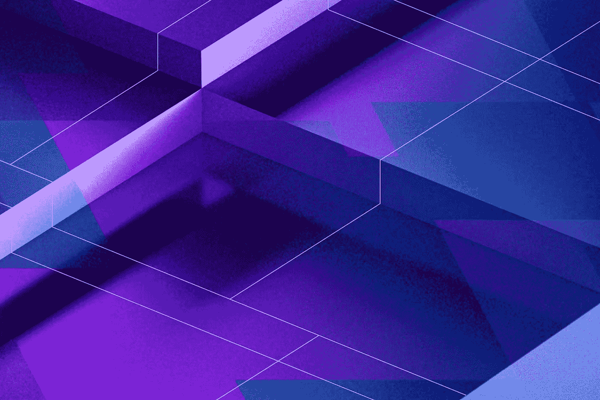
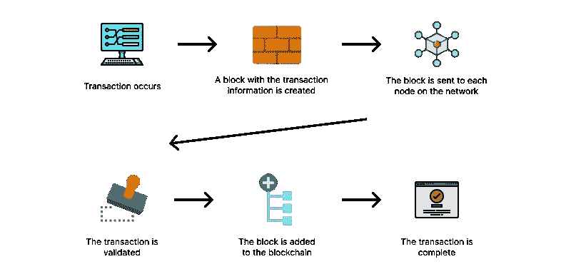

# 区块链能为全球企业做什么

> 原文：<https://medium.com/codex/what-blockchain-can-do-for-businesses-globally-6ac9d6a9502e?source=collection_archive---------25----------------------->

路易斯·迪金森拍摄的图片

在 Audacia，我们总是对寻找创新的问题解决方案感兴趣。在过去，我们已经研究了像[谷歌或-Tools](https://audacia.co.uk/technical-blog/how-audacia-implements-google-s-or-tools-into-projects) 和[微软的 Blazor Web 框架](https://audacia.co.uk/technical-blog/review-of-microsofts-blazor-web-framework)这样的技术用例。在透明度和安全性是客户的主要优先考虑事项的情况下，我们也将区块链视为安全存储数据的一种方式。

# 关键术语

在研究区块链的一些可能用途之前，定义一些与这个概念相关的关键术语是有用的。

[IBM 的定义](https://www.ibm.com/topics/what-is-blockchain):区块链(Blockchain)是一种共享的、不可变的账本，方便了商业网络中记录交易和跟踪资产的过程。资产可以是有形的(房子、汽车、现金、土地)，也可以是无形的(知识产权、专利、版权、品牌)。几乎任何有价值的东西都可以在区块链网络上被追踪和交易，降低了所有参与者的风险和成本。

这个最初的研究并没有让我更进一步理解什么是区块链。使用了一些术语，如共享的不可变分类帐、块和节点，我以前听说过这些术语，但并不完全理解它们的用途。让我们来分解一下什么是共享的不可变账本:

*   **共享**——这意味着它不是私人分发的，而是任何人都可以访问的。
*   **不可变** —这意味着交易记录到共享分类账后，任何参与者都不能更改或篡改交易。如果发生错误，不管是什么原因，都必须添加一个新的事务来纠正错误，然后每个人都可以看到事务和错误。
*   **分类账** —记录的不可变交易的集合。通过共享分类账，交易只需记录一次，消除了传统业务网络中常见的重复劳动。

将所有这些术语放在一起，我们可以说，区块链本质上是对已发生的事情的公开共享的只读审计跟踪。

理解区块链本身就像理解一系列术语。分布式分类账是由块组成的，这就提出了一个新问题:“什么是块？”

块是一条信息，其中存储了一些数据，如日期时间、在链中的位置顺序、交易是否已经过验证，以及与区块链应用程序相关的自定义数据。

数据块存储在每个节点上，但是“什么是节点？”

节点是应用程序在硬件上运行的地方。由于有不同的类型，节点的工作可以不同。例如,“全节点”作业是从网络上的其他节点接收、添加事务并同步潜在的新数据块。

节点是构成网络的要素，但是“什么是网络？”

网络是指两个或多个硬件连接在一起，以便在它们之间共享信息。

节点在添加和接收事务，但是“什么是事务？”

事务是创建数据块的事件，这些数据块显示了数据的移动，无论数据是从一个位置移动到另一个位置。

下图显示了与区块链的交易完成后发生的情况。

例如，当一个人从农业租赁店雇佣一个挖掘机时，就会发生交易；此人将挖掘机从租赁店带到了他们的工作场所。如果该人想延长租期和/或当该人将挖掘机归还给租赁店时，将会发生额外的交易。

# 行业案例研究

对技术和一些关键术语有了基本的了解后，我们现在可以探索一些正在利用区块链的行业。

# 时尚

在奢侈品时尚市场，全球品牌仿冒报告估计，由于奢侈品仿冒造成的损失将近 1000 亿美元。能够为消费者提供验证他们的奢侈时尚物品是原创和真实的能力，给予消费者信心购物的能力。

区块链的一个主要方面是它是透明和不可改变的，这意味着奢侈品牌有能力添加包含信息的块，例如他们的产品在哪里生产，产品制造中使用的材料，这些原材料的来源，然后将这些信息提供给消费者。

Alexander McQueen 就是利用这项技术的一个品牌。该品牌在 2020 年重新推出了更年轻的叛逆品牌 McQ，其关键方面是向客户提供透明度。他们在标签上添加了一个二维码，顾客可以扫描这个二维码来了解一件衣服制造过程中使用的面料的来源、制造时间和生产数量——所有这些都有助于他们对可持续奢侈时尚的承诺。

# 卫生保健

据世界卫生组织 2017 年报道，在发展中国家，估计十分之一的药物是假药[。根据世卫组织 10%的估计，爱丁堡大学估计有 72，000 至 169，000 名儿童可能因低于标准和伪造的抗生素而死于肺炎。](https://www.who.int/news/item/28-11-2017-1-in-10-medical-products-in-developing-countries-is-substandard-or-falsified)

伦敦卫生和热带医学院的另一项研究估计，在撒哈拉以南非洲，每年因低于标准和伪造的抗疟药物导致的疟疾死亡人数增加 116，000 人(64，00 至 158，000 人)，由于非正品药物，患者和卫生保健提供者的进一步治疗费用为 3，850 万美元。

医疗保健行业在采用新技术方面向来缓慢。最近有许多新的创业公司正在利用区块链技术，包括:

1.  **—开发了 EHR(电子健康记录),连接了泰国 170 多家医院和 500 万名患者。**
2.  **[**Patientory**](https://patientory.com/)**—为组织开发了一个平台，以提供个人医疗数据的透明度和隐私性，包括数据的使用方式和使用者。****
3.  ******Curisium** —开发了医疗合同管理和回扣谈判平台。Curisium 于 2020 年[被 health verity](https://blog.healthverity.com/from-the-ceo-healthverity-acquires-curisium)收购，费用未披露，但他们在 2017 年从 Flare Capital Partners 获得了 350 万美元的种子融资，这证明医疗保健领域投入了大量资金，试图利用区块链。****

# ****供应链****

****区块链看起来是为供应链行业设计的。它们有记录大量交易的分类账，在每个阶段提供透明度和防止篡改的安全机制。****

****这将允许企业减少他们的文书工作和管理成本，降低假冒产品造成的损失，增加他们对外包制造合规性的可见性，提高可信度和公众对共享数据的信任。****

****供应链市场中的区块链相对较新，由于大型企业在规划、开发和实施使用该技术的解决方案方面的规模，其采用需要时间。然而，有许多初创公司在使用这项技术:****

1.  ****[**Everledger**](https://everledger.io/industry-solutions/) —是一家技术公司，旨在减少开放市场中的欺诈行为。他们使用区块链技术来追踪钻石、宝石和电池等物品。****
2.  ****[**Migros**](https://www.migroskurumsal.com/en/media/news-from-us/migros-ticaret-as-chief-executive-officer-ozgur-tort-blockchain-has-started-at-migros-815) —瑞士最大的超市品牌为其新鲜水果和蔬菜产品实施了区块链解决方案，以降低成本和减少食物浪费。****
3.  ****[**出处**](https://www.provenance.org/tracking-tuna-on-the-blockchain)**——一家总部位于英国的初创公司，他们正在利用这项技术追踪食物。他们之前在东南亚供应链中试点追踪金枪鱼，让客户相信他们购买和食用的金枪鱼是负责任的来源。******

# ******无限的可能性******

******区块链有能力在如此多的不同领域改变世界，改变我们花钱的方式，改变公司制造和分销产品的方式，改变数字信息存储和共享的方式，以及跟踪有形和无形资产的方式——以提供透明度和安全性为目标，区块链的可能性是无限的。******

******在 Audacia，我们目前正在探索如何使用实现区块链。NET 6 和 EF Core 6，看看我们如何为客户提供这种选择。在区块链系列的下一部分中，我们将介绍我们在实施区块链时面临的一些关键挑战，以及我们是如何设计解决方案的。******

*********作者:Rhys Smith，Audacia*** 高级软件开发人员******