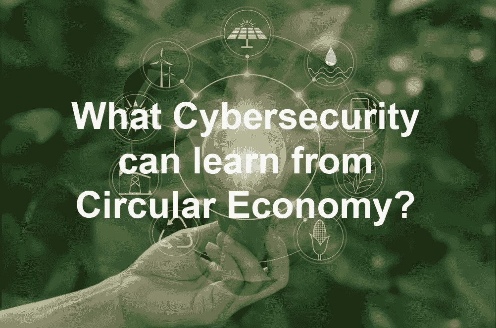
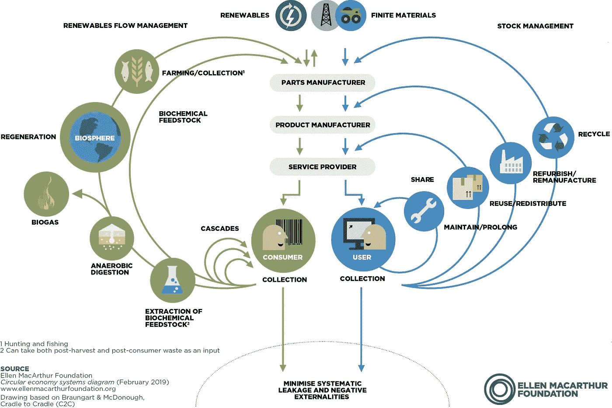

# 网络安全可以从循环经济中学到什么？

> 原文：<https://medium.com/codex/what-cybersecurity-can-learn-from-circular-economy-f35ae11fff70?source=collection_archive---------8----------------------->

[网络安全](https://cyberbakery.net/tag/cybersecurity/)

*原载于 2022 年 2 月 5 日*[*【https://cyberbakery.net】*](https://cyberbakery.net/ce/)*。*

网络安全和循环经济不是两个概念。网络安全通常与黑客攻击、隐私泄露或网络钓鱼有关，而 CE 则与气候变化和环境保护有关。然而，网络安全可以从 CE 学到很多东西，这篇文章将重点讨论我们从 CE 学到的网络安全可持续性。

在我们生活的时代，我们的经济依赖于从地球上现有的自然资源中获取材料，创造我们使用、滥用并最终作为废物扔掉的产品。这种线性过程每天产生数吨废物，带来可持续性、环境和气候变化挑战。另一方面，CE 努力阻止这种浪费和污染，回收和循环利用材料，更重要的是，为自然充电和再生。可再生能源和材料是 CE 的关键组成部分。正是这种弹性系统将经济活动与产品消费分离开来。

CE 并不是一个新概念，而是由英国水手艾伦·麦克阿瑟推广开来的。她的慈善机构为政府和组织提供 CE 方面的建议。下图是“蝴蝶图”，说明了独立于经济活动的经济内部物质的连续流动。如图所示，CE 有两个主要循环-技术循环和生物循环。在技术循环中，材料被修复、再利用、改变用途和回收，以确保产品在经济中循环。然而，在生物循环中，可生物降解的有机材料通过引发分解返回到地球，让大自然再生，继续循环。

如上所述，缺乏消费电子对地球来说是毁灭性的。人类正在制造巨量的废物，这些废物在我们周围游荡，对人类和地球上的其他居民来说是不可持续和毁灭性的。类似地，随着网络攻击破坏成本的不断增加，企业很容易被淘汰。IBM Security 和 Ponemon Institute 委托撰写的《2021 年数据泄露成本报告》。根据该报告，2021 年违规成本增加了 10%,这是最大的单年同比增幅。由于客户流失、收入损失、停机和获得新业务的成本增加(声誉下降)，业务损失占违规成本的 38%。

从短期到长期的角度来看，可持续性是指在不降低其能力的情况下长期使用和/或重复使用某物。如果实施的安全资源在一段时间后不会退化或变得无效，以减轻安全威胁，那么网络安全就是可持续的。实现可持续发展并不容易，当然也不便宜。这些组织必须对网络安全采取基于原则的方法。由于 CE 内部的制造流程从根本上考虑可持续性，因此安全性必须是产品设计和生产阶段的一部分。该系统应足够可靠，以提供其规定的功能。例如，防火墙应该阻止任何潜在的攻击，即使在硬件故障或黑客利用零日危害您的环境之后。

从本质上讲，数字系统会产生大量数据，包括特定于安全的信号。不幸的是，大海捞针极具挑战性，而且往往极其费力。在消费电子领域，我们已经找到了在源头隔离不同类型废物的方法，使得收集、回收和再利用变得更加容易和快捷。同样，系统的设计应在源头将相关安全数据与其他信息分开，而不是将其留给安全系统。这种源头隔离有助于减少误报和漏报，提供可用于保护的可靠和准确的信息。数据准确性的提高还将有助于对安全事件的响应和恢复活动进行优先排序。

CE 的设计原则明确定义了两个截然不同的循环(技术和生物)，如上文所述，以处理可生物降解和不可生物降解的材料。这些循环确保产品的价值得以保持，如果可能的话，通过修复、再利用或回收非生物降解材料。同样，这些材料通过堆肥等过程回归自然。网络安全，尽管长期以来“设计安全”原则在概念上盛行，但包括安全产品和平台在内的系统往往以方便和易用的名义忽视这些原则。任何像样的安全架构都应确保设计过程固有地考虑威胁建模以评估风险。实现的系统是模块化的，只要有价值，就能保留它们的价值。这将保证网络安全产品、平台和服务产生预期的结果，并符合组织的业务要求。应始终有重新利用或回收组件的选项，以获得安全投资回报。

并行工程中的技术周期对动态变化具有弹性。如上所述，CE 主要与经济条件无关，并将继续保持价值，直到产品不能再修复、再使用或再利用。如果产品或组件不能使用，其材料可以通过回收和保存其价值来回收生产新产品。网络弹性并不是什么新鲜事物，但最近通过重新定义其结果，它正被置于特定背景下。正如我们所知，网络威胁模式在不断变化，只有具有弹性的系统才能抵御这种动态变化。弹性网络安全有助于从已知或未知的安全漏洞中高效恢复。像 CEs 技术周期一样，实现有效的弹性需要很长时间。首先，实施和维护基线网络安全控制。类似地，冗余和弹性密切相关，因此，冗余应该包含在设计中。

我相信，我们可以从 CE 学到更多东西，以建立一个可持续和有弹性的网络安全计划，该计划可以自我修复和自我组织，以确保系统可以阻止安全漏洞。所以我想知道我们还能从 CE 中学到什么。
。

请启用 JavaScript 来查看

*原载于 2022 年 2 月 5 日*[*【https://cyberbakery.net】*](https://cyberbakery.net/ce/)*。*