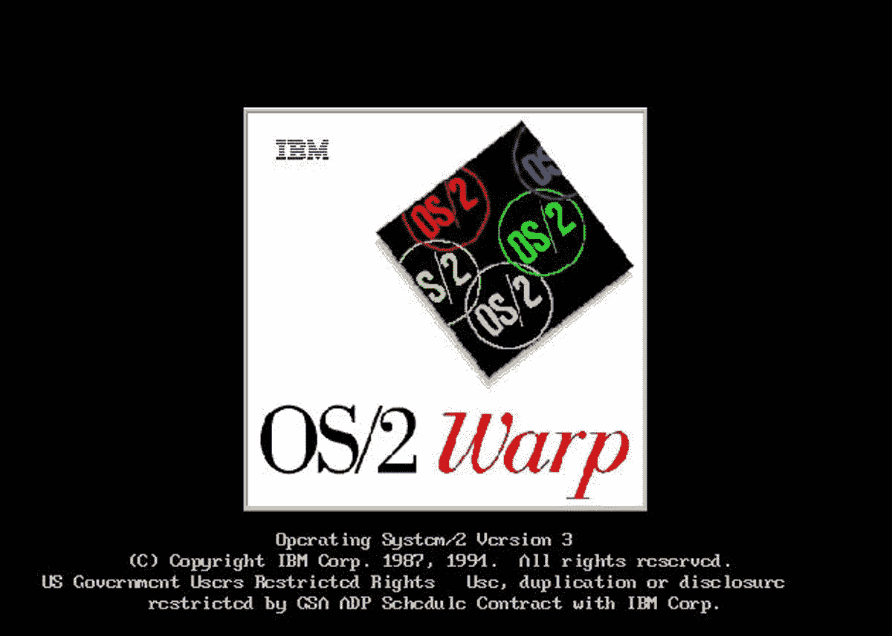

# 旧的操作系统是什么样子的？

> 原文：<https://medium.com/codex/what-did-the-old-operating-systems-look-like-68300cb9ad08?source=collection_archive---------1----------------------->

## 通过他们的用户界面享受这个简短的视觉之旅。

OS/2 Warp 版本 3。

当操作系统开始使用图形界面时，计算变得更加民主，向前迈出了一大步。在这篇文章中，我想记住一些最具标志性的操作系统及其界面。昨天在我们看来是当今世界上最现代的东西…