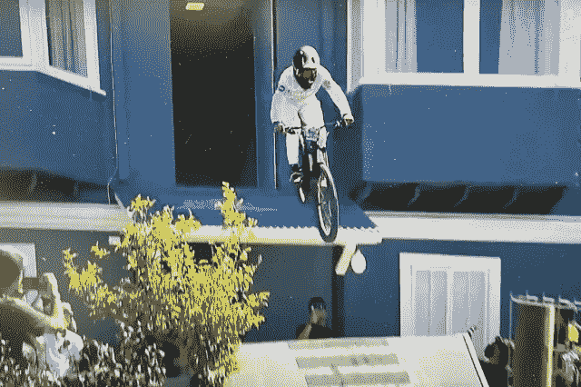

# FPV 无人机和城市下坡山地自行车赛有什么共同点？

> 原文：<https://medium.com/codex/what-do-fpv-drones-and-extreme-mountain-bike-racing-have-in-common-43cf11e509e?source=collection_archive---------18----------------------->

## 两者的结合提供了一个视觉的地狱！

一点点高度(媒体 by JC)

在刚刚过去的这个周末，我对两项活动有了新的认识。FPV(第一人称视角)无人机飞行和城市下坡山地自行车赛。公平地说，我一直很欣赏 FPV 无人机飞行，因为它需要经验和天赋来驾驶无人机…