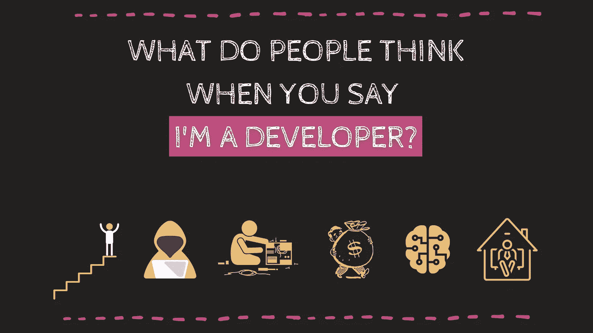

# 当你说你是一个开发者时，人们会怎么想？

> 原文：<https://medium.com/codex/what-do-people-think-when-you-say-youre-a-developer-9210fb548130?source=collection_archive---------7----------------------->

## **什么是程序员，什么不是？**

作者:FAM

*你有过下面的对话吗？*

***家人*** *:“你好吗？”*

***你*** *:“嗯，我很棒，找到工作了，过得还行。”*

***家人*** *:“哦，太好了，你是做什么的？”*