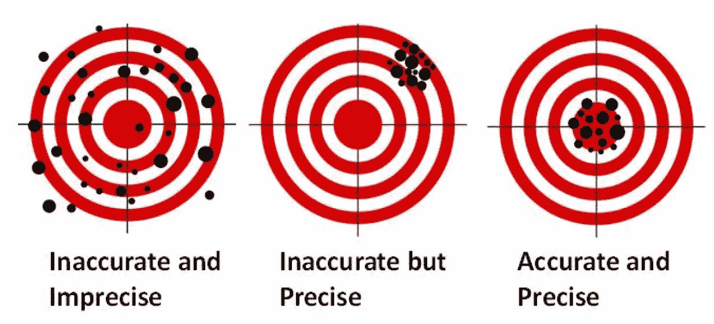

# 你说“坏数据”是什么意思？

> 原文：<https://medium.com/codex/what-do-you-mean-bad-data-1e438894da60?source=collection_archive---------15----------------------->

塞巴斯蒂安·赫尔曼在 [Unsplash](https://unsplash.com/s/photos/mess?utm_source=unsplash&utm_medium=referral&utm_content=creditCopyText) 上的照片

## 为你公司最有价值的资产建立一个词汇表。

在我的职业生涯中，有很多次，我对一份新完成的分析得到了不太有用的回应。

“这份报告味道不对”。或者“感觉不太对”。或者“我们通常不是这样做这种分析的”。

对于机器学习来说，这些异议变得更加复杂。一个好的解决方案的有用数据集的业务需求很容易在利益相关者之间的转换中丢失，导致进一步的沟通障碍和普遍的沮丧。

> 这些人想说的是“这些数据似乎很糟糕”，但我们需要一个更好的词汇来形容“糟糕的数据”。

这里有一个有用的词汇列表，用来描述数据问题，而不是“好”、“坏”或“奇怪”。

## 信任

让我们从一个更重要的开始，因为它将结束许多无用的对话。当数据被组织中的多个团队频繁使用时，数据被*信任*。这种社会化和曝光证明了数据的有用性和相对准确性，假设群体可以表达他们的意见。

如果你的数据不可信，你需要从牌桌赌注开始慢慢积累信任和声誉。否则，来自数据的任何分析都不会被证明是有用的，因为没有人会听。

## 清晰的

与可信度相关的是，*定义的数据*有一个清晰的数据收集、转换、服务和分发路径。最有可能的是，每个步骤都有清晰的文档记录，并且有坚定的管理。许多公开的政府报告都有明确的定义。

未定义的数据在初创企业中很常见，当新分析师入职时，他们会授予对数据库的全面访问权限，并根据表和列的名称猜测哪些数据在哪里。解决这个问题需要更好的文档形式的定义，并且几乎肯定需要更好的过程和管理。

## 真实的

没错，在定义*真*数据之前，我们已经排到了第三位。真实数据最常见的定义([通过 ISO](https://www.iso.org/obp/ui/#iso:std:iso:5725:-1:ed-1:v1:en) )是准确数据。准确性是指测量结果接近实际结果，但这与精确数据的概念密切相关。

## 精确的

*另一方面，精确的*数据是指对一个现象的多次测量都接近相同的输出，从而导致低的[标准偏差](https://en.wikipedia.org/wiki/Standard_deviation)。精确度在机器学习中变得尤其重要，因此该模型可以推断多个相似的测量正在测量同一现象。然后，准确性开始发挥作用，以确认这些度量映射到*正确的*现象。

下面是准确度和精确度的经典例证。

感谢西俄勒冈大学的图片

如果这些措施中的任何一个被关闭，则需要使用工具采取措施来纠正这种情况。这是否意味着调整网站的 javascript 以更好地标记点击流数据，或者需要摇动温度计，完全取决于收集的数据类型。

还和我在一起吗？酷毙了。只有两个了。

## 完成

大多数数据收集都是在一段时间内进行的，或者以设定的时间间隔进行，或者针对特定类型的每个事件进行。*完整的*数据记录了所有这些事件。不完整的数据可能会导致一些非常奇怪的偏差，尤其是在极端事件导致数据收集过程中断的情况下。

丢失两分钟的犯罪现场镜头可能是准确的、精确的、明确的和可信的，但是丢失的片段证明数据不再是好的。确保完整性需要提高数据安全性、系统正常运行时间和数据收集措施。

## 公正的

这个得到了一个特别的，特别的位置。*无偏*数据与准确和完整的数据有一些重叠，但包括对数据可能不准确或缺失的原因的判断。这个话题已经被[数学毁灭武器](https://en.wikipedia.org/wiki/Weapons_of_Math_Destruction)很好地涵盖了(如果你还没有读过，去做它而不是阅读媒介)，并且需要非常仔细地检查和处理。

未偏置数据本身就是多本书。取消偏倚的步骤大致包括检查数据的历史准确性、完整性和定义，同时继续接收利益相关者的输入，并执行元分析以确认准确性。对于许多医疗和财务数据集，需要严格遵守法律法规，并创建审计跟踪。

## TL；速度三角形定位法(dead reckoning)

称数据为“好”或“坏”几乎毫无意义。使用更具描述性的语言，如:

*   *可信*当组织一直使用该数据集时
*   *定义了*如果我们知道数据处理的整个流水线
*   *精确*如果测量系统接近现实
*   *精确*如果测量系统是可复制的
*   *如果我们持续记录和存储测量结果，请完成*
*   当我们有理由确信没有无法解释或未知的现象会导致测量结果的偏差时

向前摇摆，享受凉爽的圣诞。