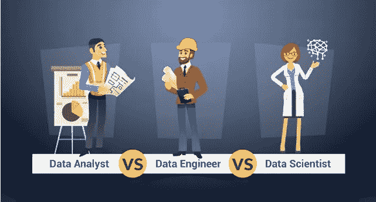

# 数据工程师是做什么的？

> 原文：<https://medium.com/codex/what-does-a-data-engineer-do-6f0e07329dd7?source=collection_archive---------8----------------------->

## 简单解释一下我的职业和日常工作。对于那些想知道分析师、工程师和科学家之间区别的人。


Avel Chuklanov 在 [Unsplash](https://unsplash.com?utm_source=medium&utm_medium=referral) 上拍摄的照片

现在数据行业有太多的角色，即使你在这个领域也很容易迷失(当我第一次听说 [*亚马逊的 BIE 角色*](/@jamie.zhang/what-does-business-intelligence-engineer-do-in-amazon-2a146b736b9)*就发生在我身上)。三个大数据玩家(**分析师**、**工程师**和**科学家**)的区别，在[这个](/@gdesantis7/data-scientist-vs-data-analyst-vs-data-engineer-bd4868f9b31e)这样的很多帖子里都讨论过。实际上，我走过了这 3 个选项来选择我的道路(*这个* [*文章*](https://towardsdatascience.com/dont-become-a-data-scientist-ee4769899025) *真的让我敞开了选择 DE 而不是 DS* )。这种比较是一个很好的起点，可以开始研究数据职业，并了解他们如何在数据驱动的业务中合作。在这里我更多地谈谈我的角色，数据工程师的职位。*

> 免责声明:有许多 DE 变体集中在基础设施、平台、编码、管道、度量上。作为一个 [AE](https://www.kdnuggets.com/2019/02/analytics-engineer-data-team.html) ，我的一直更接近于分析。

为了深入语义，我们只是将**数据** + **工程师**这几个词组合在一起。您可能知道数据是具有推动业务决策的宝贵潜力的信息片段。请记住，工程是一种基于应用科学原理来设计和制造产品的学习途径(*如民用设施、机械中的机器和电气工程职业中的设备*)。因此，**数据工程师致力于用数据构建解决方案。有些会解决常见的问题，比如每天只提供可靠的数据表，而另一些则很有创意，以至于客户甚至不知道他们的需求。甚至像业绩和成本一样躲在后台。**

# 真实数据示例

想象一下，一家公司在某个地方(*一个国家的一组覆盖城市*)销售他们的一套产品(*或服务*)。投资者把他们的钱投入市场，期望有很高的回报率。因此，业务经理必须考虑最佳的工作策略，并向他们报告结果。决策应该基于数据分析，所以他们总是需要数字。我们的朋友，数据分析师(*或商业/商业智能分析师*)被召集来回答某些问题，如这些问题(*在每个企业中都很常见，并在分析课程*中进行了探讨):

我们应该在哪个城市加大广告投入？哪些产品应该停产？



数据分析师 vs 数据工程师 vs 数据科学家— [Edureka](https://www.edureka.co/blog/data-analyst-vs-data-engineer-vs-data-scientist/)

**DAs 解释请求，并将其转化为指标**。成功可以通过销售数量、不同客户、总收入或其他指标来衡量，只要在这种背景下有意义。这是 DA 的责任，也是一项了不起的工作(*人与计算机之间的“纽带”！*)。DAs 通常使用 SQL 对数据建模，在下面的代码中查询现有的表，如 *sales* 。他们将分析输出数字，找出**洞见** ( *有用的发现，如增长趋势或某个细分市场的异常行为*)。这就是交付，其结果可能会以图形的形式呈现(*作为 Looker/Tableau 中的仪表板或带有 Collab/Jupyter 笔记本屏幕图的幻灯片*)。

```
SELECT
  date,
  city,
  product,
  COUNT(DISTINCT id_customer) AS customers,
  COUNT(id_sale) AS sales,
  SUM(amount) AS total_revenue
FROM sales
GROUP BY 1,2
ORDER BY 1,2
```


斯蒂芬·菲利普斯-Hostreviews.co.uk 在 [Unsplash](https://unsplash.com?utm_source=medium&utm_medium=referral) 上的照片

# 好的。那么德在哪里呢？

尽管我作为一名前 DA 有偏见，但我需要首先解释数据动机，这样您就可以了解 DE 在业务应用程序中的影响。有时 DEs 也不太明白，DAs 也不需要呼叫 DEs。我们甚至忘记了德的如果一切顺利或事物从不改变(*太不真实！*)。但在幕后，他们会在那里照顾我们的数据！

**像*【销售】*这样的表格之所以每天都有，而且数字准确，是因为德的工作**。总之，我们保证定期从正确的来源收集这些数据，成功地提取或传输这些数据，处理这些数据以使其更易于使用，并验证这些数据以提供正确的价值(*)多好的回应啊，嗯？*😎).感觉就像数据工程师是驱动这个复杂工作流程(*称为管道)的“齿轮”！*)。除了维护之外，业务和流程可能会发生变化，我们需要更新该流程的某些部分。

但是数据从哪里来呢？为什么它必须遵循一条路径？这些都是 ETL/ELT(提取、传输、加载)过程要回答的有趣问题。如今，我们生产的数据种类繁多、数量庞大、速度惊人([如大数据的 5 个“V”](https://www.geeksforgeeks.org/5-vs-of-big-data/))，而且它有多种来源，既可以是表格等定义好的结构化格式，也可以是音频、图像和视频媒体等非结构化格式。所以猜什么原始数据不是你在最终表格里看到的那么简单！这是一个虚构的例子，模拟了一笔销售记录(*类似于 DEs 在连接 API 以访问特定服务的数据时所发现的情况*):

```
{
"id": 1,
"product": 504 
"customer": ff6626c69507a6f511cc398998905670,
"country": BRL,
"city": 162,
"timestamp": "1628942263",
"status": "completed",
"currency": "BRL",
"item_amount": 100,
"quantity": 1
}
```

> 我很喜欢我们将原始寄存器建模成漂亮而强大的数据的方式！

很难理解，对吧？数据工程师负责数据的所有生命周期。他们从生产者那里收集到发布给利益相关者。我们确保在此流程中不会丢失数据，因此它会高质量地到达。此外，我们考虑每一个细节，以促进可用性，所以毕竟人们喜欢数据，并希望用于他们的分析！否则，没人能用有什么意义呢？数据应该易于获取和使用，运行速度快，易于理解。

想想这个表名*销售*怎么看着眼熟。我们遵循良好的编码实践，以便直观、明确地命名事物。对我来说，数据建模就像艺术工艺。在架构设计期间，我们仔细选择如何命名数据集和指标，以便最终用户可以轻松地进行计算(也便于管理人员理解)。我们将设计结构，选择工具，并决定何时收集数据，如何保存数据，在哪里保存，以何种格式保存，向谁提供访问权限等等。我们还可以对定义和表关系进行分类，这样人们就知道在哪里可以找到信息。这些举措使用户在工作中更加自助和自主。注意到我们如何影响数据驱动的思维模式了吗？

但这不是天堂。问题发生了，我们解决了！这可能很耗时，但绝对具有挑战性(*我很享受作为拯救数据分析世界的英雄修复破损管道的肾上腺素*)。程序有时可能会崩溃，我们需要尽快采取行动来恢复丢失的数据或修复错误的数据。我们提出解决方案并决定策略，如如何和何时运行，通知客户。权力越大，责任越大！一开始我不知道该做什么，但是问题可以帮助你获得经验和学习。这是我们文化的一部分，记录和分享它们，就像在死后一样。和优秀的人一起工作太棒了！

还有创新和改进的部分。正如我们从过去学到的，我们可以通过检查来预测问题(*价格*不应该是负值)。如果公司收购了一个新的销售平台，我们也将从这个新的来源检索并整合数据。如果指标发生变化，我们将更新列，并可能为旧值重新加载表。当 LGPD 的法规出台后，我们开始保护数据，所以敏感信息不会被暴露(*你的 ID 变成了隐藏你名字的散列*)。此外，我们努力保持最新，使用市场上最好的新技术，因此我们执行概念验证、迁移工具并开发内部解决方案。

听起来很多？这些职责更多地与管道和分析领域相关。数据工程中还有其他计划:自动化流程、创建代码模式或模板以抽象逻辑并避免重复、测试代码以防止故障、监控应用程序以轻松检测异常、重构代码流程并调整资源(*机器、许可证、存储*)以优化性能和成本。这些属性可能更多地与数据平台工程师有关。

注意，这个类比只是一个例子。数据分析师只是使用数据的利益相关者之一。也可能有数据科学家和机器学习专业人员从事更强大的分析，这些分析严重依赖于统计模型、算法、神经网络和人工智能(IA)。我们将安装架构，这样每个人都可以玩数据。🎲

如何做到这一切？我们最初是专门的软件工程师，就像数据库是后端开发的一个领域。我们大多数人都是，我不是！当然，计算机科学、软件工程或 IT 专业通过提供坚实的计算基础背景，无疑会使这一旅程变得更容易。但是没有这些并不是世界末日，因为今天你可以在网上学到所有的东西！如果你想找到更多，我是这些主题的自学倡导者。查看我的文章[我应该从哪里开始研究数据？](/codex/where-should-i-start-studying-data-84e64132492b)和[我是如何在 3 年内从后台转到后端的。](/@carolina_maia/from-back-office-to-back-end-in-3-years-e62212bd2a95)获得灵感开始！🤓

我希望我用这个例子清楚地说明了数据工程师(通常)做什么，我们的共同挑战以及我们对组织的重要性！❤️

你也喜欢德吗？对其他职业有疑问？请分享您的反馈，我非常期待。并把这篇文章分享给你的数据爱好者朋友们！