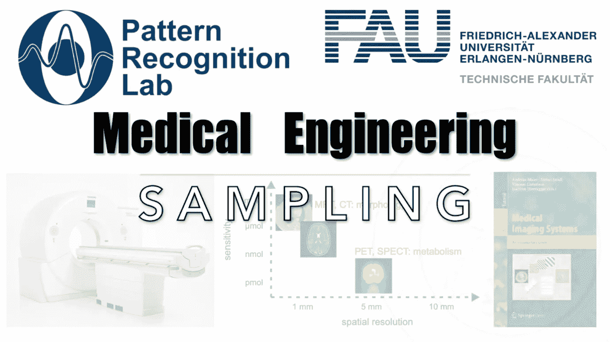

# 奈奎斯特-香农采样定理告诉我们什么？

> 原文：<https://medium.com/codex/what-does-the-nyquist-shannon-sampling-theorem-tell-us-ae2b3d24dff2?source=collection_archive---------4----------------------->

## 医学工程讲义

## 取样内容和取样时间的艺术

**这些是 FAU 的 YouTube 讲座** [**医学工程**](https://www.youtube.com/watch?v=vvftvjnXzsY&list=PLpOGQvPCDQzsgK1XuhUXO8r9M4WRqhvDf) **的讲义。这是与幻灯片匹配的讲座视频&的完整文本。课程由相应的** [**开放存取书**](https://link.springer.com/book/10.1007/978-3-319-96520-8#about) **和开源幻灯片** …