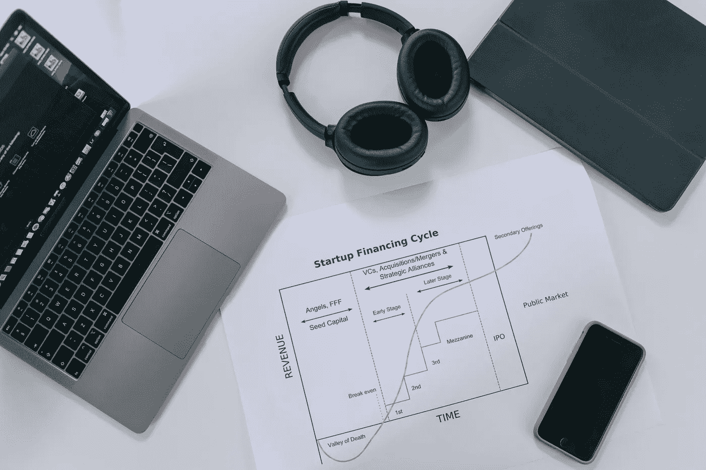

# 每个工程团队需要了解的产品导向型增长

> 原文：<https://medium.com/codex/what-engineering-teams-need-to-know-about-product-led-growth-e4ebb8588a16?source=collection_archive---------12----------------------->

照片由[伊万·萨姆科夫](https://www.pexels.com/@ivan-samkov?utm_content=attributionCopyText&utm_medium=referral&utm_source=pexels)从[派克斯](https://www.pexels.com/photo/people-desk-laptop-office-7213434/?utm_content=attributionCopyText&utm_medium=referral&utm_source=pexels)拍摄

产品导向型增长是一种公司层面的战略，专注于产品如何在市场上销售。

> 这也意味着你的产品必须有价值——并且必须在短时间内有效地证明这种价值——才能让用户转化为付费客户。
> 
> — [什么是产品导向型增长](https://www.productled.org/foundations/what-is-product-led-growth)

产品导向型增长关注用户，提供直观的解决方案，有效解决用户问题。这个产品很容易理解。用户可以立即评估产品。和公司联系没有任何开销。

所有这一切的关键是跨职能团队，迭代 MVP(最小可行产品)，快速部署实验。

PLG 路线图由尝试缩短用户实现价值的时间的实验组成。

许多团队的路线图由综合功能组成，这些功能是他们花了几个月时间设计和开发的。

为了更具实验性，团队需要增加实验次数。因此，**必须将**设计、开发和测量实验的时间缩短到几天。

你所拥有的杠杆将包括你的周期时间(从想法到生产)，WIP(在制品的数量)，范围(尝试更小的事情)，

这种方法还需要*的思维转变，从知道我们在构建什么，并期望它对我们正在构建的东西进行假设和学习，然后**根据我们看到的用户行为来调整它**。*

> ***以产品为导向的组织行动迅速，不断关注用户的需求和愿望，并培养收集和利用上下文反馈的文化。**此外，以产品为导向的公司保持一致——PLG 是一种影响深远的全公司方法，需要跨部门的协调和合作。*
> 
> *— [什么是产品导向型增长](https://www.productled.org/foundations/what-is-product-led-growth)*

*团队投资于允许测量、跟踪和分析用户行为的产品数据。行为数据用于消除用户面临的障碍。接下来，团队开发使产品更易于使用的特性。最后，团队测量这些改进，以确保更新是有效的。*

*在你的分析工具和数据库之间，你应该有足够的数据来跟踪用户通过应用程序的行为。*

*这种方法利用整个团队的创造力来提出想法，快速实现它们，并通过实际使用来衡量它们的影响。*

> *如果你没有积极思考如何在每次客户互动中最大限度地减少摩擦，以及如何提高客户忠诚度和宣传力度，那么是时候高度关注以产品为主导的竞争对手了。*
> 
> *— [什么是产品导向型增长](https://www.productled.org/foundations/what-is-product-led-growth)*

*进入待办事项列表的内容并不重要，因为它们都应该很小，并且基于假设。尝试一个实验，了解到某个东西不起作用，这是可以的。*

***投入生产并不是开发周期的结束。投入生产是学习周期的开始。**应用中的使用代表客户从产品中实现的价值。*

*一旦我们有了实验的使用指标，我们就可以决定接下来的步骤:*

*   *在哪里增加更多有价值的功能*
*   *在哪里改变路线，修复不能提供足够价值的东西*
*   *哪里删除不提供任何值的实验。*

## *来源:*

*【https://openview partners . com/product-led-growth/# . yap 9 p 73 mj 4b[https://www . product led . org/foundations/what-is-product-led-growth](https://www.productled.org/foundations/what-is-product-led-growth)[https://www.hubspot.com/flywheel](https://www.hubspot.com/flywheel)[https://www.accel.com/noteworthy/what-is-product-led-growth](https://www.accel.com/noteworthy/what-is-product-led-growth)[https://productled.com/blog/product-led-growth-definition/](https://productled.com/blog/product-led-growth-definition/)*