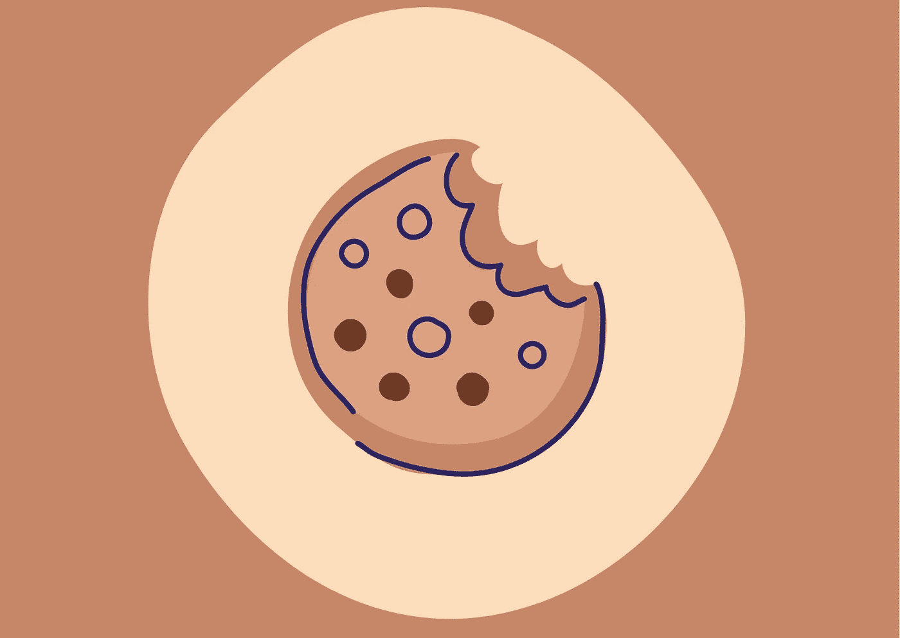
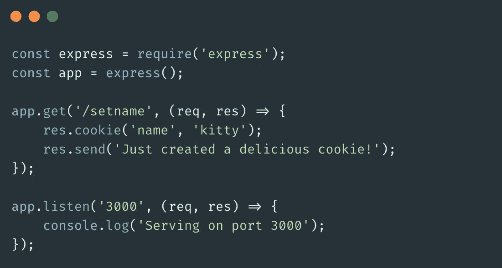
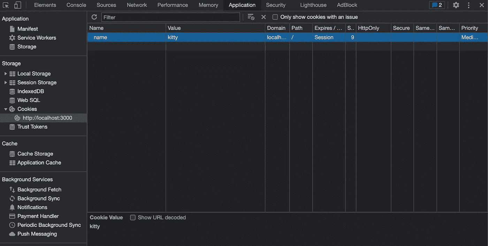
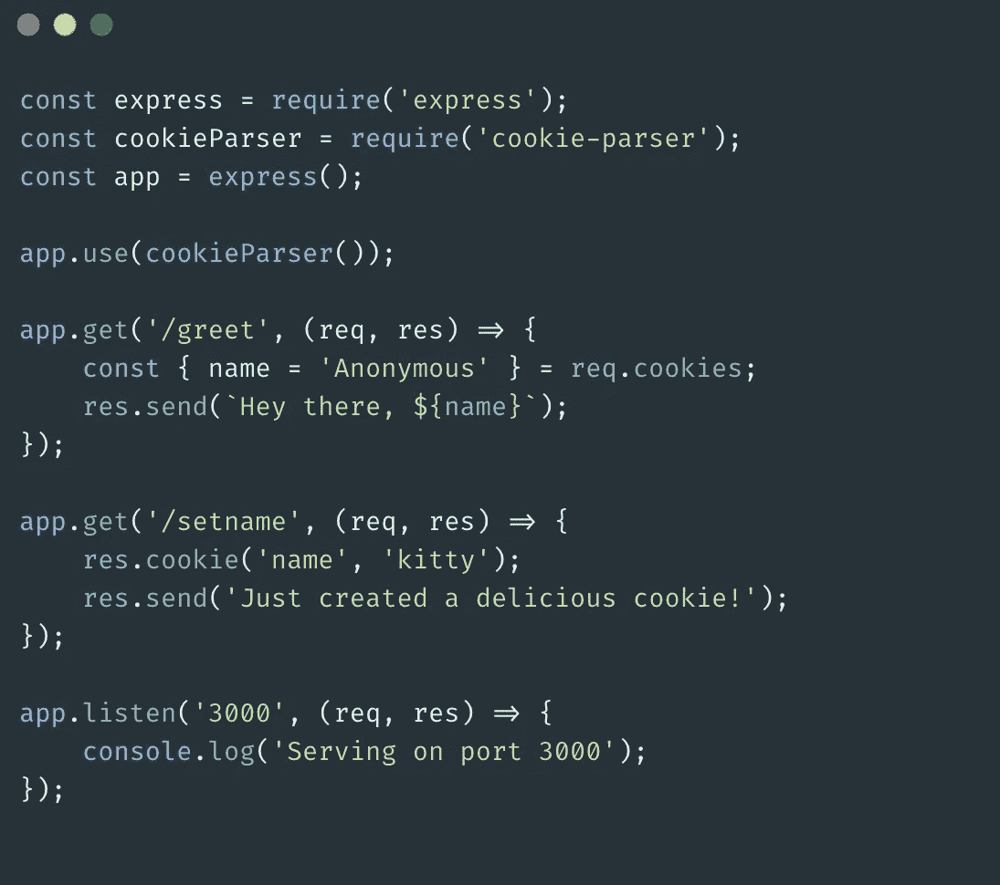

# HTTP Cookies 到底是什么？

> 原文：<https://medium.com/codex/what-exactly-are-http-cookies-3d58b5386ebb?source=collection_archive---------3----------------------->

作者通过 [Canva](https://www.canva.com/) 拍摄的照片

当我们访问一些网站时，我们都有过面对提示要求我们接受 cookies 的糟糕经历。*为什么*他们要征得我们的同意？*饼干到底是什么*？为什么说是一件大事呢？好了，这些问题你看完这篇文章就会找到答案了。

HTTP Cookie 基本上是一小段数据，服务器发送给我们的浏览器，浏览器保存它们。然后，每当您向同一台服务器发出后续请求时，这些 cookie 信息都会由我们的浏览器传递给服务器，以使请求更加个性化，因为 *HTTP* 是无状态的*。Cookies 为无聊无状态的 HTTP 协议提供了一种状态。*

*cookies 有几个用途:*

## *1.会话管理。*

*我的意思是。如今，在许多在线零售网站上，你可以在不登录或创建账户的情况下向购物车添加商品。如果您离开网站并再次回来，您仍然可以看到您的购物车信息。这些细节显然不是来自数据库(您甚至没有登录)。那里面到底发生了什么？在会话的帮助下，这些信息被暂时保存在服务器中。Cookies 使这一过程成为可能。*

## *2.个性化。*

*有时我们访问网站，我们选择黑色主题作为我们的偏好。然后你合上标签，忘记这一切。几周后，你可能会再次访问同一个网站，发现你选择的偏好仍然有效，网站处于黑暗模式。这是一个小例子，说明了 cookies 的功能。假设我们做了一个选择。然后服务器做的是，它发出包含我们偏好的 cookies。然后我们的浏览器会存储它，当你决定再次访问同一个网站时，它会在请求中附上你的偏好。*

## *3.追踪。*

*这是所有立法机构参与的地方，因为存在关于用户数据的隐私问题。由于 cookies 包含与用户兴趣、位置等相关的数据，它们可以用于跟踪或分析。这是不合法的，所以这就是为什么现代网站在对 cookies 做任何事情之前都要征得我们的同意。这就是我们访问网站时得到的提示。*

## *用 Express 创建 Cookies。*

*考虑下面的代码片段:*

**

*在您访问之后，[http://localhost:3000/setname](http://localhost:3000/setname)一次，就会从服务器发送一个将“ *name* ”设置为“ *kitty* ”的 cookie，并存储在您的浏览器中。你可以在 Chrome 开发者工具的应用标签下查看 cookie。*

**

*在对'/setname '的初始请求之后，对 [http://localhost:3000/](http://localhost:3000/) 的每个其他请求都将拥有预定义的 cookie*，并且将随着每个请求被一次又一次地发送。这可能会*降低性能。***

## **在 Express 中使用 Cookies。**

**遗憾的是，您不能直接从 express 中的 *req* 对象访问 cookies。你必须安装[*cookie 解析器*](https://www.npmjs.com/package/cookie-parser) ，以便访问存储在 cookie 中的任何数据。**

**考虑下面这个使用 *cookie 解析器*解析 cookie 信息的例子。**

****

**对[http://localhost:3000/greet](http://localhost:3000/greet)的请求将发送一个带有存储在 cookie 中的名称的问候响应。在安装了 *cookie-parser* 之后，名称被提取出来，并用于处理响应。**

**这是一个快速进入 HTTP cookies。下次见！编码快乐！**