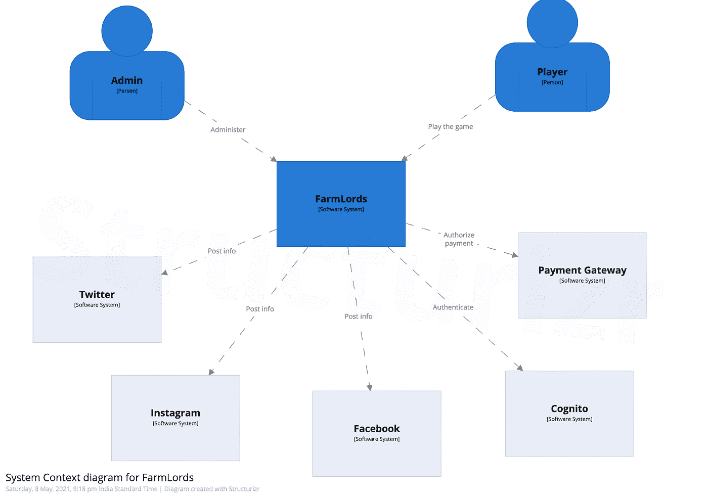
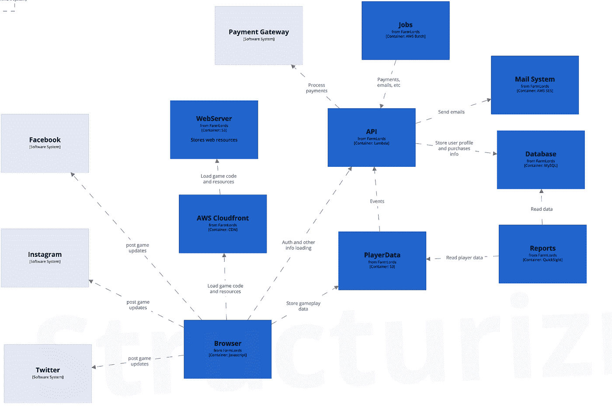
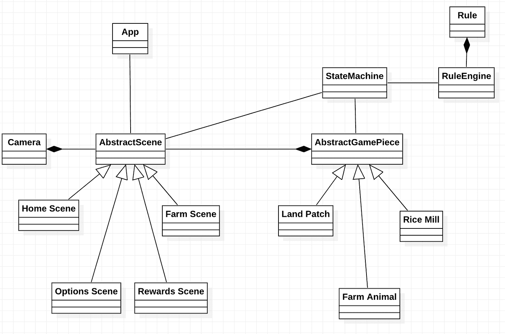
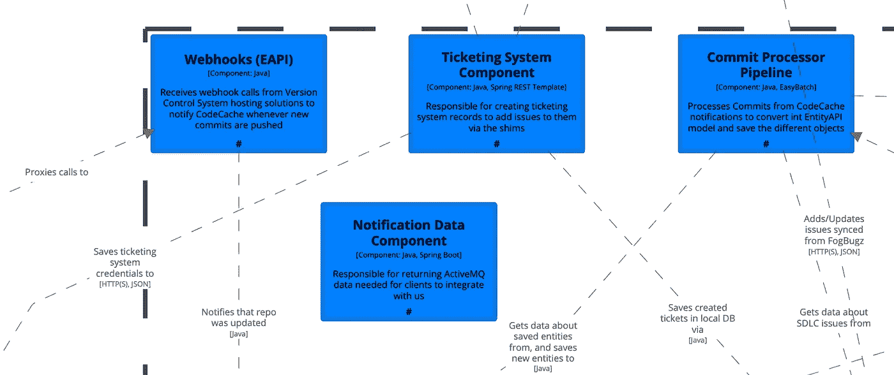
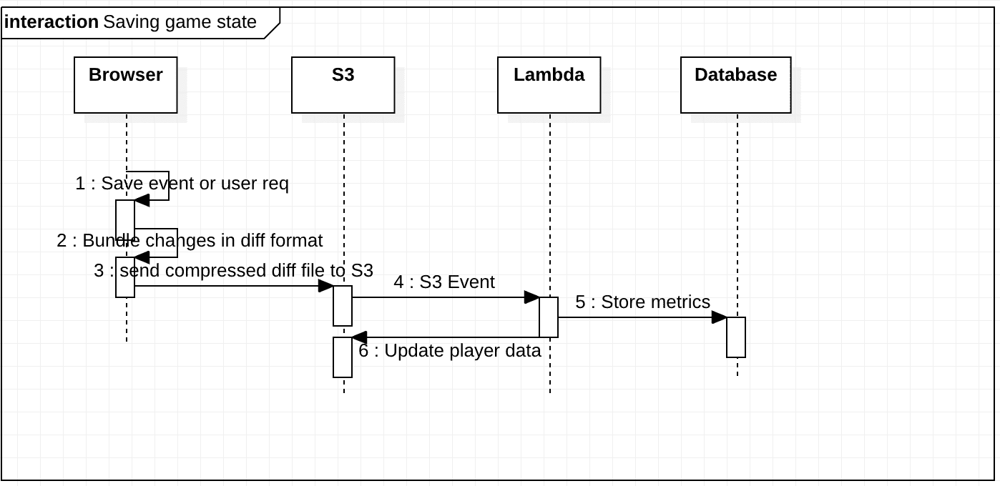
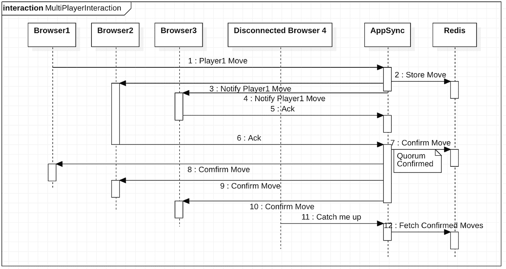
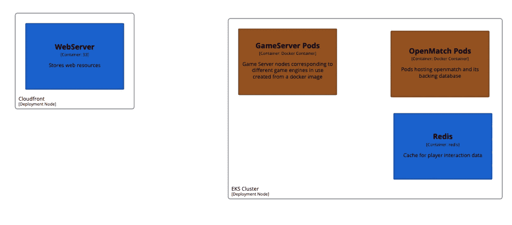

# 软件架构文档中包含什么？

> 原文：<https://medium.com/codex/what-goes-in-a-software-architecture-document-e97d808d5cec?source=collection_archive---------3----------------------->

软件架构文档

文档，没有人喜欢写它们，并且很难保持更新！有些人甚至认为没人读它们，所以写作毫无意义。如果你是一个紧密团结的小团队，挤在一个房间里开发软件，那可能是真的。然而，随着团队的成长和软件变得复杂，它会很快失控。总有一天，人们会问太多的基本问题，寻找信息却找不到。软件架构文档就是这样一个有价值的文档，它以某种方式帮助组织中的每个人提供上下文，因此努力做到这一点是非常重要的。在这篇文章中，我将深入探讨一种对我很有效的架构文档风格，并讨论诸如应该将它存储在哪里、谁应该更新它、何时更新等方面。*注意* : *我的专长是企业和云架构。所以我在这里说的可能不太适用于其他领域，比如嵌入式软件、游戏开发等。*

## 目标受众和目的:

*   让团队的新成员了解软件系统的各个部分是如何工作的。
*   在大型软件系统中，作为不同团队中的人的参考，以了解系统的其他部分正在发生什么。
*   一个单点视图和抽象层，架构师无需深入细节即可处理。
*   在一个绿地项目中，作为第一个骨架来翻译正在构建的软件的远景。
*   对于工程经理来说，当事情发生变化时，可以看到影响，以计划 QA 和其他活动。

## 文档内容:

几十年来，公司和学术界已经尝试了不同的风格和图表来表达系统正在做什么。UML、C4、SSADM、数据流模型、房间图等。其中一些的问题是它列出了非常严格的规则和符号。显然，没有人能为我们着手构建的各种系统提出规则，事情变得难以遵循。在所有这些当中，我喜欢用 T4 的 C4 方法和 UML 的组合来表达软件架构，这也是我在这里所提倡的。现在让我深入探讨一下这份文件的内容。分享一个文档模板是很诱人的，但我将避免这种情况，并讨论进入它的部分。这样，你将基于对什么是有用的理解来构建自己的结构。

因为我不能在这里展示一个真正的应用程序架构，所以我使用一个虚拟的游戏，名为 FarmLords。为了画这些图，我最喜欢的工具是 [Structurizr](https://structurizr.com/) 和 [StarUML](https://staruml.io/) (我不是这些公司赞助的)

系统上下文:

系统上下文图

系统上下文图是软件系统的 50，000 英尺视图。对你来说，软件系统的构成可能是不同的。如果你是一个处理特定子系统的团队领导，那么只有那个系统被认为是“软件系统”,其他的都被认为是外部系统。然而，如果你从整个公司的角度来看，包含许多子系统的整个软件系统将是“软件系统”

*   我们的系统与所有与之交互的外部系统一起显示。这种联系也被标记为两个系统之间最重要的相互作用。例如，在上图中，您可以看到系统与支付网关的交互显示为“授权支付”，但这并不意味着这是唯一的交互。这只是它所做的许多互动之一。这个图并不意味着包含系统之间的所有交互。
*   它还显示了使用该系统的演员。这里的 actor 和 UML 中的 actor 有相似的含义。他们基本上是使用我们系统的不同阶层的人。

体系结构文档应该有这个图表，然后在下面的详细段落中，解释图表中的每个框以及详细列表中框之间的每个连接。

容器图:

容器图

现在，我们开始从 50，000 英尺的高度向下潜水，看到 10，000 英尺的系统视图。先前上下文图中的“软件系统”现在被分解到它的容器中。“软件系统”和外部系统之间的连接现在是从您系统中的特定容器发出的。当我说容器时，我指的并不是像 docker 这样的容器技术。它可以是一个独立存在的进程、服务器或服务。为了完整起见，该图还可以显示外部系统和参与者。此处的连接和接线盒在该图下方的详细列表中再次描述。

组件图:

这部分我觉得我们有选择。我们可以走 UML 的路，或者继续走 C4 的路。如果我们采用 UML 的方式，它将是如下的简单类图:

UML 组件图

如果我们选择 C4 方法(我推荐——我将进一步解释为什么),我们可以分解组件及其关系，如下图所示(来自一个不相关的项目)。前面容器图中的每个容器都需要分解成一个组件图。

C4 组件图

这里我们需要在图表下面逐项详细解释每个组件。这三组图表将为所有常见的理解目的提供一个适当的深入视图。更重要的是，它显示了什么组件与什么其他组件相关联，因此很容易对任何更改进行影响分析。

架构上重要的用例:

现在是描述这些组件如何相互作用的时候了。尽管前面的图表显示了它们之间的关系，但是它们并没有完全描绘出在这些关系中进行了什么样的交流。描述组件之间交互的最佳方式是一组序列图，如下所示:

交互图 1

交互图 2

我们不能在这里建模所有的用例，所以我们需要识别一些我们称之为“架构上重要的”用例。换句话说，用例执行大部分组件或者展示交互的复杂性。我们应该挑选这些用例并记录下来。这些图看起来很复杂，但是可以用 StarUML 这样的工具快速绘制出来。

重要决策:

在下一节中，我们将详细介绍项目中采取的重要技术决策。通常，在本文档中列出所有决策并不是一个好主意，因为它们太多了，而且每个决策都需要大量的上下文。因此，我们将这一部分链接到一组架构决策记录，在[链接的](/@maruthijr/architecture-decision-records-7dff18f2a271)文章中有更详细的介绍。本节的目的是指出所有做出的决定以及做出这些决定的原因。

部署图:

容器图中显示的容器不一定是它们的部署方式。部署图显示了真实的服务器、服务器之间的连接以及服务器上的组件或容器。例如，容器图可以显示 5 个容器，但是在 EKS 上完成的部署可以显示这 5 个容器位于 2 个节点上。此外，生产上的配置可能不同于 QA 上的配置。部署图显示了所有这些信息。我们运行的每个环境都需要一个。下面是部分例子

配置图

监控设置:

接下来，我们将描述各种服务的监控设置。我对此没有具体的图表格式，但是需要说明或图表来解释各种服务是如何被监控的。该视图将清楚地显示被监控的服务和被监控的内容。

## C4 模型在测试中的应用

C4 模型在测试中会变得非常有用。以下是方法:

*   像 structurizr 这样的工具可以让你定义 C4 模型并将其导出为 JSON 文档。
*   C4 组件可以以编程方式导出为您的票务系统(如吉拉)中的组件
*   C4 组件可以选择引用 github/bitbucket 存储库路径
*   每个拉取请求可以自动挑选出它所涉及的组件
*   C4 组件可以基于代码审查时的判断手动与票据相关联
*   集成测试或端到端测试可以与 C4 组件相关联。
*   所有这些都有助于根据发布中包含的标签来确定在发布时需要测试什么。

## 这份文件什么时候更新？

必须为要更新的文档定义非常明确的触发点。否则这将很快变得陈旧和无用。

*   在代码评审期间由评审者更新或请求
*   由建筑师和设计师在 ADR 更新过程中更新。(参见此处的[了解 ADR 流程的](/@maruthijr/architecture-decision-records-7dff18f2a271))
*   在发布期间，在我们挑选组件进行测试时进行更新。我们一定会发现一些没有被它建造的方式所覆盖的东西。这项工作可能属于工程经理或他们委托的人。

根据我的经验，我试图为软件组织的架构文档构建一个很好的框架。希望这能帮助那些试图在自己的公司内部整合一些东西的人。我真的很想听听大家的意见和想法，这样我们就可以为了大家的利益完善这个模型。