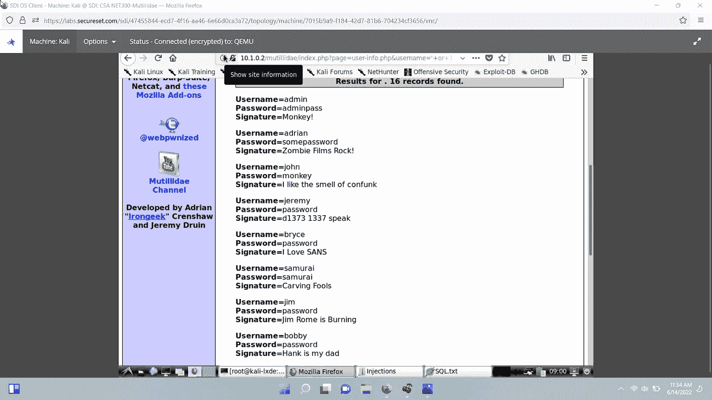
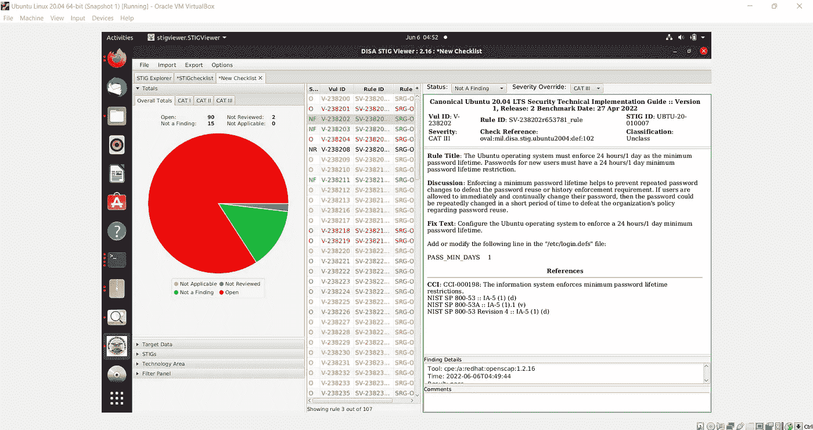
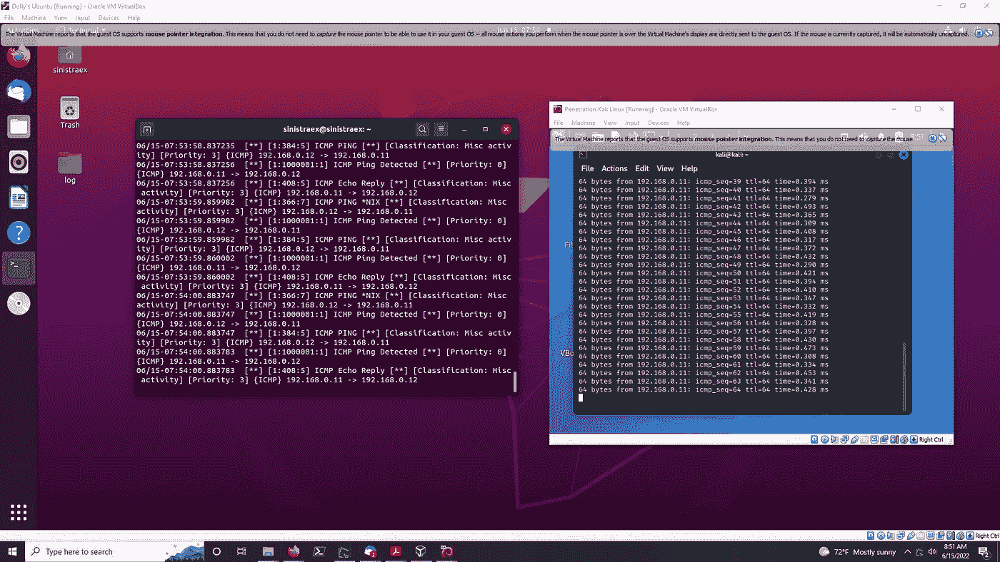

# 我这周在网络 6/16/22 学到的

> 原文：<https://medium.com/codex/what-i-learned-in-this-week-in-cyber-6-16-22-8b5c2f581d5b?source=collection_archive---------27----------------------->

就概念探索的内容而言，本周相当令人兴奋。以下是我深入研究的一些概念的重点:

**XSS-跨站点脚本**

有两种类型的 XSS 攻击-反射和存储。

**反映 XSS**——用户无意中点击了一个有漏洞网站的 URL，该网站带有威胁者指定的恶意参数。然后从浏览器向 web 服务器发送一个请求。服务器根据请求提供一个带有参数的响应，一旦浏览器收到响应，就会执行恶意代码。用于验证用户身份的敏感信息(如 cookies)会被发送给对手。对手现在可以像用户本身一样进行身份验证。

**存储的 XSS**——一个易受攻击的网站允许用户向网站提交信息，如评论。威胁参与者利用这一点，提交有效的恶意语法，而不是提交注释。然后，这些代码被存储在 web 服务器中。现在，每当新访问者访问网站并请求存储在数据库中的数据时，恶意代码就会运行。其含义很明显——威胁参与者可能会窃取用户的身份验证信息以及与帐户相关的个人信息。

**XSRF(跨站请求伪造)** -用户在一个选项卡中登录他/她的银行账户。不知何故，用户决定点击具有某些参数的 URL 链接。这些参数发出请求，指示银行向 y 账户转账 x 金额。由于用户是在另一个选项卡上通过身份验证的，所以交易是有效的。

**SQL 注入-** 一种攻击，在这种攻击中，威胁参与者实际上编写了与 SQL 数据库代码本身交互的有效语法，允许他/她修改或查看数据库的内容，而不是向输入框提交凭据。例如，对手不是在输入框中输入有效的用户名，而是输入‘或 1=1。这又导致数据库选择用户空白或总是验证请求，因为一总是等于一。然后威胁参与者可以添加额外的语法来跟进，例如 PRINT @@variable，will 可以返回存储在数据库中的信息。

Mutillidae 中的 SQL 注入模拟

**STIG 浏览器** -一个评估系统潜在漏洞的伟大工具。它还为您提供了如何补救的明确说明。

**Snort-** 一个非常健壮的 IDS(入侵检测系统)，可以根据配置的规则充当 IPS(入侵防御系统)。您可以配置 Snort，以便每当满足特定条件时(比方说，ICMP 从外部网络的任何 IP 地址发送到内部网络的任何 IP 地址)，Snort 都会发送一条定制的消息，提醒您发生了这种情况。我确实打算写一篇文章，解释将来如何安装和配置它。

这些是我本周学到的最有趣的话题。希望你也学到了新的东西，我们下次再见。