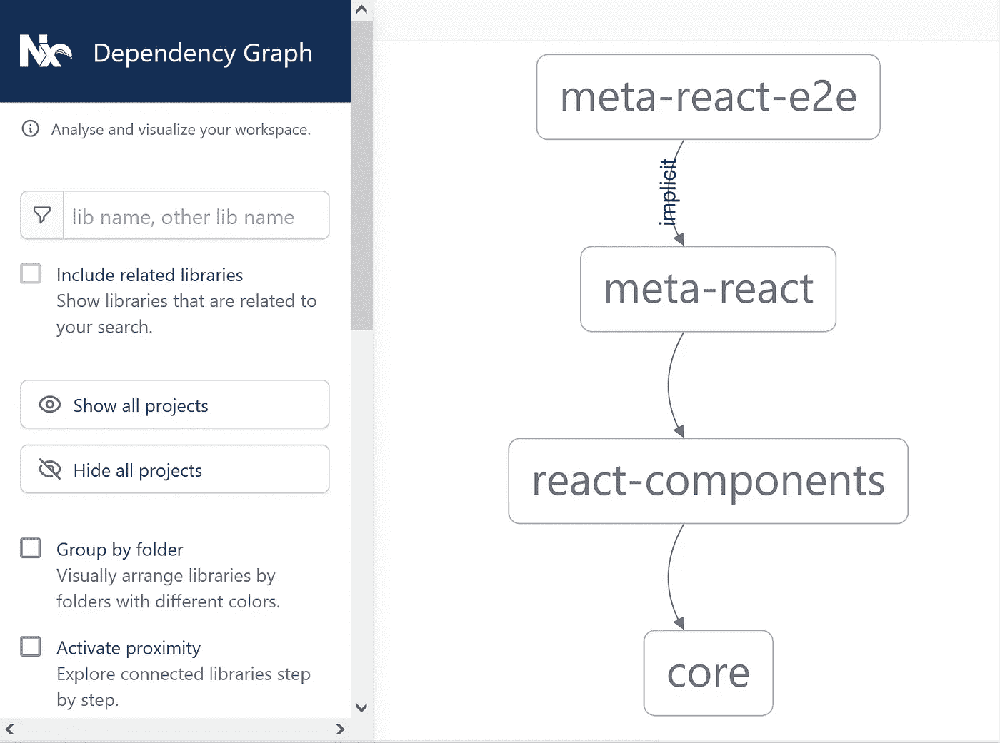

# 我做错了什么—依赖管理和 monorepo 采用

> 原文：<https://medium.com/codex/what-i-was-doing-wrong-dependency-management-and-monorepo-816c698ab9f?source=collection_archive---------3----------------------->

在分布式架构中支持多个依赖项是一个巨大的挑战，尤其是当康威定律预测团队会基于已生产的架构进一步孤立时。

现在微服务是前端和后端解决方案中的黄金标准。纳米服务在快速商业价值交付方面也变得非常受欢迎。这要求交付的软件具有更高的原子性，并增加代码可重用性的需求。因此，当核心层尚未完全稳定时，将宏划分为微以及将微划分为纳米会创建非常复杂的依赖关系图，并成倍增加支持依赖关系管理的工作。


连锁反应

我不会错误地认为微服务采用的主要目标是——减少耦合并增加凝聚力，因此每个构建模块都可以由自己的团队轻松支持和交付，从其服务的职责中自给自足，并独立于可用性目的。

完整的 UI 解决方案可以有下一个视图:


*   它由一组独立的应用程序组成，这些应用程序可以通过 SSO 共享其 authN/authZ 状态
*   每个应用程序都由一组子项目组成(大多数情况下，每个顶级路由都指向一个专用子应用程序)，我们过去称之为“微前端”
*   每个应用程序都由一组模块组成(其中一些模块如 AUTH 模块通常为所有根 UI 应用程序所共有)
*   每个模块都由一组第三方或自己开发库组成

追求一个独立于特性开发并支持特定组件的发布周期的目标——通常，这个图中的每个块都移动到它自己的存储库中，并带有它自己的发布约束。

到目前为止一切顺利，直到您需要升级依赖关系树中最底层的库:

*   “库”中的代码变更需要产生一个新的工件
*   库的新版本需要传播到所有拥有的模块并升级其版本
*   所有模块的新版本需要传播到所有所有者组件
*   ….

根据特定产品的层数，这是一个痛苦而耗时的过程(尤其是如果 CI 流程包括全面的验证流程)，重建每个层工件可能需要很长时间。

# 迁移到 monorepo

在这个依赖管理的地狱中寻找一个有效的解决方案——我们发现唯一可接受的选择是返回来支持一个包含所有链接依赖的单一存储库(类似于我们为[后端依赖管理](/codex/what-i-was-doing-wrong-managing-micro-services-common-dependencies-7110e5ebbc2f)所做的)。

令人惊讶的是，市场也已经准备好提出行之有效的解决方案，以更有效的方式缓解这个问题，大型咨询公司已经对其有效性进行了调查


因此，我们将 [NX workspaces](https://nx.dev/) 作为在我们的组织中采用 monorepo 方法的实验工具。

第一步是描述工作空间，它可以看起来像:

```
{  
  "version": 2,  
  "projects": {    
    "products": "apps/products",    
    "products-e2e": "apps/products-e2e",    
    "users": "apps/users",    
    "users-e2e": "apps/users-e2e",    
    "core": "libs/core",    
    "react-ui-components": "libs/react-ui-components"  
  }
}
```

不要考虑 monorepo 的不同单元可以使用多少个库——很容易定义特定根作为单个单元的范围和边界(例如，当此范围内的某个地方发生变化时，测试所有库和拥有的应用程序)。

然后，我们使用 git [子模块](https://git-scm.com/book/en/v2/Git-Tools-Submodules)为每个依赖项创建了一个单独的库，并将 repo 链接为一个子项目。

搭建新的 lib 就像调用`nx generate @nrwl/angular:lib auth-core`一样简单。有许多类型的生成器(从原始节点模块开始，以复杂的项目结束)。

**采用后获得的收益:**

*   所有可重用的依赖项仍然是可重用的依赖项，并且可以单独发布(因此依赖产品在迁移过程中不会遇到任何困难)，每个依赖项都可以有自己的发布/验证过程(这里称为“目标”)

```
{
  "root": "libs/core",
  "sourceRoot": "libs/core/src",
  "projectType": "library",
  "targets": {
    "build": {
      "executor": "[@nrwl/web](http://twitter.com/nrwl/web):package",
      "outputs": ["{options.outputPath}"],
      "options": ...
    },
    "release": {
      ...
    },
    "test": {
      "executor": "[@nrwl/jest](http://twitter.com/nrwl/jest):jest",
      "outputs": ["coverage/libs/core"],
      "options": ...
    }
  }
}---------------------------> nx run core:testTest Suites: 23 passed, 23 total
Tests:       72 passed, 72 total
Snapshots:   0 total
Time:        49.06 s
Ran all test suites.>  NX   SUCCESS  Running target "test" succeeded
```

*   同时，作为这些模块的所有者和主要采用者，我们可以直接访问它们，而无需在某个地方发布，因此对核心的更改可以立即反映在它所使用的层中

```
{
  "compilerOptions": {
    ...
    "paths": {
      "[@core](http://twitter.com/meta/core)": ["libs/core/src"],
      "[@react-components](http://twitter.com/meta/react-components)": ["libs/react-components/src/index.ts"]
    }
  }
}----------------------import {MinValueValidator} from "@core/validators";
import {PlatformSection} from "@react-components/containers";
```

*   由于所有依赖项现在都是主项目中的本地子项目，我们可以配置它们自己的依赖图，项目构建过程将对依赖项顺序敏感(将在构建根项目之前构建适当的库)

```
{
  "build": {
    "executor": "[@nrwl/web](http://twitter.com/nrwl/web):webpack",
    "outputs": ["dist/apps/products"],
    "options": {
      "index": "apps/products/src/app.html",
      "main": "apps/products/src/main.ts"
    },
    "dependsOn": [
      {
        "target": "build",
        "projects": "libs/react-ui-components"
      }
    ]
  }
}------------------------> nx build
> NX  Running target build for project "platform" and 2 task(s) that it depends on.
```

*   每个依赖项可以有自己的发布/验证过程(例如，对于核心库，只有单元测试就足够了，但是对于 UI，我们需要注入故事书并运行 UI 测试)，所以库管理中的原子性没有被违反
*   即使是单声道——我们也有一个组织良好的依赖结构，这个结构可以通过调用`nx dep-graph`很容易地可视化



可视化依赖图

# 发电机作为一个不错的奖励

当您的名称空间用最大化的代码组织起来并实践重用时，快速开发是可能的。这规定了关于如何组织应用程序源代码结构、继承的抽象、命名模式等的特定规则。

一旦定义并应用了规则，就可以通过代码生成器轻松地将它们描述为代码。幸运的是，NX 提供了内置的生成器支持，因此创建新的页面、库和模块可以自动化，例如:

```
nx workspace-generator lib-generator auth-core
```

如此创建一次，结构化代码可以移动到 schematics 中以供进一步重用，生成的模块可以直接注入到所拥有的项目中，并发布到包存储库中以链接到遗留解决方案中。