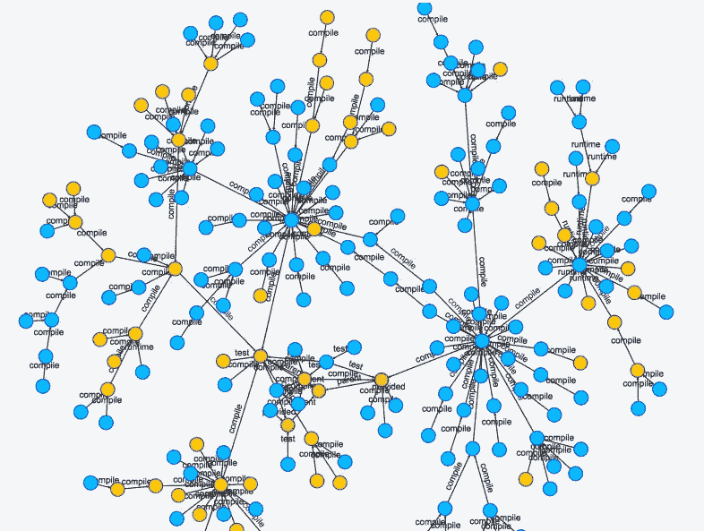
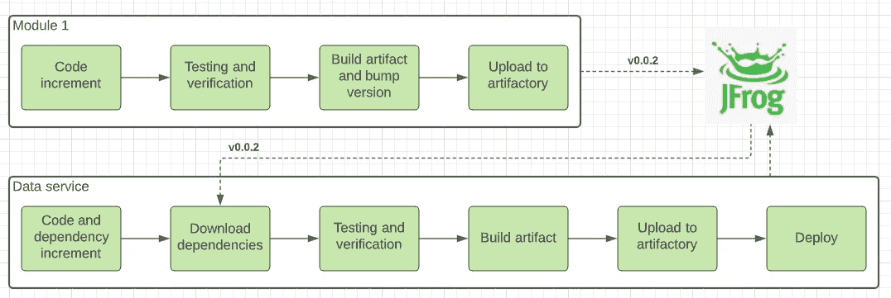
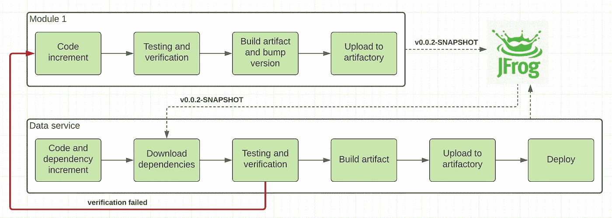
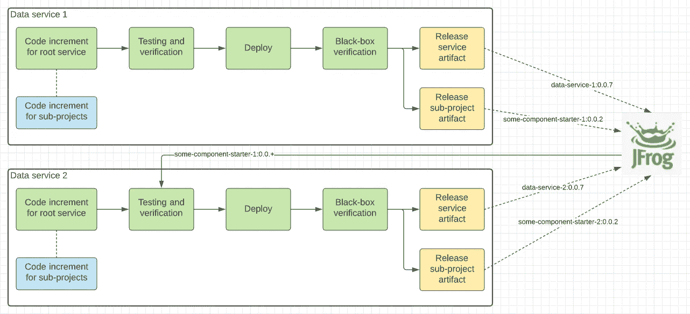

# 我做错了什么——管理微服务的公共依赖性

> 原文：<https://medium.com/codex/what-i-was-doing-wrong-managing-micro-services-common-dependencies-7110e5ebbc2f?source=collection_archive---------8----------------------->

> 我个人的一系列发现，设计问题，浪费时间的活动，不适用的模式，以及在团队定期回顾中分享的其他问题。



我相信我们不是唯一的，微服务的采用(作为公司的战略目标)不仅仅是关于可独立部署的单元。多语言开发、两个比萨饼团队、更好的敏捷性和整体团队独立性、更快的上市时间以及发生故障时更小的损害影响，使得这种范式具有吸引力，尽管实现成本增加了。

但期待总是有的，现实也是有的。

在开始采用微服务作为核心设计原则后，我们经历了以下挑战:

# 团队独立性

还有一个比较有争议的说法是微服务团队自给自足，独立自主。当生产的服务没有其他依赖关系或者这些依赖关系是相对静态的并且不意味着支持活动时，对于非常小比例的用例来说可能是。

如果您的服务不仅仅具有计算层抽象，还具有持久性、安全性、可观察性和同步性，那么您很可能希望在一个大系统的不同组件之间最小化代码重复并增加代码重用。因此，您需要在共享库中移动通常可重用的组件和服务。使用共享代码的另一个原因是不同子系统之间的一致性。定义契约并在所有参与者之间共享，可以降低由于无法识别输入数据契约而导致沟通渠道中断的可能性。

作为一个产品团队，我们也开始体验到在一个单独的库中保存共享代码的需求，以加速相关数据服务的开发。

# 怎么样

按照传统的依赖项管理流程，我们将共享库作为一个独立的项目，有自己的发布生命周期。这可以在下图中表示出来:



经典依赖项发布流程

这种流动足够好，允许:

*   独立管理工件，并作为远程可信存储库的依赖项链接到任何服务，例如

```
dependencies **{**
    compile 'com.company.shared:some-component-starter'
}
```

*   支持协作模型(如 OSS ),因此它可以是基于各种用例尊重对这个项目的贡献的单个组件所有者
*   独立的发布过程确保部署的工件通过了一定级别的质量要求(静态代码分析、单元测试、发布说明更新等)

但是在为所有支持的依赖项(大约十二个不同的大小和职责)采用这个发布流程之后，我们发现当流程变得非常低效时，交付的代码复杂性有一个特定的阈值。

**在真空中开发特征**

用附加字段扩展通用 DTO 和在真空中实现新的服务行为是不同的实现复杂性任务。

对于复杂的功能，您有机会进入循环:



迭代开发

1.  共享库中的代码增量
2.  发布快照版本
3.  在从属服务中验证
4.  如果验证未通过—转到“1”

由于每个工件升级尝试很可能需要额外的代码审查过程和 CI 执行时间——我们可以想象按照依赖关系管理的过程生产一个完整的工件需要多少额外的时间。当一个功能跨越两个或更多深层依赖项时，复杂性和时间浪费活动将呈指数级增长。

此外，特性通常是为特定服务开发的，以解决特定的业务需求，只是在一些推销活动后被其他产品重用。因此，实际上这一过程看起来是下一步——您在数据服务中构建一个特定的功能，在验证周期之后，将它移动到相应的共享库，在相应的数据服务中清理它，然后通过链接共享库来激活它。这又是一个高概率的采用循环。

对特性的采用和共享库的使用有一个整体的看法，也考虑到对这种方法的结构复杂性的回顾性抱怨，所以我们决定重新设计依赖管理过程，使它更有效。

# 子项目与子模块

如果您的团队是共享库的主要贡献者，而您的服务几乎不依赖于它，那么就出现了一个问题——从使用的角度来看，这个模块真的是“共享的”吗，或者它是您的服务的“核心”模块，并“共享”给另一个依赖的服务？谁是采用新版本共享库的主要受益者？

回顾其他团队使用共享库的所有案例，我们最终了解到大多数案例——尝试共享为特定服务开发的特定功能，以供其他服务使用，而实现和采用成本为零。换句话说——我们的库就像一个市场，有不同的业务助手和客户(服务)可以激活的特性:公开域特征的指标、采用多租户的 REST API 拦截器、Vault sidecar 集成等等。同时，这些特性中的每一个都是特定服务的核心，由特定的团队提供支持。

因此，我们将这些模块集成为子项目

```
dependencies **{**
    compile project(':some-component-starter')
}
```

其中" *some-component-starter* "是一个通过相对路径链接的项目，所以根项目可以像从相对文件夹中一样访问它的文件，同时我们可以确定子项目将首先被构建，它的代码和 jar 将被添加到类路径中。

这使得生活变得更加容易，因为您可以在一个子项目中开发特性，并且在没有工件提升的情况下立即在根服务中使用它。最重要的是，一旦在主服务发布 CI 中通过了所有验证，您就可以发布更新的共享库工件。



一旦 CI 通过，发布许多工件

因此，在更新的 CI 中，我们添加了一个额外的“发布工件”步骤，该步骤负责在使用它的服务通过所有验证后，将所有子项目作为独立的工件进行构建和发布。并且只有当通过时，新的工件才会被发布，直到依赖的服务没有确认成功的采用。此外，我们检查特定的子项目是否有任何代码更改，以避免在执行 CI 步骤时出现空发布。

如果共享代码是许多服务的一部分，并且没有单独的(主要的)支持团队——我们继续为该模块使用单独的存储库，然后使用“git 子模块”以更有效的方式将两种方法结合起来:单独的存储库和作为子项目直接链接到服务所有者。