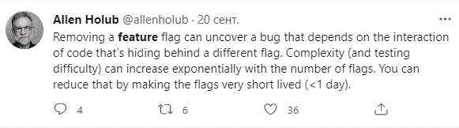
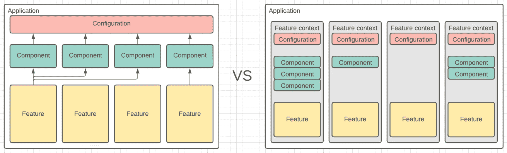

# 我做错了什么——Spring 自动布线和特性标记

> 原文：<https://medium.com/codex/what-i-was-doing-wrong-spring-autowiring-and-feature-flagging-12bb979a08f6?source=collection_archive---------1----------------------->

> 我个人的一系列发现，设计问题，浪费时间的活动，不适用的模式，以及我在团队定期回顾中分享的其他问题。

Spring framework 允许快速启动工作应用程序，以至于任何对其特性的误用或过度使用都被速度的好处所抵消。使用 Spring 创建一个基本的“用户 CRUD REST API 服务”有多快？春季工作坊系列之一的 [@jekaborisov](https://twitter.com/jekaborisov) 证明大约 2 **分钟**就够了。难以置信的快。我们可以想象 PoC 的设计速度有多快。企业听到这个时机是多么兴奋。

使用 PoC 作为长期解决方案的核心时开始出现的问题。在支持和发展阶段，这里出现了另一种情绪—业务部门非常困惑，为什么支持现有应用程序可能需要比初始 PoC 更多的时间。

# **自动布线**

Spring 提供了一个优秀的 DI 框架。组件(或者任何其他原型)注释足以标记一个特定的类来自动注入。您只需要将它自动连接到应用程序任何模块的任何组件中。后面所有的魔术都是免费的。

Spring 支持 3 种类型的自动布线:

*   按字段
*   按设定者
*   由构造者

如果没有严格的理由使用前两种类型，就不要使用。让它成为一个定期的代码检查练习来发现和修复。你的 TDD 实践会感谢你选择了“构造器注入”。此外，龙目岛还会和你握手。为什么？

**第一个原因:**您可以使用原始的 junit-mockito 测试类型来测试您的特性，而根本不需要 Sring 注入。使用 Mockito " *@InjectMocks* "注释可以很容易地复制构造函数注入，因此您的测试启动时间将不包括 Spring 初始化开销。这比依赖弹簧的测试快一百倍。

```
@RunWith(MockitoJUnitRunner.class)
public class SomeProviderTest {

    @InjectMocks
    private SomeProvider provider;

    @Spy
    private SomeService service;

    @Test
    public void testSomeMethod() {
       ...
    }
```

只需将这个测试类示例与一些常见的 Spring 测试类进行比较。

**第二个原因:** Lombok 和"*@ RequiredArgsConstructor*"注释允许你声明真正优雅简单的类，例如

```
@Component
@RequiredArgsConstructor
public class SomeProvider {
    private final SomeService someService;
    private final AnotherService anotherService;
}
```

Lombok 将为 final 字段生成一个构造函数，Spring 尊重构造函数注入，因为整个类被标记为 Component。简单就是力量。

# **特征标记**

敏感话题。有争议的话题。许多明智的人认为，将特性标志作为打开/关闭特定特性的永久选项是一种反模式。Allen Holub 和 Martin Fowler 坚持只有当特性处于开发或采用状态时才临时使用特性标志。



完全同意标志的交集增加了支持所有组合的复杂性。

但是，在一些商业案例中，功能标志的使用因其优势而变得合理:

*   *管理独立的子系统* —例如，由于检测到性能下降，禁用某些特定资源的修改 API
*   *扩展安全管理* —例如在维护期间或发现安全漏洞时禁用用户注册模块
*   *多租户配置* —仅针对特定客户开启/关闭特定功能，允许其他客户使用
*   *模块化架构* —构建和部署特定的架构单元，作为核心应用模块的子集

如果您需要构建您的应用程序来支持其中的一些业务标准，那么最好选择模块化架构，每个模块都有单独的配置(这使您能够灵活地单独管理每个模块，甚至在运行时使用特定的管理工具，如[launch darky](https://launchdarkly.com/))。

因此，我建议在这个架构中完全避免使用 Spring“组件”(和其他原型)注释。为什么？因为使用模块化体系结构在全局范围内注册 beans 不是好的做法。通过使用“组件”注释，您的应用程序变得更加整体化，这里的特性标志只对打开/关闭行为有很小的意义，但对管理服务没有意义。



模块化与整体式架构

每个特性的" *@Configuration* "类允许为特定行为创建所需工作人员的单独上下文。因此，切换配置类是打开/关闭与此功能相关的一切的一个示例。因此，应用程序变得更加模块化和易于配置。

```
@Configuration
@ConditionalOnProperty(value = "feature.enabled")
@EnableConfigurationProperties(FeatureConfig.class)
public class FeatureConfiguration {
@Value("${feature.info}")
    private String info;

    @Bean
    public FeatureService featureService(RequiredDependency dep) {
        return new FeatureService(dep);
    }

    @Bean
    public FeatureProvider featureProvider(FeatureService service) {
        return new FeatureProvider(service);
    }
}
```

一旦激活此功能，将创建所有必需的 bean，否则应用程序全局上下文将不会被独立的未使用的 bean 污染。

# 结论

*   为了尊重 TDD 的全部功能——在 Spring 中只使用构造函数注入，这允许保持测试类简单并且独立于 Spring 上下文
*   使用“配置”作为 bean 初始化的来源——这使得应用程序更加模块化，并允许保留一个位置来配置(激活/停用)特定模块，而不是将服务分布在整个应用程序中并单独管理它们。